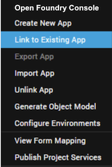

## Configuring Client Application

To configure Offline Objects in, follow these steps.

1.  Start.
2.  Create a project.
3.  Sign in to your account.
4.  On the upper-right corner of the screen, select **Data & Services**. Click the contextual menu icon  to select **Link to Existing App** option from the list.

      

5.  Select **Link to Existing App**. The **Applications** page opens with a list of applications.

      

6.  Click Associate against the app that you want to link. The application is now linked to your project.
7.  Enable the Offline Objects feature for the respective platforms. To do so, go to **Project** > **Settings**, and select the Offline Objects check box for the respective platforms.

    For Android and iOS platforms, the offline objects feature is enabled by default.

    *   **Windows**

        

    *   **Adaptive Web**

        

    *   **Responsive Web**

        

8.  Now, set up the app supporting offline objects. To do so, under the **Project** tab, right-click **Modules** and select **New JS Module** from the list. The **Module.js** tab appears. Copy the following code in the Module.js tab.
    <pre><code>var options = {};
    function onSetupSuccess() {
        alert("Setup Success");
    }
    function onSetupFailed() {
        alert("Setup Failed");
    }
    function setupSync() {
        VMXFoundry.OfflineObjects.setup(options, onSetupSuccess, onSetupFailed);
    }</code></pre>

9.  Create the required UI and assign the respective actions to the UI elements.
10.  Set the user action to sync data. You can do this through the following ways:
    *   Define a process
    *   Invoke a method on a button click
    *   Object Models

You can also generate the Object Models' code to use in the client application. For more information about integrating offline objects with generated object models, click [here](./Offline_Objects_with_Generated_Object_Models.md).  

In the case of object models, make sure to change the parameters’ status from **online** to **offline**.
