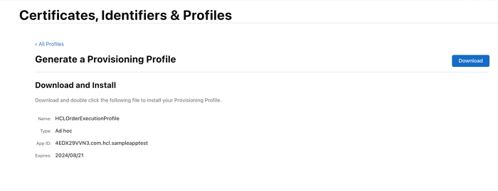

                           

Demo App QuickStart Guide (Building a Sample App – iOS): Generating the Provisioning Profile

Generating the Provisioning Profile
===================================

A provisioning profile is needed to identify the devices on which the developed application can be deployed. The following steps describe the creation of the provisioning profile for VMS demo application.

1.  Log in to your [developer.apple.com](http://developer.apple.com/) account with your credentials (user ID and password).
2.  Click **Sign In** to continue.
3.  On the **Developer Account** page, click **Profiles** under **Certificates, IDs and Profiles** in **Program resources**.

    

4.  The **Certificates, Identifiers and Profiles** page appears. Click the **+** sign next to the **Profiles** to create new profiles.
    
    
    
5.  The **Register a New Provisioning Profile** page appears. Select the **iOS App Development** option under the **Development** section. Click **Continue**.
    
    
    
    
6.  The **Select An App ID** page appears. Select the **App ID** for which the profile is created from the drop-down list and click **Continue**.
    
    
    
7.  The **Select certificates** page appears. Select the required certificate from the list-view to include in the profile and click **Continue**.
    
    > **_Note:_** To install the application on a device, the signed certificate should be included in the profile.
    
    

8.  The **Select devices** page appears. Select the device on which you need to install the application and click **Continue**.
    
     
    
9.  The **Additional Entitlements**  page appears. Select Entitlements from the drop-down list and click **Continue**.
     
     

10.  The **Review, Name and Genarate** page appears. **Provisioning Profile Name**: Enter the profile name and click **Continue** to create the provisioning profile for the selected certificate and the device.
    
      
    
11.  Click **Download** to download the profile.
    
     