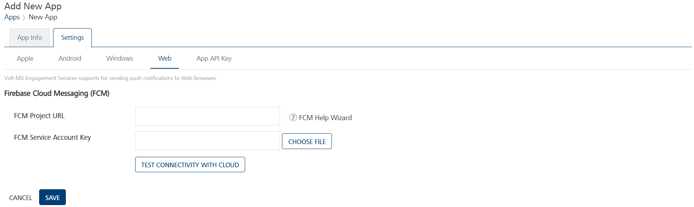

                           

Web
===

Volt MX  Engagement Server supports the sending of web push notifications using Google’s Firebase Cloud Messaging (FCM). Follow these steps to add a new application and configure settings to send web pushes.

> **_Note:_** You can send push notifications to Google Chrome, Microsoft Edge, and Mozilla Firefox Web Browsers.

**To configure the Web platform, follow these steps:**

FCM Project URL and Service Account Key
---------------------

1.  **FCM Project URL** and **Service Account Key**: Enter the **FCM Project URL** and upload the **Service Account Key**
    
    > **_Note:_** Refer **[Generating Firebase Cloud Messaging (FCM) Project URL, Service Account Key and Sender ID](Generating_Web_FCM_keys.md)** for more details on how to subscribe to FCM and get the FCM Project URL and Service Account Key. You can also test the FCM Project URL and Service Account Key for validation by clicking the **Test Connectivity** button
    
2.  Click **Test Connectivity** button to check if the **FCM** Project URL anda Service Account Key is valid or not.  
    The system displays the confirmation message that the FCM connection test is successful.
3.  Click **Cancel**, if you do not want to add **Web** platform.
4.  Click **Save** to save the specified details.
