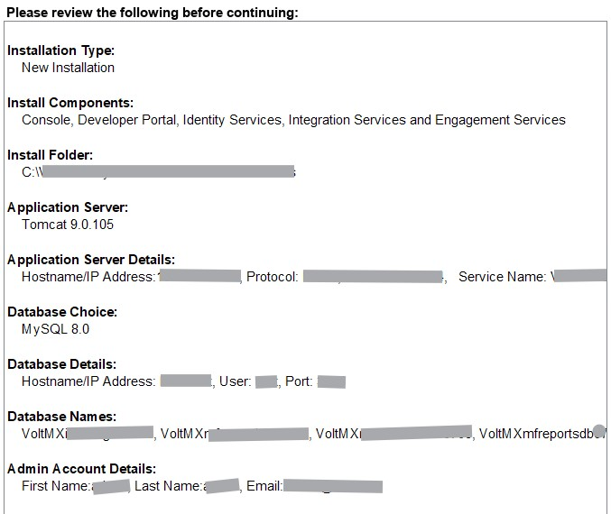

# Prerequisites

The following sections explain the software and hardware required to install JasperReports Server.

## Software Requirements

<table>

<tr>

<th>Purpose</th>

<th>Software Requirement</th>

</tr>

<tr>

<td rowspan="2">

Installer

VoltMX Products support only Jasper Professional or Jasper Enterprise edition and not the community edition.

</td>

<td>

<b>Windows</b>:
<ul>
<li>jasperreports-server-7.1-windows-x64-installer.exe</li>
<li>jasperreports-server-6.2-windows-x64-installer.exe</li>
<li>jasperreports-server-6.0-windows-x64-installer.exe</li>
</ul>

To get access to the reports created with latest features, VoltMX recommends to install Jasper Enterprise edition 6.2 or 7.1 with VoltMX Foundry V8 or latest.

</td>

</tr>

<tr>

<td>

<b>Linux</b>:
<ul>
<li>jasperreports-server-7.1-linux-x64-installer.run</li>
<li>jasperreports-server-6.2-linux-x64-installer.run</li>
<li>jasperreports-server-6.0-linux-x64-installer.run</li>
</ul>
To get access to the reports created with latest features, Temenos recommends to install Jasper Enterprise edition 6.2 or 7.1 with VoltMX Foundry V8 or latest.

</td>

</tr>

<tr>

<td>

JasperSoft License

</td>

<td>

Jasperserver.license file  

</td>

</tr>

</table>

> **_Important:_** Make sure to download TIBCO JasperReports Server version 7.9.2 or 7.1.0 and install it before configuring user attributes in How to Set Up the Jasper Reports Server.  
The license key for JasperReports Server for On-premises, you must procure the license from TIBCO. 

For JasperReports Server Installation Documentation, refer to the following:  

[https://community.jaspersoft.com/documentation/jasperreports-server-install-guide/**v561**/introduction](https://community.jaspersoft.com/documentation/jasperreports-server-install-guide/v561/introduction).  

[http://community.jaspersoft.com/documentation/tibco-jasperreports-server-installation-guide/**v60**/introduction](http://community.jaspersoft.com/documentation/tibco-jasperreports-server-installation-guide/v60/introduction)  

[http://community.jaspersoft.com/documentation/tibco-jasperreports-server-installation-guide/**v62**/introduction](http://community.jaspersoft.com/documentation/tibco-jasperreports-server-installation-guide/v62/introduction)  

[https://community.jaspersoft.com/documentation/tibco-jasperreports-server-user-guide/**v71**/introduction-jasperreports-server](https://community.jaspersoft.com/documentation/tibco-jasperreports-server-user-guide/v71/introduction-jasperreports-server)  

For JasperReports Server Distributions, refer to the following:  

[https://community.jaspersoft.com/documentation/jasperreports-server-install-guide/**v561**/jasperreports-server-distributions](https://community.jaspersoft.com/documentation/jasperreports-server-install-guide/v561/jasperreports-server-distributions).  

[http://community.jaspersoft.com/documentation/tibco-jasperreports-server-installation-guide/**v60**/jasperreports-server-distributions](http://community.jaspersoft.com/documentation/tibco-jasperreports-server-installation-guide/v60/jasperreports-server-distributions)  

[http://community.jaspersoft.com/documentation/tibco-jasperreports-server-installation-guide/**v62**/jasperreports-server-distributions](http://community.jaspersoft.com/documentation/tibco-jasperreports-server-installation-guide/v62/jasperreports-server-distributions)  

[https://community.jaspersoft.com/documentation/tibco-jasperreports-server-community-edition-release-notes/**v71**/release-distributions](https://community.jaspersoft.com/documentation/tibco-jasperreports-server-community-edition-release-notes/v71/release-distributions)  

## Supported Databases and Drivers

| Database Version | Database Connectivity Drivers |
| --- | --- |
| MySQL 5.7.X and 8.X | mysql-connector-java-8.x.x   Click the below link to download the .jar: [https://downloads.mysql.com/archives/c-j/](https://downloads.mysql.com/archives/c-j/) |
| | mysql-connector-j-8.x.x.jar   (For Mysql server  8.0.33 DataBase) |
| | **In the case of MySQL 8.x Database with JasperReports Server V 7.9.2, ensure that you must delete the mariadb-java-client-2.5.3.jar file if it exist in your system.** |
| |For example: &lt;jasperinstall-dir&gt;/apache-tomcat/lib/mariadb-java-client-2.5.3.jar|
| Microsoft SQL Server 2012, 2014 and 2019 | mssql-jdbc-7.2.2.jre8.jar   Click the below link to download the .jar:   [https://msdn.microsoft.com/en-us/sqlserver/aa937724.aspx](https://msdn.microsoft.com/en-us/sqlserver/aa937724.aspx) |
| Oracle 11g, 12c | ojdbc8.jar   Click the below link to download the .jar:  [https://www.oracle.com/database/technologies/appdev/jdbc-downloads.html](https://www.oracle.com/database/technologies/appdev/jdbc-downloads.html) |
| IBM - DB2 10.1 | db2jcc4.jar Click the below link to download the .jar: [http://www-01.ibm.com/support/docview.wss?uid=swg21363866](http://www-01.ibm.com/support/docview.wss?uid=swg21363866) |  

## Hardware Requirements

<table>

<tr>

<th>Supported OS</th>

<th>Resource</th>

<th>Footprint</th>

<th>Minimum</th>

<th>Recommended</th>

</tr>

<tr>

<td rowspan="3">

<b>Windows</b>

<ul>
<li>Windows 2008</li>
<li>Windows 7</li>
<li>Windows 8</li>
</ul>

</td>

<td>

Disk

</td>

<td>600 MB</td>

<td>10 GB free</td>

<td>40 GB+</td>

</tr>

<tr>

<td>RAM</td>

<td> </td>

<td>512 MB</td>

<td>1 GB +</td>

</tr>

<tr>

<td>Processor</td>

<td> </td>

<td>1 GHz (single Pentium)</td>

<td>1.5 GHz + (multi-core Pentium)</td>

</tr>

<tr>

<td rowspan="3">

<b>Linux</b>

<ul>
<li>Red Hat Enterprise Linux 5, 6</li>
<li>Novell SUSE Linux Enterprise 10, 11</li>
<li>Debian 6</li>
<li>Ubuntu 10</li>
</ul>

</td>

<td>

Disk

</td>

<td>600 MB</td>

<td>10 GB free</td>

<td>40 GB+</td>

</tr>

<tr>

<td>RAM</td>

<td> </td>

<td>512 MB</td>

<td>1 GB +</td>

</tr>

<tr>

<td>Processor</td>

<td> </td>

<td>1 GHz (single Pentium)</td>

<td>1.5 GHz + (multi-core Pentium)</td>

</tr>

</tbody>

</table>

## Supported Foundry Versions

<table>

<tr>

<th>VoltMX Foundry Version</th>

<th>Jasper Reports Server Version</th>

</tr>

<tr>

<td>For V8 SP2 and earlier versions</td>

<td>JRS 6.2 and JRS 6.0</td>

</tr>

<tr>

<td>For V8 SP3 and later versions</td>

<td>JRS 7.1 and JRS 6.2</td>

</tr>

</table>

## Reports Database

While installing VoltMX Foundry, the system creates the reports database, `<prefix>mfreports<suffix>`, based on the following choices only:

*   If you select **Console** check box, the system creates the reports database.
*   If you select **Console** and **Integration Service** check boxes, the system creates the reports database.

*   If you select **all** (components: Console, Identity Service, and Integration Service) check boxes, the system creates the reports database.

For more details, refer to [VoltMX Foundry Installer\_Guide > Installing Volt MX Foundry > Install Components window.](../../../Foundry/voltmx_foundry_windows_install_guide/Content/Installing_VoltMX_Foundry_on_Windows.md)

 In the Installing VoltMX Foundry page, scroll down to the **Install Components** window.

A reports database is created in the **VoltMX Foundry Installation > Pre-Installation Summary** window, shown below:

In the Install VoltMX Server page, scroll down to the **Database Details** section.