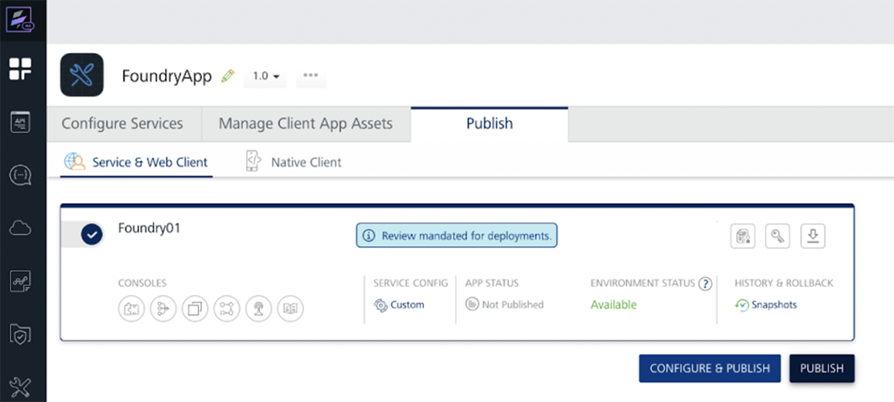
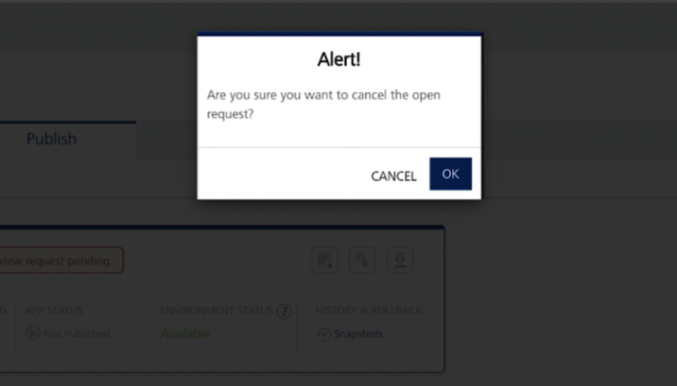
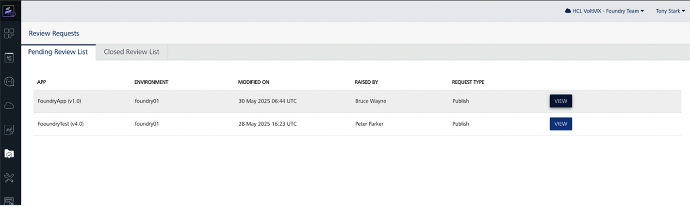

### Overview

The Governance feature in Volt Foundry introduces a controlled publishing workflow that ensures application changes undergo proper review before being deployed to target environments. This helps organizations prevent accidental or unauthorized app updates and provides visibility and auditability into deployment operations.

When governance is enabled for an environment, app publish must go through an approval process. This is enforced across the Foundry Console, Volt Iris, and Iris CI (headless build) workflows.

### Key Capabilities

* **Role-based Review Workflow:** Authors initiate deployment requests, and Reviewers review and approve/decline the requests.

* **Environment Level Governance Control:** Governance is enabled per environment by Foundry Admins or higher.

* **Review Requests Dashboard:** Approvers and Admins can manage incoming publish requests directly from the Foundry Console.

* **Review History:** Approval history is stored and accessible for compliance.

* **Change list Viewer:** Reviewers can inspect changes between app versions using a Git-style changelist.


How It Works
--------------

### Enabling Governance 

Governance is configured per environment from the Foundry Console. Only Admin or higher users can enable or disable it.

### Deployment of App Changes to Runtime

* If governance is disabled, app publish happens immediately (Existing behavior).

* If governance is enabled, the Developer submits a publish request instead of publishing directly.

* The request is queued and awaits action in the "Review Requests" dashboard, which is only accessible to Approvers and Admins.

* Once the request gets approved, the app can be published.

### Reviewing and Approving

* Approvers (new role) or Admins can review pending requests.

* A Git-style changelist shows file-level changes.

* The Approver can approve or Decline the request.

* Upon approval, the app is ready to be published.

### Notifications

* Email notifications from Foundry and new UI elements in Console inform users of status changes.

* For On-Prem, email notifications must be configured separately. Refer [here](https://help.hcl-software.com/voltmx/v10_test/Foundry/voltmx_foundry_user_guide/Content/Settings.html#governance-email-settings) Governance Email Settings for setup details.

Governance Actions
---------------------

### Governance for an Environment

Foundry supports environment-level governance to enable a controlled publishing workflow that ensures application changes undergo proper review before being deployed to target environments.

>**Note:** <li>Governance is not applicable for Native Publish.</li><li>Governance is <b>only applicable for single-tenant Foundry</b> environment</li><li>Only users with the Admin and higher role can enable or disable governance for a given environment.For user roles, see [User Management](https://help.hcl-software.com/voltmx/v10_test/Foundry/voltmx_foundry_user_guide/Content/Settings_Cloud.html).</li>

**To Enable Governance:**

1. Open the Foundry Console and navigate to Environments.

2. Select the target environment and locate the Governance toggle in the environment configuration panel.

3. Switch the toggle to Enable.

    

    Once enabled, all apps publishing to this environment will require review and approval by an Approver or Admin before being deployed.

<b>Important Behavior with Save App package in Snapshot</b>

When <b>Governance</b> is enabled for an environment, the <b>Save App package in Snapshot</b> setting is automatically enabled and cannot be disabled until Governance is turned off. Post this even if Governance is disabled, it won't be turned off automatically, it needs to be turned off manually if needed. This setting is located on the <b>Settings</b> page under <b>Snapshot</b>.

*   If <b>Save App package in Snapshot</b> was already enabled before enabling Governance, the changelist will show <b>only the changes made during the current publish</b>.

*   If <b>Save App package</b> in Snapshot was not previously enabled, then during the <b>first publish after enabling Governance, all app artifacts will be displayed as changes</b> in the changelist.

>**Note**: This behavior also applies when upgrading Foundry. If Save App package in Snapshot was not enabled before the upgrade, the first publish after the upgrade will show all artifacts as changes in the changelist.

**To Disable Governance:**

1. Open the Foundry Console and navigate to Environments.
2. Select the target environment and locate the Governance toggle in the environment configuration panel.
3. Switch the toggle to Disable.

    


Once disabled, all apps publishing to this environment will get published directly without any review.

>**Note:** Disabling Governance is only allowed when there is no pending review request in queue and there is no app with approved review requesting pending to deploy.

Approver Role
--------------

The Approver is a new role introduced for Governance with permission to access the new Governance Review Requests dashboard to review publish requests raised and approve/decline the requests. The Approver receives the email notifications when a new publish request is raised.

Only users with Admin or higher role can assign this role to users via Console > Settings > Users.


>**Note:** The Approver need not have access to the particular environment to review and approve the request. Approval role is on the account level for Governance.

For user roles, see [User Management](https://help.hcl-software.com/voltmx/v10/Foundry/voltmx_foundry_user_guide/Content/Settings_Cloud.html).


Raise a Review Request
-----------------------

To raise a review request for your app from Volt Foundry, follow these steps:

1. Open the Foundry Console and navigate to your app.


    


2. Select the target Environment where you want to publish under the publish tab.

    


3. Click Publish — if governance is enabled, a Raise Publish Request form appears.


    


4. Review the changes and enter Comments for the request. Click Submit.


    


>**NOTE:** <li> All Foundry app services published till now will be shown as a change under the changelist in the first publish review request.</li><li> Changes made to configurations will not appear in the displayed list of changes.</li><li> In the Foundry application, whenever a change is made, the associated Web Client Binary (if available) will be automatically listed in the List of Changes, regardless of whether the binary itself was modified. However, if the Web Client Binary is not displayed in the List of Changes, it indicates that no web client binary is currently mapped to the application, even if other changes were made to the application.</li>


5. The publish request is now queued for review and approval.


    


6. Once the request is approved, click Deploy Changes to deploy the app.

    


>**Note:** <li>App changes cannot be directly deployed to Governance enabled environments.</li><li>Once the review request is approved, the app can be deployed by its Author or Approver/Admin</li>

Cancel a Review Request
-------------------------

A review request can be cancelled anytime till deployment is done whether the request is in review queue or approved. A review request can only be cancelled by the Author.

**To cancel a review request:**

1. Click the Cancel Request button to Cancel a pending publish request.


    


2. Click OK to confirm.


    


Review and Approve/Decline a Request
------------------------------------

1. Open the Foundry Console.

2. From the left sidebar, click **Review Requests** (visible only to Approvers/Admins).


    


3. Locate the pending request under the Pending Review List tab with the appropriate environment and app.

    


4. Click the View button for the request to view the Review Request details.


    


5. Choose to Approve or Decline the request and enter a comment.


    


6. Upon approval, the app is ready to be deployed by the developer. If Declined, the submitter is notified with the reason.

7. Approved or Declined requests can be viewed under the Closed Review Requests tab.


    


CI Integration with MFCLI Support
-----------------------------------

Governance-aware publishing is fully supported via CLI workflows:


### MFCLI Support

Governance specific commands are added to MFCLI for a seamless continuous integration with the new deployment steps.

See here for all Governance MFCLI commands and options [here](https://help.hcl-software.com/voltmx/v10/Foundry/voltmx_foundry_user_guide/Content/MFCLI_Governance_Commands_Reference_Guide%20.html).

### Sample MFCLI commands for Governance


*   **Check Governance Status**

    Checks whether Governance is enabled for a particular environment:

```
java -jar mfcli.jar governanceStatus -u [user] -p [password] -e [env] -au [auth URL] -cu [console URL

```

* **Create a Publish Request**

    Creates a review request which gets queued for review:

```
java -jar mfcli.jar createPublishRequest -u [user] -p [password] -e [env] -a [app] -v [version] -au [auth URL] -cu [console URL] -r publish -s true -md text -d changes

```

*   **Check Request Status**

    Checks status of a review request raised:

```
java -jar mfcli.jar publishRequestStatus -u [user] -p [password] -a [app] -v [version] -e [env]

```

*   **View Diff**

    Fetches diff to review before raising a request:

```
java -jar mfcli.jar publishDiff -u [user] -p [password] -e [env] -a [app] -v [version] -r publish -au [auth URL] -cu [console URL]

```

CI Integration with Foundry APIs
---------------------------------
Governance capabilities are exposed by Volt MX Foundry for automation via APIs. These APIs help automate the process of raising a publish request, approving/declining, and deploying publish requests, without using the Volt MX Foundry Console.

### Supported Goverance APIs for CI/CD Automation

| Use Case | API Description |
| --- | --- |
| Check App Update Status | Check if an app has changes since the last publish |
| Create Publish Request | Submit a publish request for governance approval |
| Fetch Publish Requests | View publish request status or history |
| Update Publish Request (Approve / Decline / Cancel) | Approve, Decline, or Cancel a publish request |
| Create Unpublish Request | Initiate a publish request for unpublishing an app |
| Calculate App Diff | Compare app artifacts for governance review |
| Deploy Approved Publish Request | Deploy after governance approval |
| Fetch Publish Status | Retrieve current publish state |
| Check Open Requests | Verify pending or approved publish requests exist |

Refer [here](https://help.hcl-software.com/voltmx/v10/Foundry/voltmx_foundry_user_guide/Content/Continuous_Integration_with_Foundry_Governanc_%20APIs.html) for all Governance related Foundry APIs


AppFactory Support
--------------------


AppFactory supports Governance in various workflows where a review request needs to be raised when a user chooses the publish option with a Governance enabled environment.

**Web/Foundry App Build with Publish:** When the publish option is selected with build for a Web app or a Foundry app with a Governance enabled environment then Appfactory checks and only proceeds if a pending review request is not in queue for review. And instead of publishing the app, it raises a review request successfully.

Limitation
------------

* Governance currently does not support publishing micro apps with publish of the composite app. If there are linked apps, raise publish requests for each app independently.

Notes
------
*   Governance is only applicable in runtime deployments like deploying Foundry app.

*   The changelist generated while creating a review request only generates for changes in foundry services and not on app bundles/binaries.

*   Deleting or renaming a Foundry environment, disabling Governance for a Foundry environmenrt or deleting a Foundry app is only allowed when there is no pending review request and there is no app with approved review requesting pending to deploy.

*   When Governance is enabled, a Review Request is required to be raised for Foundry app Publish, Unpublish and Configure & Publish.

Frequently Asked Questions
----------------------------

Q: Can I disable governance anytime?

Yes, Admins and higher users can disable governance at any time per environment with a constraint that there should be no publish request in queue and no approved publish request pending to deploy in the selected environment.

Q: Is this feature backwards-compatible?

Yes. Existing apps behave as usual. Publish flow changes if the Governance is explicitly enabled. All Foundry app services published till now will be shown as a change under the changelist in the first publish review request.

Q: Is there an audit log for review requests?

Approved or Declined requests can be viewed under the Closed Review Requests tab.

