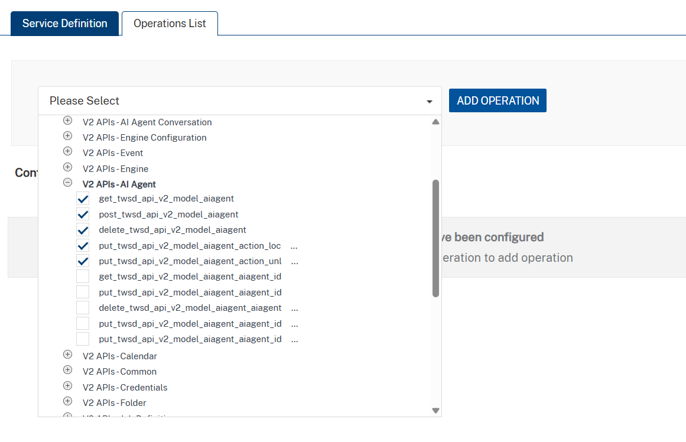

                                

User Guide: [Integration](Services.md#integration) \> [Configure the Integration Service](ConfigureIntegrationService.md) > HCL Universal Orchestrator Adapter

HCL Universal Orchestrator Adapter
==================================

HCL Universal Orchestrator (formerly OpenAPI Specification) is a framework that defines interfaces. It helps you design, build, document, and consume REST APIs.

To configure an HCL Universal Orchestrator service in Volt Foundry, provide a JSON or YAML file (and any dependent files) that includes the API specifications. Volt Foundry imports the files, reads the metadata, and displays the APIs.

Starting with **V10 Servicepack 2**, Volt Foundry supports **HCL Universal Orchestrator**.<br>
For more information about HCL Universal Orchestrator, see [A Guide to What’s New in HCL Universal Orchestrator](https://gateway.hclpnp.com/q/swagger-ui/#/).

Configuring an HCL Universal Orchestrator End-point Adapter
-----------------------------------------------------------

To configure an HCL Universal Orchestrator adapter in [Integration Service Definition](ConfigureIntegrationService.md#IntSD) tab, follow these steps:

1.  On the [Integration Service Definition](ConfigureIntegrationService.md#IntSD) page, from the **Service Type** list, select **HCL Universal Orchestrator**.

2.  Configure the service definition parameters. For more information, refer to the following sections.  
    
    <table style="mc-table-style: url('Resources/TableStyles/Basic.css');width: 80%;" class="TableStyle-Basic" cellspacing="0"><colgroup><col class="TableStyle-Basic-Column-Column1" style="width: 15%;"><col class="TableStyle-Basic-Column-Column1" style="width: 65%;"></colgroup><tbody><tr class="TableStyle-Basic-Body-Body1"><th class="TableStyle-Basic-BodyE-Column1-Body1">Parameter</th><th class="TableStyle-Basic-BodyD-Column1-Body1">Description</th></tr><tr class="TableStyle-Basic-Body-Body1"><td class="TableStyle-Basic-BodyE-Column1-Body1">Name</td><td class="TableStyle-Basic-BodyD-Column1-Body1">Specifies the name that Foundry uses to identify the service on the console.</td></tr><tr class="TableStyle-Basic-Body-Body1"><td class="TableStyle-Basic-BodyE-Column1-Body1">Version</td><td class="TableStyle-Basic-BodyD-Column1-Body1">Specifies the version number of the service. The version number ranges from <b>1.0</b> to <b>999.99</b>. If you are creating a new service, the version number is <b>1.0</b> by default, and it cannot be changed.</td></tr><tr class="TableStyle-Basic-Body-Body1"><td class="TableStyle-Basic-BodyB-Column1-Body1">Description</td><td class="TableStyle-Basic-BodyA-Column1-Body1">Specifies the description of the service that is displayed on the console.</td></tr></tbody></table>
    
    <details close markdown="block"><summary>Connection Parameters</summary> 
    <table style="mc-table-style: url('Resources/TableStyles/Basic.css');width: 80%;" class="TableStyle-Basic" cellspacing="0"><colgroup><col class="TableStyle-Basic-Column-Column1" style="width: 15%;"><col class="TableStyle-Basic-Column-Column1" style="width: 65%;"></colgroup><tbody><tr class="TableStyle-Basic-Body-Body1"><th class="TableStyle-Basic-BodyE-Column1-Body1">Parameter</th><th class="TableStyle-Basic-BodyD-Column1-Body1">Description</th></tr><tr class="TableStyle-Basic-Body-Body1"><td class="TableStyle-Basic-BodyB-Column1-Body1">HCL Universal Orchestrator</td><td class="TableStyle-Basic-BodyA-Column1-Body1">Specifies the JSON, or YAML file that contains the required API specifications. You can also upload a zip file that contains the JSON or YAML file. To upload an HCL Universal Orchestrator specification file, click <b>Upload</b>, and then select a file from your local system. After you upload a file, Foundry displays additional parameters based on the HCL Universal Orchestrator spec version that is mentioned in the file.</td></tr></tbody></table>
    <b>Note</b>: Volt Foundry V10FP2 GA supports uploading of HCL Universal Orchestrator spec 3.0 versions. To upload an HCL Universal Orchestrator specification file, click <b>Upload</b>, and then select a file from your local system. After you upload a file, Foundry displays additional parameters based on the HCL Universal Orchestrator spec version that is mentioned in the file.
    
    <h4>Connection Parameters for HCL Universal Orchestrator</h4>
    <table style="mc-table-style: url('Resources/TableStyles/Basic.css');width: 80%;" class="TableStyle-Basic" cellspacing="0"><colgroup><col class="TableStyle-Basic-Column-Column1" style="width: 15%;"><col class="TableStyle-Basic-Column-Column1" style="width: 65%;"></colgroup><tbody><tr class="TableStyle-Basic-Body-Body1" data-mc-conditions="Default.V9SP2M1"><th class="TableStyle-Basic-BodyE-Column1-Body1">Parameter</th><th class="TableStyle-Basic-BodyD-Column1-Body1">Description</th></tr><tr class="TableStyle-Basic-Body-Body1" data-mc-conditions="Default.V9SP2M1"><td class="TableStyle-Basic-BodyE-Column1-Body1">Server URL</td><td class="TableStyle-Basic-BodyD-Column1-Body1">Specifies the URL of the server that hosts the APIs. The default URL is the first server URL in the specification file. For information about how Foundry parses the URLs, refer to the <a href="#Miscellaneous" class="selected">Miscellaneous</a> section. For example: <code class="codefirst" style="font-size: 11pt;">https://subdomain.site.com/version</code></td></tr><tr class="TableStyle-Basic-Body-Body1" data-mc-conditions="Default.V9SP2M1"><td class="TableStyle-Basic-BodyB-Column1-Body1">Server Description</td><td class="TableStyle-Basic-BodyA-Column1-Body1">Specifies the description for the server that is specified by the URL. For example: <code class="codefirst" style="font-size: 11pt;">Development Server</code></td></tr></tbody></table>
    </details>

    <details close markdown="block"><summary>Authentication</summary>
    <table style="mc-table-style: url]('Resources/TableStyles/Basic.css');width: 80%;" class="TableStyle-Basic" cellspacing="0"><colgroup><col class="TableStyle-Basic-Column-Column1" style="width: 15%;"><col class="TableStyle-Basic-Column-Column1" style="width: 65%;"></colgroup><tbody><tr class="TableStyle-Basic-Body-Body1"><th class="TableStyle-Basic-BodyE-Column1-Body1">Parameter</th><th class="TableStyle-Basic-BodyD-Column1-Body1">Description</th></tr><tr class="TableStyle-Basic-Body-Body1"><td class="TableStyle-Basic-BodyB-Column1-Body1">Use Existing Identity Provider</td><td class="TableStyle-Basic-BodyA-Column1-Body1">Specifies the identity provider that you want to use to authenticate users for the service. You can select any Identity Service that is created on the <span class="MyVariablesVoltMX">VoltMX</span> Foundry cloud. For information about creating an Identity Service, refer to <a href="ConfigureIdentiryService.html" target="_blank">Configure Identity Service</a>.</td></tr></tbody></table>
    </details>

    <details close markdown="block"><summary>Advanced</summary>  

    | Field | Description |
    | --- | --- |
    | Custom code | Specifies any custom JAR files that you want to associate with the service.To associate a JAR file with the service, follow either of the following steps. From the **Select Existing JAR** list, select a JAR file from the Volt Foundry cloudClick **Upload New**, and then select a JAR file from the file explorer> **_Note:_** For on-premises instances of Foundry, make sure that the JAR file that is built on the same JDK version that is used to install the Foundry Integration. |
    | API Throttling | Specifies whether Foundry must limit the number of request calls in a minute. To use **API Throttling**, follow these steps.<br><br>In the **Total Rate Limit** box, type a required value. This limits the total number of requests that are processed by the service.<br><br>In the **Rate Limit Per IP** box, type a required value. This limits the number of requests based on the IP Address of the request.<br><br>You can also override throttling from the Volt Foundry App Services Console. For more information, refer to [Override API Throttling Configuration](API_Throttling_Override.md#override-api-throttling-configuration). |

    </details>
    
3.  After you configure all the parameters, click **SAVE**.  
    
    > **_Note:_** If you want to add operations to the service, click **SAVE AND ADD OPERATIONS**.
    

Creating Operations for HCL Universal Orchestrator
-----------------------------------------

After you create a service, you can view existing operations and create new ones on the **Operations List** tab. For an HCL Universal Orchestrator endpoint, the operations correspond to the paths defined in the specification file (for example, **POST AI Agent model** or **PUT AI Agent model**).

To create an operation, follow these steps:

1.  On the **Service Definition** page, open the **Operations List** tab. 
    Alternatively, click the `+` icon in the left pane, and then select **Add New Operation**.
2.  On the **Operations List** tab, select the operations you want to add from the drop-down list. 
    When you select a path (operation), Volt Foundry automatically populates all the fields associated with that operation.  
      
    
3.  After you select the operations, click **ADD OPERATION**. Volt Foundry adds the selected operations to the **Operations List** tab.
    
    
    
4.  Under **Configured Operations**, click an operation to view its details.
    
    
    
    Volt Foundry displays the selected operation in edit mode. You can configure the parameters to update the operation. For more information, see the following table.
    
    | Field | Description |
    | --- | --- |
    | Name | Specifies the name that Foundry uses to identify the operation on the console. |
    | Operation Security Level | Specifies the authentication that is required to invoke the operation. Contains the following options: **Authenticated App User** – It restricts the access to clients who have successfully authenticated using an Identity Service associated with the app. **Anonymous App User** – It allows the access from trusted clients that have the required App Key and App Secret. Authentication through an Identity Service is not required. **Public** – It allows any client to invoke this operation without any authentication. This setting does not provide any security to invoke this operation and you should avoid this authentication type if possible. **Private** - It blocks the access to this operation from any external client. It allows invocation either from an Orchestration/Object Service, or from the custom code in the same run-time environment. |
    | Description | Specifies the description of the service that is displayed on the console. |
    
5.  Configure the parameters in the **Advanced** section as required. For more information, see the following table.
    <details close markdown="block"><summary>Advanced</summary>
    <table style="margin-left: 0;margin-right: auto;mc-table-style: url]('Resources/TableStyles/Basic.css');width: 80%;" class="TableStyle-Basic" cellspacing="0"><colgroup><col class="TableStyle-Basic-Column-Column1" style="width: 15%;"> <col class="TableStyle-Basic-Column-Column1"></colgroup><tbody><tr class="TableStyle-Basic-Body-Body1"><td class="TableStyle-Basic-BodyE-Column1-Body1">Custom Code Invocation</td><td class="TableStyle-Basic-BodyD-Column1-Body1">You can add pre and post processing logic to services to modify the request inputs. When you test, the services details of various stages in the service execution are presented to you for better debugging. All options in the Advanced section are optional. For more details, refer to <a href="Java_Preprocessor_Postprocessor_.html" target="_blank">Preprocessor and Postprocessor</a>.</td></tr><tr class="TableStyle-Basic-Body-Body1"><td class="TableStyle-Basic-BodyE-Column1-Body1">Additional Configuration Properties</td><td class="TableStyle-Basic-BodyD-Column1-Body1">Additional Configuration Properties allows you to configure service call time out cache response. For information on different types of configuration properties, refer <a href="Java_Preprocessor_Postprocessor_.html#timeout_cachable" target="_blank">Properties</a>.</td></tr><tr class="TableStyle-Basic-Body-Body1"><td class="TableStyle-Basic-BodyE-Column1-Body1">Front-end API</td><td class="TableStyle-Basic-BodyD-Column1-Body1">Front-end API allows you map your endpoint (or) backend URL of an operation to a front-end URL. For detailed information, refer Custom <a href="FrontEndAPI.html" target="_blank">Front-end URL</a>.</td></tr><tr class="TableStyle-Basic-Body-Body1"><td class="TableStyle-Basic-BodyB-Column1-Body1">Server Events</td><td class="TableStyle-Basic-BodyA-Column1-Body1">Using Server Events you can configure this service to trigger or process server side events. For detailed information, refer <a href="ServerEvents.html">Server Events</a>.</td></tr></tbody></table>
    </details>
   
6. After you configure the required parameters, click **SAVE**.


### Configuring Request Parameters

Volt Foundry picks the request input parameters from the uploaded HCL Universal Orchestrator specification file. Any changes you make to the parameters from the console are ignored.

> **_Important:_** Ensure that the input parameters are `form-url-encoded`.

To create a new parameter on the **Request Input** tab, follow these steps:

1.  On the **Body** tab, click **Add Parameter**.<br>
    Volt Foundry adds a new row to the parameters table.

2.  Configure the fields (columns) for the input parameter. For more information, see the following table.
    
    | Field | Description |
    | --- | --- |
    | Name | Specifies a unique identifier for the parameter. The name is the key of the parameter in the request. |
    | VALUE | Specifies the source of the value of the parameter. Contains the following options. **request** The value is picked from the configuration of the request parameter. If you select **request** as the source, you need to configure the TEST VALUE and DEFAULT VALUE fields. **session** The value is picked from the session context. If you select **session** as the source, the TEST VALUE and DEFAULT VALUE fields are disabled. **constant** The value is a constant that is defined on the Foundry console. If you select **constant** as the source, you need to type a value for the parameter. **identity** The value is picked from the response that is sent by the specified identity provider. If you select identity as the source, you need to configure the **provider**, **attribute**, and **value**. For example: `sampleAuth.profile.userID` <br> **Note:** For more information on Externalizing Identity Services, refer to [Replace the Identity Service references in a Foundry app](Replacing_Identity_Services.md).|
    | TEST VALUE | Specifies the value of the parameter that is used while testing the service. |
    | DEFAULT VALUE | Specifies the value of the parameter that is used if the test value is empty. |
    | DATA TYPE | Specifies the data type of the parameter. Contains the following options: **string** A combination of alpha-numeric and special characters. Supports all formats (including UTF-8 and UTF-16) with no maximum size limit. **boolean** A value that can be true or false. **number** An integer or a floating point number. **date** A value that contains the day, month, year, and time. **collection** A set of multiple records. **record** A set of multiple objects. > **_Note:_** The **binary** data type is not supported for operations in HCL Universal Orchestrator. |
    | Record ID | Specifies the ID of the record that contains the parameter. This field is applicable for nested payloads. |
    | Collection ID | Specifies the ID of the collection that contains the parameter. This field is applicable for nested payloads. |
    | Description | Specifies the description for the request parameter. |
    
3.  After you configure all parameters, validate the details by testing the service operation. For more information, see the [Test a Service Operation](Test_a_Service_Operation.md).
    

### Configuring Response Parameters

You can view details such as the name, scope, and data type of the response parameters using the **Response Output** tab.

The **Restrict Parameters to HCL Universal Orchestrator definition** check box is selected by default.  This option determines whether Volt Foundry picks parameters from the HCL Universal Orchestrator definition file or from the Foundry console configuration.

To create a parameter based on the back-end response, follow the below steps:

1.  Clear the **Restrict Parameters to HCL Universal Orchestrator definition** check box.

2.  From the **Select Environment** list, select a run-time environment, and then click **Save and Fetch Response**.  
    Volt Foundry displays the back-end response in the **Test** window, and the **Backend Response** pane shows the response nodes in a tree view.

3.  Hover over to the node that you want to add to the response output parameters, and then click **Create Response**.  
      
    Volt Foundry adds a new row to the **Response Output** tab with the details of the selected node.

To create a parameter manually, follow these steps:

1.  Clear the **Restrict Parameters to HCL Universal Orchestrator definition** check box.

2.  Click **Add Parameter**. Volt Foundry adds a new row to the parameters table.

3.  Configure the fields for the parameters. For more information, see the following table.  
    
    | Field | Description |
    | --- | --- |
    | Name | Specifies a unique identifier for the parameter. The name is the key of the parameter in the response. |
    | Scope | Specifies the scope at which the parameter is available. Contains the following options. **response** The parameter is available in the response. **session** The parameter is available throughout the user session. > **_Note:_** If the parameters inside a record are defined as the session, the session scope is not reflected for the parameters. |
    | DATA TYPE | Specifies the data type of the parameter. Contains the following options: **string** A combination of alpha-numeric and special characters. Supports all formats (including UTF-8 and UTF-16) with no maximum size limit. **boolean** A value that can be true or false. **number** An integer or a floating point number. **date** A value that contains the day, month, year, and time.**collection** A set of multiple records. **record** A set of multiple objects. > **_Note:_** The **binary** data type is not supported for operations in HCL Universal Orchestrator. |
    | Record ID | Specifies the ID of the record that contains the parameter. This field is applicable for nested payloads. |
    | Collection ID | Specifies the ID of the collection that contains the parameter. This field is applicable for nested payloads. |
    | Description | Specifies the description for the request parameter. |
    
4.  After you configure all parameters, click **SAVE OPERATION**.  
    
    > **_Note:_** To test the operation, select a run-time environment from the drop-down list, and then click **SAVE AND FETCH RESPONSE**.
    

> **_Note:_** You can view the service in the **Data Panel** in Volt Iris. The Data Panel lets you link back-end data services to your application UI elements with low-code to no code development. For more information about the Data Panel, see [here](../../../Iris/iris_user_guide/Content/DataPanel.md#top).

### Testing the Operation

After you create an operation and configure the request and response parameters, you can test the operation to validate the configuration.

To test an operation, select an environment from the **Select Environment** list, and then click **SAVE AND FETCH RESPONSE**. Volt Foundry displays the result of the operation. 

For more information, see [Test a Service Operation](Test_a_Service_Operation.md).

> **_Note:_** For **POST** or **PUT** methods that contain nested payloads, you cannot test the service from the Volt Foundry Console. You must send the request from the **App Services Console** or from [Postman](https://www.postman.com/).

Miscellaneous
-------------

### HCL Universal Orchestrator in Foundry V10 Servicepack 2

*   With the HCL Universal Orchestrator Specification, you can add multiple URLs to your definition and also include parameters in the URL. For more information, refer to [A Visual Guide to What's New in HCL Universal Orchestrator](https://gateway.hclpnp.com/q/swagger-ui/#/).
    *   While creating a service for HCL Universal Orchestrator in Volt Foundry V10 ServicePack 2, you can select only one URL as the Server URL. If your specification file contains multiple URLs, Foundry picks the first URL by default.
    *   You can change the URL before you publish the service to the run time by re-configuring the service before a publish. For more information, refer to [Service Reconfiguration](ServiceReconfig.md).
    *   Parameters in the URL are not supported. Make sure that you add static server URLs to your specification file.
*   Extension data is not supported as Foundry parses only one specification file. If your specification file contains references to any external files, the console displays an error.  
    For example, if your file contains the following code snippet, the console displays an error:  
```
{
    "$ref": "PayInOutExtension.json#/components/schemas/customFields"
    }
```
*   The **trace** HTTP method is not supported and the APIs that use the trace method are ignored.  
    APIs that use other HTTP methods are parsed by Foundry to create operations.
*   If the HTTP response code is not **200**, the console displays the response from the back-end server as is.
*   **OpenID Connect** (OIDC) is not supported for authentication.
*   **Callbacks**, which are used to define Webhooks, are not supported. **Links**, which are used to define the output one operation as input for another operation, are not supported. Make sure that you remove Callbacks and Links from your HCL Universal Orchestrator spec before you upload it to Foundry.
*   Serialization of parameters, which includes **style** (defines the delimiter for multiple parameters) and **explode** (specifies whether objects of an array are generated as separate parameters), is not supported.
*   Foundry does not parse or validate **examples** from the specification file.
* Foundry HCL Universal Orchestrator adapter does not support the BinarySchema, ByteArraySchema, FileSchema and MapSchema.
