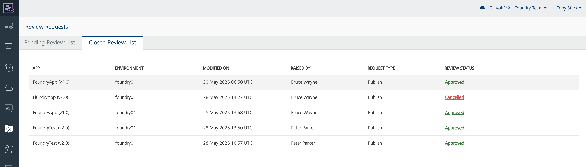

## Review Requests Dashboard

With Governance, a new Review Requests menu appears in the Console sidebar (visible to Approvers and Admins) which allows to view all pending and closed publish requests. A publish request can be reviewed using the diff-viewer to inspect changes before approving or rejecting a request.

        

Only users with the Approver, Admin and higher role can access this dashboard.

Learn more about Governance [here](https://help.hcl-software.com/voltmx/v10/Foundry/voltmx_foundry_user_guide/Content/Governance_for_Foundry.html)
