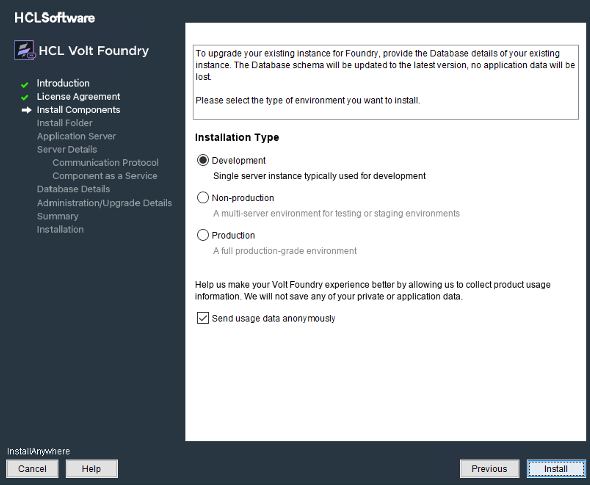
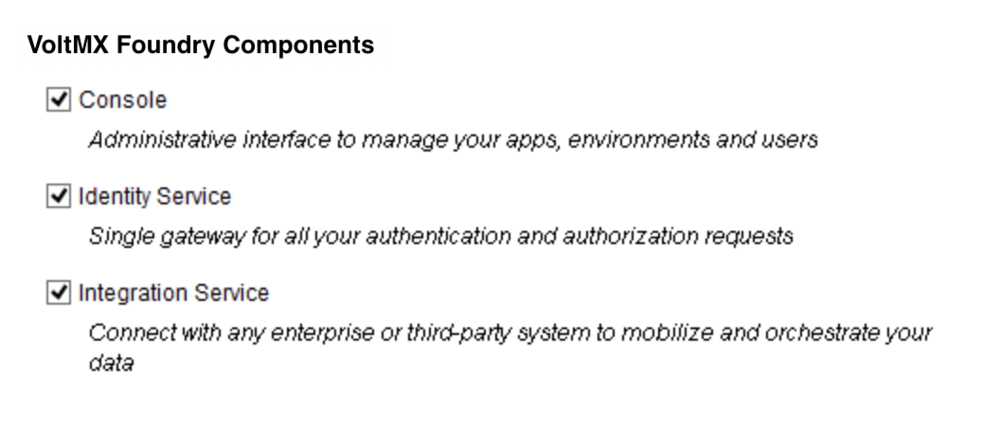
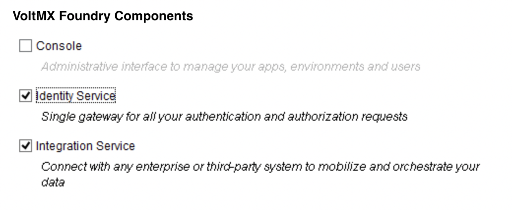
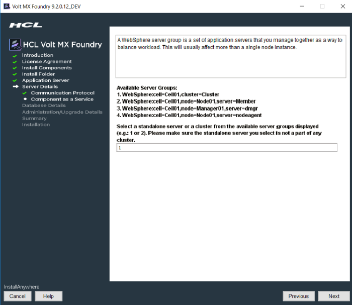
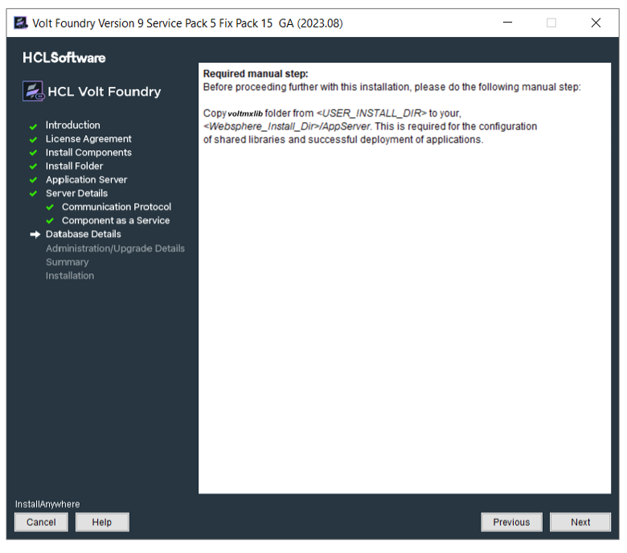
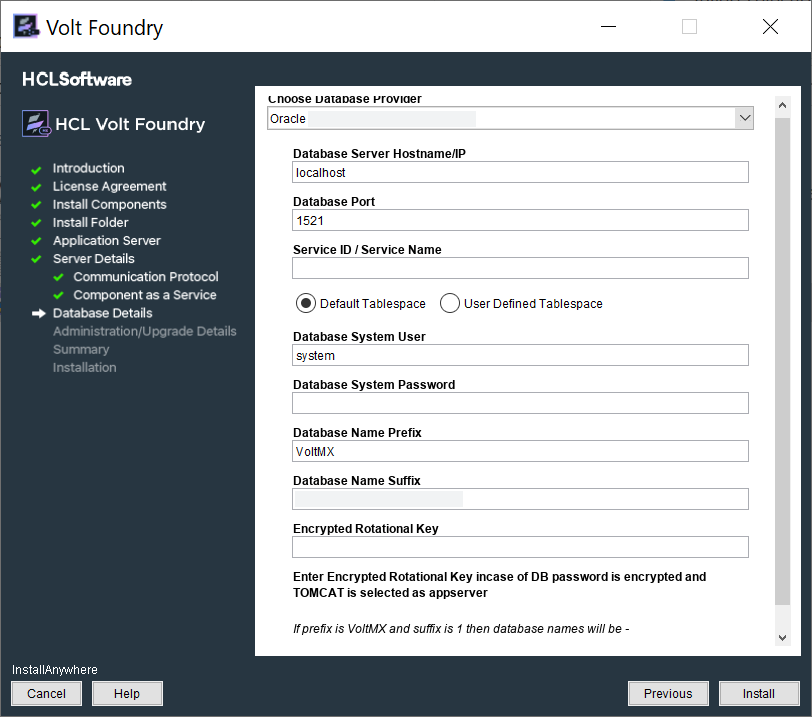
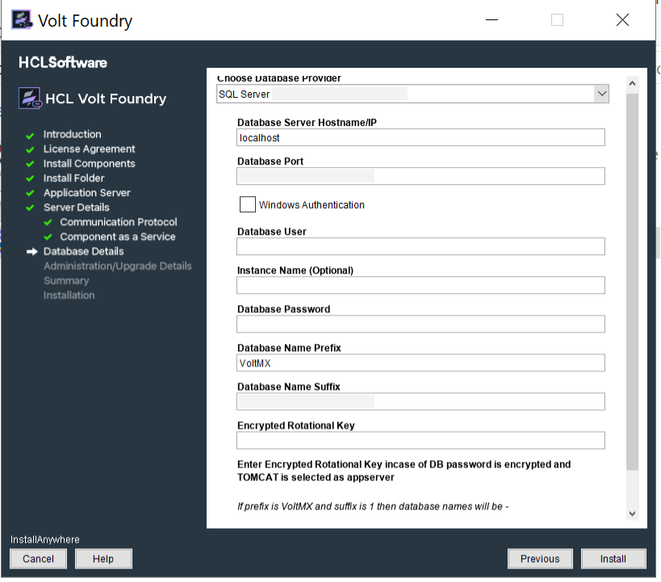
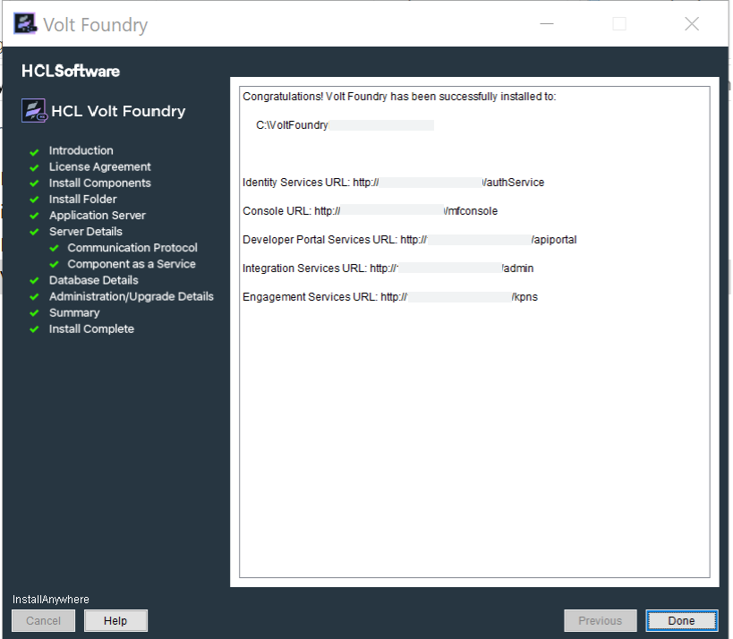

### Installing Volt Foundry on WebSphere

This section of the document provides you with the instructions for installing and configuring Volt Foundry components.

You need the required hardware and access to the supporting software as mentioned in the [Prerequisites](Prerequisites.md) section and must perform the steps noted in the [Pre-installation Tasks](Pre-installation_Tasks.md) section.

Make sure that you have proper administrative rights to install Volt Foundry on your computer.

The **<Install Location\>** directory contains the log files documenting each invocation of the installer or uninstaller. To make problem identification easier, provide these log files to VoltMX when reporting an issue.

To install Volt Foundry Console on WebSphere using the installer, follow these steps:

1.  Unzip the `VoltMXFoundrySetup.zip` file.
2.  Double-click `VoltMXFoundryInstaller-x.x.x.x_GA.exe` to launch the installer.  
    The **InstallAnywhere** dialog appears. The **InstallAnyWhere** dialog displays information about the progress of the software installation at run time.

    

    A dialog with the VoltMX logo appears.

    

3.  The **Welcome to Volt Foundry** windows appears.  
    Read the instructions carefully before installing Volt Foundry Console.

    

4.  Read the instructions carefully, and click **Next**.  
    The **LICENSE AGREEMENT** window appears.

5.  Scroll until end of the screen, and select the "**I accept the terms of the License Agreement**" option.

    To activate the License Agreement option, read carefully the whole agreement text.

      

6.  Click **Next**. The **Install Components** window appears with the following supported installation types:
    *   **Development** for single machine instance.
    *   **Non-Production** for larger environments like QA or UAT.

    *   **Production** for the production instance.

    Installation environment is set to Development by default .

    

7.  Choose the **New Installation** option for new installation.
8.  Choose one of the appropriate install type based on your license - for example, Development, Non-Production, or Production.
9.  Select the **Send usage data anonymously** check box. Allows VoltMX to collect product usage information to make your Volt Foundry experience better. VoltMX does not save any of your private or application data. By default this check box is selected.
10.  Click **Next**. The **Choose components to install** window appears.

     

11.  Select one or more check boxes for the supported components. By default, the **Console**, **Identity Services**, **Integration Services**, **Developer Portal**, and **Engagement Services** check boxes are selected:
    *   **Console** - To install Volt Foundry Console, select the **Console** check box.  
        The system creates the following databases: `<prefix>mfconsoledb<suffix>`, `<prefix>mfaccountsdb<suffix>`, and  `<prefix>mfreportsdb<suffix>`.
    *   **Identity Services** - To install VoltMX Identity Services, select the **Identity Services** check box.  
        The system creates the following database: `<prefix>idconfigdb<suffix>`.
    *   **Integration Services** - To install Volt Foundry Integration Services, select the **Integration Services** check box.  
        The system creates the following databases: `voltmxadmindb`  and  `mfreportsdb`.
    *   **API Developer Portal** - To install developer portal, select the **API Developer Portal** check box.  

        > **_Note:_** During installation if you have selected **API Developer Portal**, the **API Developer Portal** is created. You can directly access your [VoltMX Developer Portal](../../../Foundry/voltmx_foundry_user_guide/Content/VoltMXDevPortal.md) in Volt Foundry Console.

    *   **Engagement Services** - To install Volt Foundry Engagement Services, select the **Engagement Services** check box.  
        The system creates the following database: `<prefix>vpnsdb<suffix>`.

     
    **Reports Database**

    The reports database is used for configuring reports.

    The Installer creates the `mfreportsdb` if you are installing the following Volt Foundry components:

    If you try to install Integration and Console in different nodes, ensure that you point to the same reports database to make reports feature work properly.

     The reports database is used for configuring reports.  

    While installing Volt Foundry, the system creates the reports database, **<prefix>mfreports<suffix>**, based on the following choices only:  

    -   If you select the Console check box, the system creates the reports database.
           

    -   If you select the Console and Integration Services check boxes, the system creates the reports database.  
          

    -   If you select all (components: Console, Identity Services, Integration Services) check boxes, the system creates the reports database.  
          

    <u style="font-weight: bold; font-size: 14pt;">Reports Database for Integration on a Separate Node:</u>

    While installing console and integration on separate nodes, the installer prompts you to point the reports database during the integration installation.  

    For example:  
    You have installed only Console on one node. The installer creates these three databases such as `<>mfreportsdb<>` along with the `<>mfconsoledb<>` and `<>mfaccountsdb<>`. For example, your report database name is `voltmxmfreportsdb1`.  

    Refer to [creating a reports database, for example, **<prefix\>mfreports<suffix\>**](#CreatingReportsDB).  

    If the only Console is installed, the <>mfreportsdb<> along with the <>mfconsoledb<> and <>mfaccountsdb<> are created.  

    For example:  

    If the only Console is installed on one node, the <>mfreportsdb<> along with the <>mfconsoledb<> and <>mfaccountsdb<> are created.  

    When you install the integration with or without one or more components ( identity, KMS or Sync) on a separate node, the installer displays the **Reports Database Name** field in the **Database Details** window, based on the following choices only :  

    -  if you select Integration Services check box, the system displays the **Reports Database Name** field in the **Database Details** window.  

    -  if you select Integration Services with Identity Services, the system displays the **Reports Database Name** field in the **Database Details** window.  

    If the installer prompts you to enter the existing reports db, enter the reports database name in the **Database Details window > Reports Database Name** field. Refer to the [Database Details](#DatabaseDetails) window.  

    Refer to [creating a reports database, for example, **<prefix\>mfreports<suffix\>**](#CreatingReportsDB).
    
    
    
      

12.  Click **Next**. The **Install Folder** window appears. The selected path appears in the **Where would you like to install** field.

    

13.  

     Click **Choose** to browse the required folder from your system.  

14.  Click **Next**. The **Application Server** window appears asking you to choose the application server. By default, the Application Sever is set to Tomcat.

     

15.  In the **Application Server** window, select **WebSphere**  

16.  Click **Next** to display the **Service Details** window.

     

     

17.  Click **Next**. In the **Service Details** window, enter the details for WebSphere.

     <!-- While installing Volt Foundry on WebSphere, if you face any issues, refer to [http://docs.voltmx.com/voltmxlibrary/Volt Foundry/resources/websphere_faqs.html](http://docs.voltmx.com/voltmxlibrary/voltmxfoundry/resources/websphere_faqs.html) -->

     1.  The following window will appear only if you select all the check boxes at [Install Components](#InstallComponents). Enter the following details:

         

         *   **Fully Qualified Public URL of Volt Foundry**: Enter load balancer URL to use public communication.

             If you are using standalone WebSphere Server without Load Balancer, ensure that the port for default host is set to either 9080\. For example, `http://<domain>:9080`

         *   **Hostname/IP Address of WebSphere Administrator Server**: Enter IP Address/Hostname of the WebSphere Administrator Server.  

             If you are installing Volt Foundry on a machine where the IP address may change, for example, development boxes that connect to the network via Wi-Fi, it is preferred to provide the Hostname instead of IP address during installation.

         *   **WebSphere SOAP Connector Port**: Enter SOAP connector port of WebSphere Server.

             Port details for a particular server can be contained from the **Server Configuration** page, as shown in the following:

             

         *   **WebSphere Java Messaging Service (JMS) Port**: Enter WebSphere-JMS port.

             The JMS port is same as Bootstrap address for WebSphere.

         *   **WebSphere Administrator Server User**: Enter the log-in username for WebSphere Administrator Server.

         *   **WebSphere Administrator Server Password**: Enter the log-in password for WebSphere Administrator Server.  

             *   The following window will appear only if you select the **Console** check box at [Install Components](#InstallComponents):

                 

             *   The following window will appear only if you the **Identity Services** check box at [Install Components](#InstallComponents):

                 

             *   The following window will appear only if you the **Integration Services** check box at [Install Components](#InstallComponents):

                 

             *   The following window will appear only if you the **Engagement Services** check box at [Install Components](#InstallComponents):

                 

             *   The following window will appear only if you the **Sync Services** check box at [Install Components](#InstallComponents):

                 

    2.  Click **Next**. The Keystore and Truststore details window appears. Enter the following details Keystore and Truststore details of your preconfigured WebSphere Server. These details are needed to create the remote connection to your WebSphere Server.

        

        *   Enter the location for Keystore file location.
        *   Enter the password for Keystore file location.
        *   Enter the location for Truststore file location.
        *   Enter the password for Truststore file location.  
    
    3.  Click **Next**. The **Server Groups** window appears.

        

    4.  Enter server groups separated by commas - for example, 1, 2, shown in the previous step. Click **Next**. The system displays the selected groups in the **Selected Server Group** window, shown below:`WebSphere:cell=KH2013Node01Cell,node=KH2013Node01,server=server1`

        

        If the JVM Heap size is less than 6GB when all the components are selected, the following warning is displayed:

        

        You can choose to continue with the installation by clicking **OK**, to avoid roll back during installation due to the "OutofMemory" warning.

    5.  Click **Next**. The **Shared Lib** window appears.

        

        Required manual step: Before proceeding further with this installation, please do the following manual steps:  

        *   Copy voltmxlib folder from <USER_INSTALL_DIR> to your <Websphere_Install_Dir>/AppServer. This is required for the configuration of shared libraries and successful deployment of applications.  

        The installation will not work without the above steps.</madcap:conditionaltext>  

        <!-- For more information and FAQ on WebSphere installation, refer to [http://docs.voltmx.com/voltmxlibrary/Volt Foundry/resources/websphere_faqs.html](http://docs.voltmx.com/voltmxlibrary/voltmxfoundry/resources/websphere_faqs.html)   -->

18.  Click **Next**. The **Database Details** window appears. From the **Database Choice** drop-down, choose one of the databases to display database details and fill the details. By default, this option is set to MySQL.  

    *   Enter the following database details for **MySQL**.

        

        *   **Database Server Hostname/IP**: Enter the DB server Hostname/IP to be used to create a database of selected components of Volt Foundry. By default, the server Hostname/IP is set as localhost.
        *   **Database Port**: Enter the database port of the MySQL Server. By default, this field is set to 3306 for MySQL.
        *   **Database User**: Enter the user name used while creating the database user - for example, dbclient.
        *   **Database Password**: Enter the user password used while creating the database user.
        *   **Reports Database Name**: Enter the reports database name that is created during Volt Foundry installation. Refer to [Install Components](#ComponentsDBs).

            The system verifies the entered database name - for example, `SampleReportsDatabase`. If the reports database name does not exist, the system displays the warning message: `Reports database SampleReportsDatabase does not exist. Do you want to create a new database?`, shown below:

            

            Click **Yes**. The system creates the reports database - for example, `SampleReportsDatabase`.

             If you try to install Integration Services and Console in different nodes, ensure that you point to the same reports database to make reports feature work properly.

        *   **Database Name Prefix**: Enter the valid prefix databases - for example, VoltMX.
        *   **Database Name Suffix**: Enter the valid suffix for all databases - for example, 1.

    *   Enter the following database details for **Oracle**.

        

        *   **Database Server Hostname/IP**: Enter the DB server Hostname/IP to be used to create a database of selected components of Volt Foundry. By default, the server Hostname/IP is set as localhost.
        *   **Database Port**: Enter the database port of the Oracle Server. By default, this field is set to 1521 for oracle.
        *   **Service ID / Service Name:** Enter Oracle service ID or service name. Service ID is unique alias given to an instance name of Oracle DB.
        *   Select the tablespace for Oracle database:

             If tablespaces were already created, the DBA must grant quota (permissions) on these tablespaces to the installer with admin option.  

            The DBA also must include grant quota on the schemas from installer login.

            *   **Default Tablespace**: If selected, the database schema and SQL scripts migration happen automatically to the default tablespace for example, `USERS`
            *   **User Defined Tablespace**: If selected, enter the tablespaces for the following:
                *   **Data Tablespace**:  
                    Enter the name for Data tablespace.  

                    This is a mandatory field. If the Data tablespace field empty, the installer displays the error message:

                    

                    If the Data tablespace (for example, SampleData) does not exist, the installer displays the error message:

                    

                *   **Index Tablespace**: Enter the name of Index tablespace.  
                    If the input for Index Tablespace is not provided, then the value will be set to the provided Datatable space value.
                *   **LOB Tablespace**: Enter the name for LOB tablespace.  
                    If the input for LOB Tablespace is not provided, then the value will be set to the provided Datatable space value.  

        *   **Database System User**: Enter the user name used while creating the database user - for example, dbclient.  

        *   **Database System Password**: Enter the user password used while creating the database user. 

        *   **Reports Database Name**: Enter the reports database name that is created during Volt Foundry Installation. Refer to [Install Components](#InstallComponents).

            The system verifies the entered database name - for example, `SampleReportsDatabase`. If the reports database name does not exist, the system displays the warning message: `Reports database SampleReportsDatabase does not exist. Do you want to create a new database?`, shown below:

            

            Click **Yes**. The system creates the reports database - for example, `SampleReportsDatabase`.

             If you try to install Integration Services and Console in different nodes, ensure that you point to the same reports database to make reports feature work properly.

        *   **Database Name Prefix**: Enter the valid prefix databases - for example, jboss.
        *   **Database Name Suffix**: Enter the valid suffix for all databases - for example, 54.

    *   Enter the following database details for **SQL Server**.

        If you want to enable Windows Authentication Support on SQL Server, run the following command to start the installation process after extracting the artefact:

        `VoltMXFoundryInstaller-8.2.0.1_GA.exe -Dprop.java.library.path=<location of sqljdbc_auth.dll>`

        If you choose to enable Windows Authentication support on SQL Server, you do not need to provide the **Database System User** and **Database System Password**.

        

        *   **Database Server Hostname/IP**: Enter the DB server Hostname/IP to be used to create a database of selected components of Volt Foundry. By default, the server Hostname/IP is set as localhost.
        *   **Database Port**: Enter the database port of the SQL Server. By default, this field is set to 1433 for SQL.
        *   **Database System User**: Enter the user name used while creating the database user - for example, dbclient.
        *   **Instance Name (optional)**: Enter the instance name for the database. This information is optional.
        *   **Database System Password**: Enter the user password used while creating the database user.  

        *   **Reports Database Name**: Enter the reports database name that is created during Volt Foundry Installation. Refer to [Install Components](#InstallComponents).

            The system verifies the entered database name - for example, `SampleReportsDatabase`. If the reports database name does not exist, the system displays the warning message: `Reports database SampleReportsDatabase does not exist. Do you want to create a new database?`, shown below:

            

            Click **Yes**. The system creates the reports database - for example, `SampleReportsDatabase`.

             If you try to install Integration Services and Console in different nodes, ensure that you point to the same reports database to make reports feature work properly.

        *   **Database Name Prefix**: Enter the valid prefix databases - for example, jboss.
        *   **Database Name Suffix**: Enter the valid suffix for all databases - for example, 54.

        If a database faces connection issues, the system displays an error message. For example:  
        

    *   Enter the following database details for **DB2**.

        

        *   **Database Server Hostname/IP**: Enter the DB server Hostname/IP to be used to create a database of selected components of Volt Foundry. By default, the server Hostname/IP is set as localhost.

        *   **Database Port**: Enter the database port of the DB2\. By default, this field is set to 5000 for DB2.

            *   Provide tablespace for DB2 database:
                *   **Default Tablespace**: If selected, the database schema and SQL scripts migration happen automatically to the default tablespace for example, `USERSPACE1`
                *   **User Defined Tablespace**: If selected, enter the tablespaces for the following:
                    *   **Data Tablespace**:  
                        Enter the name for Data tablespace.  

                        This is a mandatory field. If the Data tablespace field empty, the installer displays the error message:

                        

                        If the Data tablespace (for example, SampleData) does not exist, the installer displays the error message:

                        

                    *   **Index Tablespace**: Enter the name of Index tablespace.  
                        If the input for Index Tablespace is not provided, then the value will be set to the provided Datatable space value.
                    *   **LOB Tablespace**: Enter the name for LOB tablespace.  
                        If the input for LOB Tablespace is not provided, then the value will be set to the provided Datatable space value.
        *   **Instance Name**: Enter the instance name for the database.
        *   **Database User**: Enter the user name used while creating the database user.
        *   **Database Password**: Enter the user password used while creating the database user.
        *   **Reports Database Name**: Enter the reports database name that is created during Volt Foundry Installation. Refer to [Install Components](#InstallComponents).

            The system verifies the entered database name - for example, `SampleReportsDatabase`. If the reports database name does not exist, the system displays the warning message: `Reports database SampleReportsDatabase does not exist. Do you want to create a new database?`, shown below:

            

            Click **Yes**. The system creates the reports database - for example, `SampleReportsDatabase`.

             If you try to install Integration Services and Console in different nodes, ensure that you point to the same reports database to make reports feature work properly.

        *   **Database Name Prefix**: Enter the valid prefix databases - for example, jboss.
        *   **Database Name Suffix**: Enter the valid suffix for all databases - for example, 54.

             Download the following DB2 JARs from IBM download site:  
                 - IBM DB2 Type 4 Driver (db2jcc4.jar)  
                 - DB2 JDBC Driver licence (db2jcc_license_cu.jar)  

            The version of the downloaded JARs should be compatible with your installed DB2 Database version.

        *   **DB2 JDBC Driver Path**: Click **Choose** and select the path for the IBM DB2 Type 4 Driver (db2jcc4.jar) that you downloaded.

            Provide the complete path of the database jar file. For example, `<path of the database jar location>/db2jcc4.jar`

        *   **DB2 JDBC Driver License Path**: Click **Choose** and select the path for the DB2 JDBC Driver license (db2jcc_license_cu.jar) that you downloaded.

            Provide the complete path of the database license file. For example, `<path of the database license location>/db2jcc_license_cu.jar`

            If a database faces connection issues, the system displays an error message. For example:  
            
              

    *   Enter the following database details for **MariaDB**.  

        *   **Database Server Hostname/IP**: Enter the DB server Hostname/IP to be used to create a database of selected components of Volt Foundry. By default, the server Hostname/IP is set as localhost.

        *   **Database Port**: Enter the database port of the MariaDB. By default, this field is set to 3306 for MariaDB.

        *   **Database User**: Enter the user name used while creating the database user.

        *   **Database Password**: Enter the user password used while creating the database user.

            The **Reports Database Name** filed appears only if you have selected the Console, Identity, and Integration during [Install Components](#InstallComponents).

        *   **Reports Database Name**: Enter the reports database name that is created during Volt Foundry Installation. Refer to [Install Components](#InstallComponents).

            The system verifies the entered database name - for example, `SampleReportsDatabase`. If the reports database name does not exist, the system displays the warning message: `Reports database SampleReportsDatabase does not exist. Do you want to create a new database?`, shown below:

            

            Click **Yes**. The system creates the reports database - for example, `SampleReportsDatabase`.

             If you try to install Integration Services and Console in different nodes, ensure that you point to the same reports database to make reports feature work properly.

        *   **Database Name Prefix**: Enter the valid prefix databases - for example, jboss.
        *   **Database Name Suffix**: Enter the valid suffix for all databases - for example, 54.  

19.  After entering database server details, click **Next**.

    If a database exists, the system displays the warning message: `One or more databases already exist. Do you want to use existing databases? If yes, then the schema may be upgraded.` shown below:

    

    If you are installing Volt Foundry V8 on an application server using the existing database and in case if there is a change in server details, you must update the `management_server` details in the `admin` database with the application server instance details for the WebAapp publish to work. You must update the following fields in the `server_configuration` table of the **admin DB**:  

    - management_server_host_name <application_instance hostname\>
    
    - management_server_port <soap port of application_instance\> 
    
    - management_server_user <application_instance admin username\>
    
    - management_server_password <application_instance admin password\>   
    
    - management_server_groups <application_instance groups details\>

20.  Click **Next**. The **Shared Lib** window appears.

     

     Required manual step: Before proceeding further with this installation, please do the following manual steps:  

     *  Copy voltmxlib folder from <USER_INSTALL_DIR\> to your <Websphere_Install_Dir\>/AppServer. This is required for the configuration of shared libraries and successful deployment of applications.  

    The installation will not work without the above steps.</madcap:conditionaltext>  

21. Enter the databases details, and click **Next**. The **Pre-Installation Summary** window appears.

    

22.  Click **Install**. The **Installing Volt Foundry** window appears.

    

     Sometimes, even after showing 100% installation progress, Volt Foundry Installer takes around 20 more minutes to complete installation on Windows.

    Once the installation completes, the **Install Complete** window appears with the confirmation message.

      

23.  Click **Done** to close the window.

    After installing Volt Foundry, import your SSL (for example, `domain.subdomain.crt`) into your Volt Foundry Installer's JRE trusted certificate authority (CA) certificates file - for example, `C:\Volt Foundry\jre\lib\security\cacerts`  

    If your SSL certificate is not configured, the system displays an error message - for example, "peer not authenticated."  

    For details, refer to [Troubleshoot with SSL Certificate Issues](Troubleshooting.md#Service_Provider's_Certificate_Issues).

    > **_Note:_** You can now access Volt Foundry Console by using the URLs. For more details, refer to [Accessing Volt Foundry Console - On-premises](../../../Foundry/voltmx_foundry_user_guide/Content/How_to_access_VoltMX_Foundry_Portal_on-Prem.md).    

      

    During installation if you have configured your super administrator account, you can directly [log in to Volt Foundry Console](../../../Foundry/voltmx_foundry_user_guide/Content/How_to_access_VoltMX_Foundry_Portal_on-Prem.md) by using the Console URL. 

    