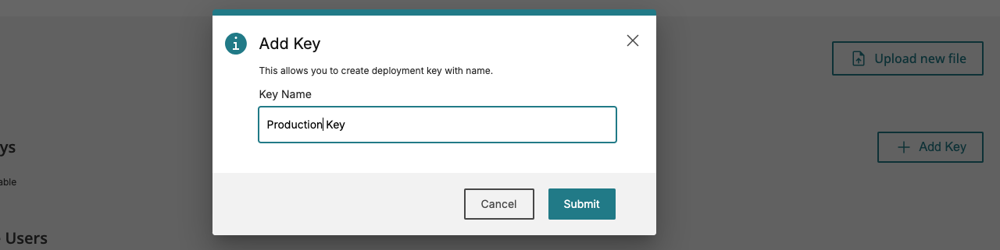
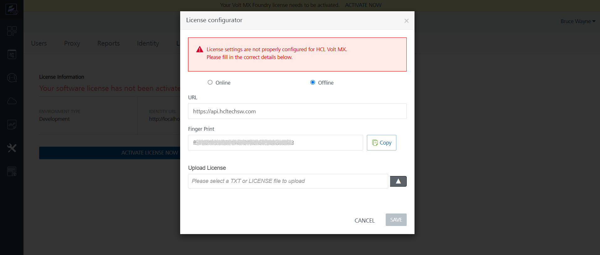
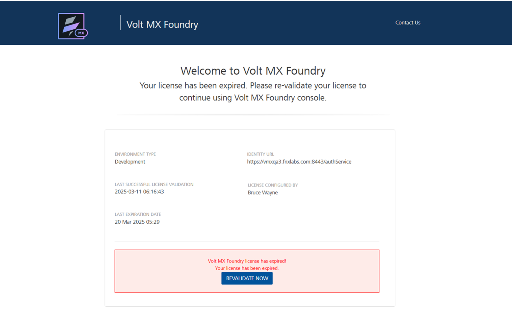

# Volt Foundry Licensing Guide  
**Applicable for Volt Foundry version 9.5.20.0 and onwards.** 

<h2>Overview</h2>
This document guides Volt Foundry administrators through the process of activating and managing licenses from the My HCLSoftware (MHS) Portal. The licensing feature enables the activation of your Volt Foundry instances and the tracking of license usage. An FAQ on the change in download and licensing can be found [here](https://support.hcl-software.com/csm?id=kb_article&sysparm_article=KB0119348){:target="_blank"}.

<h2>Prerequisites</h2>

Following are the prerequisites for activating the Volt Foundry instance:

* **My HCLSoftware (MHS) Portal Access:** You will need access to the [MHS Portal](https://my.hcltechsw.com/){:target="_blank"} to create deployment, deployment keys, manage license, etc. MHS uses the same HCLSoftware ID and single-sign on (SSO) system used for other portals such as the HCLSoftware Customer Support. Raise a request on the CRM portal to get access if needed.

* **Volt Foundry Permissions:** You will need the ‘owner’ role within Volt Foundry to perform license activation.

<h2>Deployment Creation and Allocation in MHS</h2>

Before licenses can be activated in Volt Foundry, a deployment must be created in MHS and entitlements allocated to that deployment. If you have already completed this step, you can go directly to the <a href="#la">License Activation instructions.</a>

A deployment allows you to allocate licenses to each specific environment (e.g., development, test, production, project, department, and so on). Each deployment has a unique Deployment Key that is required to activate the corresponding Volt Foundry instance.

You need to create a deployment in MHS to correspond to each instance of Volt Foundry you are deploying, including non-production instances. After creating a deployment, you must allocate all or a portion of your license entitlement to each instance.

> **_Note_** You must allocate at least one entitlement to each deployment (Foundry instance), even for non-production instances. This will reduce the number of available entitlements for your production instance in MHS. From a licensing standpoint, only the number of users or sessions for your production instance(s) will count against your licensed quantity of users, even if that exceeds what is allocated in MHS. There will be no interruption of services based on what is allocated in MHS.

<h3>Deployment Creation</h3>

1. Login to MHS

2. Click the **Deployments** tab

3. Click the **Add Deployment** tile. 

4. Enter a unique name for the deployment in the **Deployment Name** field. It is helpful to include the type of deployment (e.g., Volt MX-Dev, VoltMX-Prod) in the name.

5. Select the deployment type from the drop-down list.

6. Click **Add Deployment**

****

<h3>Allocating Entitlements</h3>

For each deployment, allocate all or a portion of users for the desired feature(s).

1. In MHS, select the **Deployment tab** and click on the **Deployment** tile that you would like to update.

2. Each deployment contains various features, which are identified by a Feature Name and Feature ID. Additionally, each feature has associated entitlements.

3. **Enter the number of licenses** you wish to allocate for each feature type in the **Allocated** field. 

4. As a reminder, each deployment must have at least one entitlement allocated. It is not necessary to have an allocation for every feature.

5. When complete, click the **Save all changes** button

> **_Note_** At this time it is not possible to allocate a number of sessions in MHS. If you have licensed Volt MX through a session-based part, including HCL Total Experience or the HCL Volt MX Add-On for Digital Experience Cloud Native, you will see an equivalent number of users associated with the feature. Please allocate the users in order to be able to activate the Volt Foundry instance. Session usage will be tracked by Volt Foundry and by MHS and that is what will be used when checking for license compliance.

<h3>Creating Deployment Key or License File</h3>

A deployment key (for online activation) or license file (for offline activation) must be created for each deployment to activate the corresponding Volt Foundry instance. The creation process will differ for online license activation and offline license activation.

<h4>Creating Deployment Key for Online License Activation</h4>

1. In MHS, select the **Deployment tab** and click on the **Deployment** tile that you would like to create a deployment key for.

2. Click the **Add Key** button.

3. Enter a **Key Name** to describe the key and click **Submit.**

4. The unique deployment key will be shown. **Copy and save the key** for use in activation. **Note:** You will not be able to retrieve the key again.****

<h4>Creating License File for Offline License Activation</h4>

1. In MHS, select the **Deployment tab.**

2. Click the three dots on the top right of the **Deployment** **tile** you would like a key for and select **Download License File.**  
   

3. Enter the **Fingerprint** generated from Volt Foundry. See **Offline License Activation** below for details on producing the fingerprint.

4. Click **Download** to download the license file.****

<h2 id="la">License Activation in Volt Foundry</h2>

Volt Foundry users can activate or revalidate their licenses. Volt Foundry supports online and offline methods for license activation.

<h3>Online License Activation</h3>

<h4>Pre-requisites</h4>
Before initiating an online license activation, ensure you have the following handy:

* **Deployment Key:** This licensing key is essential for authenticating the Volt Foundry instance with the MHS License Server. Generate this key from a deployment on the MHS Portal. (see **Creating Deployment Keys** above for instructions specific to Volt MX. Additional details are available in the [MHS documentation](https://help.hcl-software.com/myhclsoftware/topics/introduction.html){:target="_blank"}.)

<h4>To activate your license online:</h4>

1. In the Volt Foundry Console, navigate to the Licensing tab in Settings.

2. Click “ACTIVATE LICENSE NOW”

3. Select the "Online" activation mode in the License configurator dialog.

4. Enter the **Deployment Key**.

5. Save your settings to activate the license.

6. When activation is complete, you are redirected to the dashboard of your Volt Foundry Console. You can check your license information on the Licensing tab in Settings.

<h3>Offline License Activation</h3>

Offline license activation is used in instances where the Volt Foundry does not have direct internet access. This method involves generating a unique fingerprint from the Foundry Console, using that fingerprint to obtain a license file from MHS, and then uploading that file back into the Foundry Console.

<h4>Pre-requisites</h4>
The following is necessary for offline license activation:

* **Foundry Console Fingerprint:** The fingerprint is a unique identifier generated by the Foundry Console, and it is used to create the offline license file.

* **Offline License File:** This is a unique file for each Foundry instance that contains the necessary license token generated from the MHS using the fingerprint.

<h4>To activate the license offline:</h4>

1. In the Volt Foundry Console, navigate to the Licensing tab in Settings.

2. Click “ACTIVATE LICENSE NOW”

3. Select the "Offline" activation mode in the License configurator dialog.

4. The console will display a **Fingerprint**. Copy this Fingerprint.  

   

5. Transfer the Fingerprint to a system that can access the MHS License Server.

6. In MHS, use the copied Fingerprint to create an offline license file. (See **Creating License File for Offline License Activation** above for details on creating the License File on MHS.)

7. In the Volt Foundry Console, upload the license file you downloaded from the MHS Portal.   

   

8. Save your settings to activate the license.

9. When activation is complete, you are redirected to the dashboard of your Volt Foundry Console. You can check your license information on the Licensing tab in Settings.

   
   

<h2>License Revalidation</h2>

License revalidation is required when a license is **updated** or **renewed within** the grace period of **30-days from** **license expiry**.

<h3>Online License Revalidation</h3>

1. In the Volt Foundry Console, navigate to the Licensing tab in Settings.

2. Click ‘RE-VALIDATE’.

> **_Note_** License will get revalidated if there are no errors such as network issues, pre-requisites not met like valid entitlements unavailable in the deployment on the MHS Portal, etc. 

<h3>Offline License Revalidation</h3>

1. In the Volt Foundry Console, navigate to the Licensing tab in Settings.

2. Click ‘RE-VALIDATE’.

3. As with normal license activation, the license configurator dialog prompts you to supply the correct license configuration.

<h3>License Revalidation on Disabled Foundry Console</h3>

If your **license has expired** for more than 30 days, the Foundry Console becomes inaccessible and the license expired page is displayed. 

To activate the license, Click “REVALIDATE NOW”. 

As with normal license activation, the license configurator dialog prompts you to supply the correct license configuration. Upon saving the configuration, you will be redirected to the console dashboard and the Foundry Console is now enabled.

<h2>License Usage Reports</h2>

Volt Foundry provides the ability to report on license usage data. This helps you access and understand how your organization is utilizing the license using multiple metrics like sessions, total users, API calls monthly, devices monthly, etc. 

<h3>Online License Usage Reports</h3>

License usage data is automatically uploaded to the MHS Portal monthly.

<h3>Offline License Usage Reports</h3>

For offline instances, you can download a license usage report from the Volt Foundry Console. This report helps to analyse the usage data available whenever the report is uploaded to the MHS Portal.

<h4>To generate an offline license usage report:</h4>

1. In the Volt Foundry Console, navigate to the Licensing tab in Settings.

2. Select the option ‘Generate License Usage Report’ to generate a flat file containing the aggregated usage metrics.

3. Save the generated file, which will be in .metrics format.

4. Upload the file to the corresponding deployment on the MHS by clicking the “Upload new file” button of the deployment.

<h2>FAQ (Frequently Asked Questions)</h2>

*   **How do I find my Deployment Key?**  
    
    * See **Creating Deployment Keys** above for instructions specific to Volt MX. Additional details are available in the [MHS documentation](https://help.hcl-software.com/myhclsoftware/topics/introduction.html){:target="_blank"}.

*   **What happens when my license expires?**

    * When your license expires, an alert banner will appear, and you will have a 30-day grace period.
    * After this grace period, the Foundry Console will be inaccessible. 
    * Foundry Runtime continues to function, ensuring deployed apps and services are not impacted.
    * To restore access, renew the license and follow license revalidation steps to activate it.

*   **What is the MHS Portal?**

    * The My HCLSoftware (MHS) Portal is the online interface used to manage licenses of your HCLSoftware products. Through MHS, you can seamlessly manage downloads and license subscriptions, making it simpler to access and manage the licensing of your HCLSoftware products.

*   **What is a Deployment on MHS Portal?**  
    
    * A deployment is a set of allocated licensed features, created to separate licenses by environment, project, or department. Each deployment has a unique ID, required for configuring product license information.
    * Each deployment requires a name and a type. The type determines the available features and functionality for the deployment. 

*   **What is Feature Allocation in an MHS Deployment?**  
    
    * Feature allocation assigns licenses to deployment features, identified by a Feature Name and ID. Entitlements define allocations, and once allocated, licenses can be assigned to users within the available limit.

*   **What is a Deployment Key?**  
  
    * A unique deployment key is generated for each deployment to ensure secure installation and configuration. Acting as an access code, it restricts deployment to authorized systems, preventing unauthorized installations. This key helps manage and track deployments accurately while adding a security layer to ensure proper configuration.

*   **Who should I contact for license support?**

    * For license-related issues, contact your MHS license administrator or HCLSoftware Customer Support.

<h2>Troubleshooting</h2>

*   **Invalid Deployment Key:**  
    
    * Verify that the Deployment Key is accurate and has not expired. Also verify that it is not already being used.
    * If you continue to experience this error, contact MHS license administrator or HCLSoftware Customer Support.

*   **License File Upload Failed (Offline Activation):**  

    * Verify that the license file was generated using the correct Fingerprint.
    * Ensure that you have selected the correct license file.
    * If the upload fails repeatedly, contact MHS license administrator or HCLSoftware Customer Support.

*   **Connectivity Issues with the MHS License Server (Online Activation):**   
    
    * Check your network connection to ensure that you can reach the MHS License Server.
    * Ensure that the following URLs and whitelisted and/or reachable from Volt Foundry:

        * [my.hcltechsw.com](http://my.hcltechsw.com)
        * [my.hcl-software.com](http://my.hcl-software.com)
        * [api.hcltechsw.com](http://api.hcltechsw.com)
        * [api.hcl-software.com](http://api.hcl-software.com)
        * [cdn.hcltechsw.com](http://cdn.hcltechsw.com)
        * [cdn.hcl-software.com](http://cdn.hcl-software.com)
        * [cls.hcl-software.com](http://cls.hcl-software.com)

    * Verify that there are no firewall rules blocking communication with the MHS License Server.
    * Contact your network administrator if you suspect network connectivity issues.
