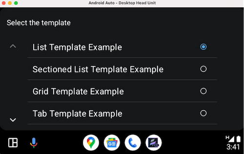
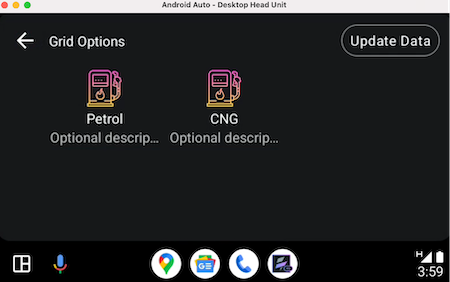
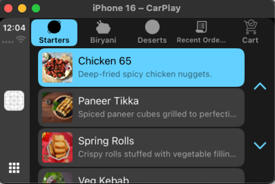
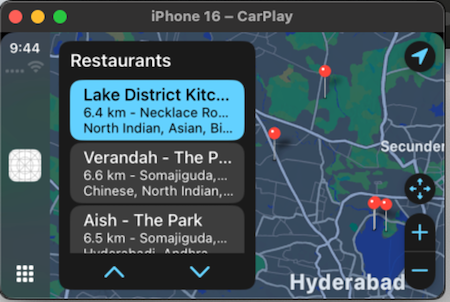

## voltmx.auto.CarForm

CarForm represents one form and is instantiable like a form, but it is not considered a widget. Widgets have customizable properties, while forms have predefined templates and cannot be customized.  

CarForm exposes an API to attach the template to the form. Below is how we can create a screen instance and attach the template to it.

<b>CarForm Lifecycle</b>

Below are the lifecycle events and their explanation.

* **Init:** This event gets executed immediately when the show API on carform is called.  
* **preShow:** This event gets executed when the car form is about to be visible on screen.  
* **postShow:** This event gets executed immediately after the car screen is visible on the screen.  
* **onHide:** This event gets called when the car form goes out of the screen.  A car can go out of the screen when another form is to be shown.

**Lifecycle Diagram**  


<b>JS Specifications</b>

 The below snippet creates a CarForm holding ListTemplate as the root template. 

```javascript
//Eg: List Template
var dessertsTemplate = new voltmx.auto.ListTemplate({
"id" : "dessertsTemplate",
"title" : "Dessert list",
"data" : [
            {
                "title": "Gulab Jamun",
                "image": "gulab_jamun.jpg",
                "description": "Sweet dumplings soaked in sugar syrup."
            },
            {
                "title": "Rasmalai",
                "image": "rasmalai.jpg",
                "description": "Soft cheese patties in sweetened milk."
            }
],
"onRowClick" : function(eventobject,rowIndex,sectionIndex){
}
});
var carform1 = new voltmx.auto.CarForm({
	"id" : "carform1",
	"template" : dessertsTemplate,//Constructor level property
	"init" : function(){
	,
	"preShow" : function(){
	},
	"postShow" : function(){
	,
	"onHide" : function(){
	,
	"onDestroy" : function(){
		// only available for Android.
	} 
});
```

> **_Note_**: Every Template is a screen level widget. Any CarForm can hold only a single template.


<b>Properties</b>

<details close markdown="block"><summary>id</summary>
* * *

<b>Type</b>

String


<b>Description</b>

The unique identifier for the car form. This ID is used to reference the specific car form instance.

* * *
</details>


<details close markdown="block"><summary>template</summary>
* * *

<b>Type</b>

Object


<b>Description</b>

A constructor level property that is mandatory for creating a car form instance. You must pass the template object to be attached to the car form template to create the instance of the carform.

* * *
</details>


<details close markdown="block"><summary>preShow</summary>
* * *

<b>Type</b>

Callback


<b>Description</b>

A callback function that is executed before the car form is shown.

<b>Parameters</b>

None

* * *
</details>


<details close markdown="block"><summary>postShow</summary>
* * *

<b>Type</b>

Callback


<b>Description</b>

A callback function that is invoked after the car form is shown.

<b>Parameters</b>

None

* * *
</details>  


<details close markdown="block"><summary>onHide</summary>
* * *

<b>Type</b>

Callback


<b>Description</b>

A callback function that is triggered when the car form is hidden. This could happen when navigating away from the form, closing the form.

<b>Parameters</b>

None

* * *
</details>  


<details close markdown="block"><summary>onDestroy</summary>
* * *

<b>Type</b>

Callback


<b>Description</b>

A callback function that is executed when the car form is destroyed.

<b>Parameters</b>

None

* * *
</details>  


<details close markdown="block"><summary>onDestroy</summary>
* * *

<b>Type</b>

Callback


<b>Description</b>

A callback function that is executed when the car form is destroyed.

<b>Parameters</b>

None

* * *
</details>


<b>Methods</b>


<details close markdown="block"><summary>show</summary>
* * *

<b>Description</b>

Displays the form on which the method is invoked.

<b>Parameters</b>

None

<b>Return Value</b>

None

<b>Platform Support</b>

iOS and Android

* * *
</details>


<details close markdown="block"><summary>setAsRootForm</summary>
* * *

<b>Description</b>

Sets the current form as the root form, clearing all other forms from the navigation stack.

<b>Parameters</b>

None

<b>Return Value</b>

None

<b>Platform Support</b>

iOS and Android

* * *
</details>


<details close markdown="block"><summary>close</summary>
* * *

<b>Description</b>

Closes the current Form and removes it from the stack.  

> **_Note_**: if the Form is the only CarForm present on the stack it will not be closed and this close request will be ignored.  

<b>Parameters</b>

None

<b>Return Value</b>

None

<b>Platform Support</b>

Android

* * *
</details>


## Templates

<b>Overview</b>

CarApps on Android and iOS have fixed UIs defined for different use cases. You cannot alter or reposition the UI elements can not be altered or repositioned. You can only attach data to the UI.

These fixed sets of UI elements are called templates.

Each template has its own properties, explained in this section.

<b>Supported Templates</b>

Currently, Volt MX supports these templates.

* List  
* Grid  
* Tab  
* Point of Interest   
* Alert  
* ActionSheet  
* Information  
* Message  
* LongMessage  
  


> **_Note_**: Other templates will also be supported in future versions.  


<details close markdown="block"><summary>List Template</summary>
* * *

The list template provides a versatile method for displaying scrollable collections of items within a car application. It can present these items either as a unified, continuous list or segmented into distinct sections, offering flexibility in organizing information. 

This template is particularly effective for user interfaces that require presenting a series of selectable options or informational entries in a clear and easily navigable manner suitable for drivers.   
Common use cases include displaying application menus with various features and settings, presenting a list of contacts for communication, offering a set of navigation destinations or points of interest, showcasing the results of a user's search query, and generally presenting any collection of items that the user needs to browse and potentially interact with. The interactive nature of the list template allows drivers to easily scroll through the displayed items and select the desired option, contributing to a safer and more user-friendly in-car experience. 

The design prioritizes ease of use and legibility, ensuring that drivers can quickly find and select information without being overly distracted from the primary task of driving.

**Android Auto**




**Apple CarPlay**

  


**`id` \[Read Only\] \[Mandatory\]**  
**Type:** String   
**Description:** The unique identifier for the template.  
**Platform Support**: Available in iOS and Android Platforms.

**`title`** \[Read and Write\]  
**Type:** String   
**Description:** A String which represents the title of the template.  
**Platform Support**: Available in iOS and Android Platforms.

**`leftTitleBarButtons`** \[Read and Write\]  
**Type:** Array of objects (BarButton)  
**Description:** This property defines the buttons displayed on the **left side** of the title bar. A maximum of two buttons can be configured for iOS CarPlay. Any additional buttons in the array will be ignored. Android Auto does not respect this property and will ignore it. The buttons configured here will not appear in Android Auto.  
**Platform Support**: Available only in iOS.

**`rightTitleBarButtons`**  \[Read and Write\]  
**Type:** Array of objects (BarButton)  
**Description:** This property defines the buttons displayed on the **right side** of the title bar.  
***iOS***  
A maximum of two buttons can be set for iOS CarPlay.  
***Android***  
Of the two allowed buttons, one can contain text and an icon. The other can have only an icon.
Any additional buttons in the array will be ignored.  
**Platform Support**: Available in iOS and Android Platforms.

**`data`** \[Read and Write\]  
**Type:** An array of rows.  
**Description:** These rows can optionally have **headers**. The structure of the data is explained below.  
**Platform Support**: Available in iOS and Android Platforms.

Each Row consists of below properties:

**`isEnabled`**  
**Type:** Boolean  
**Description:** Boolean which tells whether a row is enabled or disabled.

**`title`**  
**Type:** String  
**Description:** represents title of the row.

**`description`**  
**Type:** String  
**Description:** represents the description of the row.

**`image`**  
**Type:** String  
**Description:** Contains the name of the image.

Each Header has the following properties:

**`title`**    
**Type:** String  
**Description:** The title of the header under which the rows are grouped  


<blockquote><b><i>Note: </i></b>
<ul>
<li><b>For Carplay iOS devices</b>- The recommended image sizes for List Item are typically <b>80x80</b> pixels for regular resolution and <b>120x120</b> pixels for high-resolution (Retina) displays. For other sizes, the system will automatically scale the images.</li>
<li><b>For Android Auto</b>- To minimize scaling artifacts across a wide range of car screens, apps should provide images targeting a 88 x 88 dp bounding box. If necessary, the image will be scaled down while preserving its aspect ratio.</li>
</ul>
</blockquote>


**`onRowClick` \[**Read and Write\]  
**Type:** CallBack  
**Description: callback function** that executes when a row is clicked. The function consists of 3 parameters: listTemplate, rowIndex and sectionIndex.

Available in iOS and Android Platforms.

> **_Note_**: sectionIndex would be 0, if the ListTemplate does not contain sections.

Example:

```
//Eg: List Template
var desertsTemplate = new voltmx.auto.ListTemplate({
"id" : "desertsTemplate",
"title" : "Desert list",
"data" : [
            {
                "title": "Gulab Jamun",
                "image": "gulab_jamun.jpg",
                "description": "Sweet dumplings soaked in sugar syrup."
            },
            {
                "title": "Rasmalai",
                "image": "rasmalai.jpg",
                "description": "Soft cheese patties in sweetened milk."
            }
],
"onRowClick" : onRowClick
});


function onRowClick(eventobject,rowIndex,sectionIndex){


}
```

**`enableBackButton` \[**Read Only\]  
**Type:** Boolean  
**Description:** This property displays a back button at the top-left corner of the screen for back navigation on Android. The back action pops the current screen from the navigation stack. If the screen is the only one in the stack, the back action is ignored.  
**Platform Support**: Available only on Android.

**Methods:**

`setData(data)`  
**Description:** Sets the data to the template  
**Parameters:** Array of row data (either with or without headers).  
**Return Value:** None

**Constructor:**

```javascript
var list = new voltmx.auto.ListTemplate({
        "id" : "list",
        "title" : "Music list",
        "data" : data,
        "onRowClick" : onRowClick,
        "leftTitleBarButtons" : [barButtonTitle],
        "rightTitleBarButtons" : [barButtonImage],
	  "enableBackButton": true //Android specific	
    });
// Definition of BarButton
var barButtonTitle = new voltmx.auto.BarButton({
    "type":constants.BAR_BUTTON_TITLE,
    "action":function(){
        voltmx.print("clicked on title bar button item");
    },
    "title":"play",
    "isEnabled" : true,
    "image":"play.png",
});

var barButtonImage = new voltmx.auto.BarButton({
    "type":constants.BAR_BUTTON_IMAGE,
    "action":function(){
        voltmx.print("clicked on image bar button item");
    },
    "title":"play",
    "image":"play.png",
    "isEnabled" : true
});

```

**Rows without section:**

```javascript
var data = [
            {
                "title": "Jai Balayya Mass Anthem",
                "image": "jaibalayya.jpg",
                "description": "Song from VeeraSimhaReddy",
                “isEnabled”: true
            },
            {
                "title": "Tiger ka Hukum",
                "image": "hukum.webp",
                "description": "Song from Jailer”,
                  “isEnabled”: true
             }
        ];
```

**Rows with section:**

```javascript
 
var data = [
    [
        {
            "title": "Top Hits"
        },
        [
            {
                "title": "Jai Balayya Mass Anthem",
                "image": "jaibalayya.jpg",
                "description": "Song from VeeraSimhaReddy",
                “isEnabled”: true
            },
            {
                "title": "Tiger ka Hukum",
                "image": "hukum.webp",
                "description": "Song from Jailer”,
                  “isEnabled”: true
             }
        ]
    ],
   [
        {
            "title": "Top Hits"
        },
        [
            {
                "title": "Jai Balayya Mass Anthem",
                "image": "jaibalayya.jpg",
                "description": "Song from VeeraSimhaReddy",
                “isEnabled”: true
            },
            {
                "title": "Tiger ka Hukum",
                "image": "hukum.webp",
                "description": "Song from Jailer”,
                  “isEnabled”: true
             }
        ]
    ]
]
```

* * *
</details>


<details close markdown="block"><summary>Grid Template</summary>
* * *

The grid template arranges content items in a visually organized, multi-column structure. This layout is particularly effective when visual recognition plays a key role in user decision-making. 

By showcasing items with accompanying images, users can quickly scan and identify their desired selection based on visual cues. This approach is beneficial for applications where product browsing, media selection, or icon-based navigation are primary use cases.   
The clear and structured presentation of the grid enhances the user experience by providing an easily digestible overview of available options, reducing the need for extensive text descriptions. 

This template prioritizes visual appeal and efficient information retrieval through imagery.

**Android Auto**




**Apple Carplay**


**`id`** \[Read Only\] \[Mandatory\]    
**Type:** String   
**Description:** The unique identifier for the template.  
**Platform Support**: Available in iOS and Android Platforms.

**`title`** \[Read and Write\]  
**Type:** String   
**Description:** A String which represents the title of the template.  
**Platform Support**: Available in iOS and Android Platforms.

**`leftTitleBarButtons`** \[Read and Write\]  
**Type:** Array of objects (BarButton)  
**Description:** This property defines the buttons displayed on the **left side** of the title bar. A maximum of two buttons can be configured for iOS CarPlay. Any additional buttons in the array will be ignored. 
**Platform Support**: Available only in iOS.

**`rightTitleBarButtons`**  \[Read and Write\]  
**Type:** Array of objects (BarButton)  
**Description:** This property defines the buttons displayed on the right side of the title bar. A maximum of two buttons can be set for iOS CarPlay and Android Auto. For Android Auto, of the two allowed, one can contain text and an icon, while the other button can have only an icon.   
**Platform Support**: Available in iOS and Android Platforms.

**`data`** \[Read and Write\]  
**Type:** An array of grids.  
**Description:** The data to be set for GridTemplate. The structure of the data is explained below.  
**Platform Support**: Available in iOS and Android Platforms.

Each Row consists of below properties:

**`title`** \[Mandatory on Android\]  
**Type:** String  
**Description:** represents title of the row.

**`image`** \[Mandatory on Android\]  
**Type:** String  
**Description:** contains the name of the image.

**`text`** \[Available only on Android\]   
**Type:** String  
**Description:** represents optional description text which can be displayed under grid item.

**`onGridItemClick`** \[Read and Write\]  
**Type:** CallBack  
**Description:**A callback function triggered when a grid item is clicked. It accepts two parameters: the `gridTemplate` instance and the data associated with the clicked grid item.  
**Platform Support**: Available in iOS and Android Platforms.  

**`enableBackButton`**\[Read Only\]  
**Type:** Boolean  
**Description:** This property displays a back button at the top-left corner of the screen for back navigation on Android. The back action pops the current screen from the navigation stack. If the screen is the only one in the stack, the back action is ignored.  
**Platform Support**: Available only on Android.

**Methods:**

**`setData(data)`**     
**Description:** Sets the data to the template.  
**Parameters:** Array of grid items.  
**Return Value:** None


<blockquote><b><i>Note: </i></b>
<ul>
<li>For Carplay iOS devices - The recommended image sizes for Grid Icon are typically <b>80x80</b> pixels for regular resolution and <b>120x120</b> pixels for high-resolution (Retina) displays. For other sizes, the system will automatically scale the images.</li>
<li>For Android Auto - To minimize scaling artifacts across a wide range of car screens, apps should provide images targeting a <b>128x128</b> dp bounding box. If necessary, the image will be scaled down while preserving its aspect ratio.  </li>
<li>Currently, CarApp only supports bundled images.</li>
</ul>
</blockquote>  


**Grid Array**

```javascript
var gridItems = [
    {
        title: "Rasmalai",
        image: " rasmalai.jpg"
    },
    {
        title: "Gulabjamun",
        image: "gulab_jamun.jpg"
    }
];
```

**Grid Template Constructor**

```javascript
var gridTemplate = new voltmx.auto.GridTemplate({
        "id" : "gridTemplate"
        "title" : "Options Screen",
        "data" : gridItems,
        "onGridItemClick" : Callback, //callback consists selected Grid in param.
        "leftTitleBarButtons" : [barButtonTitle],
        "rightTitleBarButtons" : [barButtonImage],
	  "enableBackButton" : true //Android specific property
    });
```


* * *
</details>


<details close markdown="block"><summary>Tab Template</summary>
* * *  

The Tab template is a versatile container for other CarApp templates, enabling smooth navigation between different templates. 

This tabbed interface organizes extensive information or functionalities into accessible categories, allowing users to easily switch between them for efficient browsing and focused interaction. 

The Tab template improves user experience by reducing clutter and presenting information logically, making it easier for drivers to find and use features with minimal distraction. 


**iOS CarPlay**  




**Android Auto**  


**id** \[Read Only\] \[Mandatory\]

**Type:** String   
**Description:** The unique identifier for the template.  
**Platform Support**: Available in iOS and Android Platforms.

**tabs** \[Read and Write\] \- \[Mandatory\]

**Type:** List<Tabs\>  
**Description:** List of tabs to show on the template.  
**Platform Support**: Available in iOS and Android Platforms.

<blockquote><b><i>Note: </i></b>
<ul>
<li>iOS: The maximum number of tabs allowed is 5</li>
<li>Android: The maximum and minimum number of tabs allowed are 4 and 2 respectively. </li>
</ul>
</blockquote>

**Tab**  
Below are the properties of a single tab item

**“tabID” :**  String \- Id of the tab in String format. \[Mandatory\]  
“**template**”: JSObject \- object of the template. \[Mandatory\]  
**“title”**: String \- title of the tab.  
**“image” \-** Image for the Tab. 

<blockquote><b><i>Note: </i></b>
<ul>
<li>For Carplay iOS devices - The supported image sizes for Tab are typically <b>48x48</b> pixels for regular resolution and <b>72x72</b> pixels for high-resolution (Retina) displays.</li>
<li>For Android Auto - To minimize scaling artifacts across a wide range of car screens, apps should provide icons targeting a <b>36x36</b> dp bounding box. If the icon exceeds this maximum size in either one of the dimensions, it will be scaled down to be centered inside the bounding box while preserving its aspect ratio.</li>
</ul>
</blockquote>

**Methods**

**setTabs(tabs<List\>)** \- Sets the list of tabs to be displayed. If there are existing tabs added, those will be cleared out. Only four tabs can be displayed.

**setSelectedTab(tabId)** \- Takes the TabId as an input and sets it as an active tab. If the tab id does not match the error will be thrown.  
> **_Note_**:  For iOS, it is available only from iOS 17.0 and above devices.

**Callbacks**

**onTabSelected(eventObject: TabTemplate , tab: Tab)** \- this callback will be invoked when the particular tab is selected and it returns the selected Tab.

**Tabs Array**

```javascript
 
var tabs = [
        {
           	"tabId": "Music",
		"template": listTemplate, //Constructor property, instance of the supported template
"title": "Music",
              "image": "music.jpg"

        },
 	{
           	"tabId": "Albums",
		"template": gridTemplate, //Constructor property, instance of the supported template 
"title": "Pics",
              "image": "album.jpg"

        }
     ]
```

**Tab Template Constructor**

```javascript
var tabTemplate = new voltmx.auto.TabTemplate({
	"id":"tabTemplate",
        "tabs" : tabs, // constructor level property, see the definition of tabs array above.
        "onTabSelected" : Callback //callback consists selected tab in param.
    });

```

* * *
</details>


<details close markdown="block"><summary>Point of Interest Template</summary>
* * *  

The Android Auto POI Template is a key component for in-car location and navigation apps. It helps users easily find and navigate to places like restaurants and gas stations by presenting nearby or searched locations in a dual-pane layout with a POI list and a map.

This streamlines destination selection, minimizing driver distraction. The template provides a structured way to display essential POI details like name, address, and distance. 

The integrated map offers visual context and interactive selection of POIs. Overall, it's a versatile tool for developers to create user-friendly and safe in-car location-based experiences.

**Apple CarPlay**

   


**Android Auto**


**Permission for Android Auto** : For Android auto to use this template below permission must be added to manifest. 

**<uses-permission android:name="androidx.car.app.MAP\_TEMPLATES" /\>**

The above permission can be added through Iris by below steps

Project Settings \-\> Native \-\> Android Mobile/Tablet \-\> Tags \-\> Child tag entries under <manifest\> tag 

**`id` \[Read Only\] \[Mandatory\]**  
**Type:** String   
**Description:** The unique identifier for the template.  
**Platform Support**: Available in iOS and Android Platforms.

**`title`** \[Read and Write\]  
**Type:** String   
**Description:** A String which represents the title of the template.  
**Platform Support**: Available in iOS and Android Platforms.

**`leftTitleBarButtons`** \[Read and Write\]  
**Type:** Array of objects (BarButton)  
**Description:** This property defines the buttons displayed on the **left side** of the title bar. A maximum of two buttons can be configured for iOS CarPlay. Any additional buttons in the array will be ignored. 
**Platform Support**: Available only in iOS.

**`rightTitleBarButtons`**  \[Read and Write\]  
**Type:** Array of objects (BarButton)  
**Description:** This property defines the buttons displayed on the **right side** of the title bar. A maximum of two buttons can be set for iOS CarPlay and a maximum of four buttons can be set on Android Auto. Each button can contain either text or an image, but not both.
**Platform Support**: Available in iOS and Android Platforms.

**`enableBackButton` \[**Read Only\]  
**Type:** Boolean  
**Description:** This property displays a back button at the top-left corner of the screen for back navigation on Android. The back action pops the current screen from the navigation stack. If the screen is the only one in the stack, the back action is ignored.  
**Platform Support**: Available only on Android.

**onDataRefresh \[**Read and Write\]

**Type:** Callback  
**Description:** This property when set enables the refresh button on POITemplate and upon clicking on it the configured callback will be fired to the JS layer. This is helpful if the data needs to be refreshed on POITemplate.   
**Platform Support**: Available only on Android.

“**data**”: An array of map annotations, which are also represented as items in a scrollable picker overlaid on the map. Users can interact with the picker to navigate between annotations, enhancing the map’s functionality and enabling seamless location selection.  
Read and Write

Each Row consists of below properties:

**`title`**   \[Mandatory on Android\]  
**Type:** String  
**Description:** represents the title of the item.

**`subtitle`**  
**Type:** String  
**Description:** represents the subtitle of the item.

**`summary`**  
**Type:** String  
**Description:** represents the summary of the item.

**`location`**   \[Mandatory on Android\]  
**Type:** Dictionary  
**Description:** A dictionary containing the latitude and longitude.

**`detailTitle`**  
**Type:** String  
**Description:** The title displayed on the detail card, providing a brief and clear label for the content of the card.If no specific detailTitle is provided, this field will be populated with the default item for the item.  
> **_Note_**:  This key is only available for iOS. 

**`detailSubtitle`**  
**Type:** String  
**Description:** The subtitle shown beneath the detail card's title, offering additional context or clarification for the content.  If no specific detailSubtitle is provided, this field will be populated with the default subtitle for the item.  
> **_Note_**:  This key is only available for iOS.

**`detailSummary`**  
**Type:** String  
**Description:** A short summary displayed within the detail card, providing an overview or description of the item or location.  If no specific summary is provided, this field will be populated with the default summary for the item.  
> **_Note_**:  This key is only available for iOS.

**actions**  
**Type:** Array of dictionaries containing title and action.   
**Description:** A collection of actions that can be performed from the detail card or any other interface element. Each action consists of a title (the label of the action) and an action (the specific operation or function triggered by selecting the action)

> **_Note_**:  Maximum of only two actions can be set to POITemplate. **Android supports only**            
**first action which will be mapped to the rowClick listener, the second action will be**   
**ignored by Android.**  


Each dictionary contains the below keys:

* **`Title` \[iOS specific\]**  
  **Type:** String  
  **Description:** represents the title of the item.

* **`action`**  
  **Type:** Caback

  **Description:** represents the action which gets invoked when the user taps on the item.


  
**Constructor:**

```javascript
var poiTemplate = new voltmx.auto.POITemplate({
    "id" : "restaurantTemplate",
    "title":"Restaurants",
    "data" : [{
          "location": {
              "latitude": 17.4311,
              "longitude": 78.4742
          },
          "title": "Lake District Kitchen",
          "subtitle": "6.4 km - Necklace Road, Secunderabad, Hyderabad",
          "summary": "North Indian, Asian, Biryani, Fast Food, Bar Food, Seafood, Desserts",
          "detailTitle": "Lake District Kitchen",
          "detailsSubtitle": "6.4 km - Necklace Road, Secunderabad, Hyderabad",
          "detailSummary": "North Indian, Asian, Biryani, Fast Food, Bar Food, Seafood, Desserts",
     	   "actions" : [
{
             		"title": "Order Online",
             "action": orderOnlineFood
       },
{
             		"title": "Directions",
             "action": gotoRestaurantLocation
}
    ] 
    }],
    "leftTitleBarButtons" : [barButtonTitle],
    "rightTitleBarButtons" : [barButtonImage],
     "enableBackButton": true //Android specific
});

```

* * *
</details>


<details close markdown="block"><summary>Alert Template</summary>
* * *

> **_Note_**:  This template is available only for the iOS platform.  

This template is used to communicate important information to the user, such as warnings or confirmations.

**Alert template Example** 


**`id` \[Read Only\] \[Mandatory\]**  
**Type:** String   
**Description:** The unique identifier for the template.  
**Platform Support**: Available in iOS Platform.

**`title`** \[Read and Write\]  
**Type:** String   
**Description:** A String which represents the title of the template.  
**Platform Support**: Available in iOS Platform.

**`actions`** \[Read and Write\] \- \[Mandatory\]  
**Type:** Array of dictionaries containing title,style and action.  
**Description:** A collection of actions that can be performed from the Alert. Each action consists of a title (the label of the action), style and an action (the specific operation or function triggered by selecting the action)  

Each dictionary contains the below keys:

**`title`**  
**Type:** String  
**Description:** represents the title of the item.

**`Style`**  
**Type:** Constant  
**Description:** represents the style of the action item on alert. The possible values are 

* `constants.ACTION_ITEM_STYLE_DEFAULT`   
  * `constants.ACTION_ITEM_STYLE_CANCEL`   
  * `constants.ACTION_ITEM_STYLE_DESTRUCTIVE`   
    

  **`callback`**  
  **Type:** Function  
  **Description:** represents the action which gets invoked when the user taps on this item.

**Methods:**

**`show`**   
**Description:** displays alert on the car screen.  
**Parameters:** None.  
**Return Value:** None

**Constructor:**

```javascript
var alertTemplate = new voltmx.auto.AlertTemplate({
    "id" : "alertTemplate",
    "title": "Add Item",
    "actions": [
      {
        "title": "Yes,
        "style": constants.ACTION_ITEM_STYLE_DEFAULT,
        "callback": alertAction
      },
      {
        "title": "No",
        "style": constants.ACTION_ITEM_STYLE_CANCEL,
        "callback": dismissAction
      },
      {
        "title": "Cancel",
          "style": constants.ACTION_ITEM_STYLE_DESTRUCTIVE,
        "callback": dismissAction
      }
    ]
  });
alertTemplate.show()
```

* * *
</details>


<details close markdown="block"><summary>ActionSheet Template</summary>
* * *

> **_Note_**: This template is available only for the iOS platform.

**ActionSheet template example**


**`id` \[Read Only\] \[Mandatory\]**  
**Type:** String   
**Description:** The unique identifier for the template.  
**Platform Support**: Available in iOS Platform.

**`title`** \[Read and Write\]  
**Type:** String   
**Description:** A String which represents the title of the template.  
**Platform Support**: Available in iOS Platform.

**`message`** \[Read and Write\]  
**Description:** A message which needs to be shown on the template.  
**Platform Support**: iOS Platform.

**`actions`** \[Read and Write\] \- \[Mandatory\]  
**Type:** Array of dictionaries containing title, style, and action. 
**Description:** A collection of actions that can be performed from the Alert. Each action consists of a title (the label of the action), style and an action (the specific operation or function triggered by selecting the action).  

Each dictionary contains the below keys:  

**`title`**  
**Type:** String  
**Description:** represents the title of the item.

**`Style`**  
**Type:** Constant  
**Description:** represents the style of the action item on alert. The possible values are 

* `constants.ACTION_ITEM_STYLE_DEFAULT`   
  * `constants.ACTION_ITEM_STYLE_CANCEL`   
  * `constants.ACTION_ITEM_STYLE_DESTRUCTIVE`   
    

  **`callback`**  
  **Type:** Function  
  **Description:** represents the action which gets invoked when the user taps on this item.

**Methods:**

**`show`**   
**Description:** displays ActionSheet on the car screen.  
**Parameters:** None.  
**Return Value:** None

**Constructor:**

```javascript
var actionSheetTemplate = new voltmx.auto.ActionSheetTemplate({
    "id" : "actionSheetTemplate",
    "title" : "Make Call",
    "message": "Do you want to call? this will navigate you to the dialer app",
    "actions": [
      {
        "title": "Action 1",
        "style": constants.ACTION_ITEM_STYLE_DEFAULT,
        "callback": alertAction
      },
      {
        "title": "Action 2",
        "style": constants.ACTION_ITEM_STYLE_CANCEL,
        "callback": dismissAction
      },
      {
        "title": "Action 3",
         "style": constants.ACTION_ITEM_STYLE_DESTRUCTIVE,
        "callback": dismissAction
      }
    ]
  });
actionSheetTemplate.show()
```

* * *
</details>
 

<details close markdown="block"><summary>Information Template</summary>
* * *

> **_Note_**:  This template is available only for the iOS platform.

Information templates present users with a list of items and up to three possible actions.

These templates are useful for displaying informative and actionable content. For instance, you could show a summary of a user's food order along with options to place or cancel it.

**Information template example**


**`id` \[Read Only\] \[Mandatory\]**  
**Type:** String   
**Description:** The unique identifier for the template.

**`title`** \[Read and Write\]  
**Type:** String   
**Description:** represents the title of the template.

**`layoutType`** \[Read Only\]  
**Type:** Constant  
**Description:** represents the layout type of a template. The possible values are 

* `constants.INFO_TEMPLATE_LAYOUT_LEADING`  
  * `constants.INFO_TEMPLATE_LAYOUT_TWOCOLUMN`  
    

**`data`** \[Read and Write\]:  
 An array of dictionaries contains information items with item type, title, detail, rating and maximumRating.

Two types of information items are : Default item , Rating item.  
To define this, have this as one of the keys (type) in the dictionary.

* `constants.INFO_TEMPLATE_ITEM_DEFAULT`  
  * `constants.INFO_TEMPLATE_ITEM_RATING`

If a rating item has to be defined, type should be mentioned as `constants.INFO_TEMPLATE_ITEM_RATING` along with title, detail, rating and maximumRating should be defined.  
            
 **`type`**  
 **Type:** Constant  
 **Description:** represents the type of information item <br>
 `constants.INFO_TEMPLATE_ITEM_RATING`

 **`title`:**  
 **Type:** String  
 **Description:** represents the title of the item.

 **`detail`**  
 **Type:** String  
 **Description:** represents the detailed description of the item.

 **`rating`**  
 **Type:** Number  
 **Description:** represents rating of the item.  
> **_Note_**:  This value is between 1 to 5.. Beyond this value also shows up to 5 only.

 **`maximumRating`**  
 **Type:** Number  
 **Description:** represents maximum rating of the item.  
> **_Note_**:  This value is between 1 to 5.. Beyond this value also shows up to 5 only.

If a default item has to be defined, type should be mentioned as `constants.INFO_TEMPLATE_ITEM_DEFAULT` along with title, detail should be defined.  

  **`title`**  
  **Type:** String  
  **Description:** represents the title of the item.

  **`Detail`**  
  **Type:** String  
  **Description:** represents the detailed description of the item.  

> **_Note_**:   
The template can display 10 items maximum. If the array contains more items, the template uses only the first 10.

**`leftTitleBarButtons`** \[Read and Write\]  
**Type:** Array of objects (BarButton)  
**Description:** This property defines the buttons displayed on the **left side** of the title bar. A maximum of two buttons can be configured for iOS CarPlay. Any additional buttons in the array will be ignored.   
**Platform Support**: Available only in iOS.

**`rightTitleBarButtons`**  \[Read and Write\]  
**Type:** Array of objects (BarButton)  
**Description:** This property defines the buttons displayed on the **right side** of the title bar. A maximum of two buttons can be set for iOS CarPlay and Android Auto.   
**Platform Support**: Available in iOS and Android Platforms.

**`actions`**  
**Type:** Array of dictionaries containing title, style and action.   
**Description:** A collection of actions that can be displayed under the information item list. Each action consists of a title (the label of the action), textStyle(the style of the action) and  an action (the specific operation or function triggered by selecting the action)  
> **_Note_**:  Maximum of three actions can be set to InformationTemplate.

Each dictionary contains the below keys:

  * **`title`**  
    **Type:** String  
    **Description:** represents the title of the action..  
    
  * **`style`**  
    **Type:** Constant  
    **Description:** represents the style of the action.  

  * **`action`**  
    **Type:** Callback  
    **Description:** represents the action which gets invoked when the user taps on the item.The possible values are   
    * `constants.ACTION_STYLE_NORMAL`  
    * `constants.ACTION_STYLE_CANCEL`  
    * `constants.ACTION_STYLE_CONFIRM`

**Constructor:**

```
var informationTemplate = new voltmx.auto.InformationTemplate({
    "id": "infoTemplate",
    "title": "Binay Bihari Restaurant",
    "layoutType": constants.INFO_TEMPLATE_LAYOUT_TWOCOLUMN,
     "data": [
      {
        "type": constants.INFO_TEMPLATE_ITEM_RATING,
        "title": "Aloo Paratha",
        "detail": "Yummy!!! Flavorful",
        "rating": 4,
        "maximumRating: 5
      },
      {
        "type": constants.INFO_TEMPLATE_ITEM_RATING,
        "title": "Punjabi Paneer",
        "detail": “Delicious”,
        "rating": 3,
        "maximumRating": 5
      },
      {
        "type": constants.INFO_TEMPLATE_ITEM_DEFAULT,
        "title": "Daal Bhaat Bhujiya",
        "detail": “Yummy!!! Flavorful”,
      },
    ],
     "actions": [
      {
        "title": "Action 1",
        "style": constants.ACTION_STYLE_NORMAL,
        "callback": alertAction
      },
      {
        "title": "Action 2",
        "style": constants.ACTION_STYLE_CANCEL,
        "callback": dismissAction
      },
      {
        "title": "Action 3",
        "style": constants.ACTION_STYLE_CONFIRM,
        "callback": confirmAction
      }
    ]
  });
informationTemplate.show()

```


* * *
</details>
 


<details close markdown="block"><summary>Message Template</summary>
* * *

> **_Note_**:  This template is available only for the Android platform.

The Information template standardizes in-car UI messaging for errors, permissions, and status updates, improving user experience. It can also be embedded within Tab templates to provide contextual information within tabs without disrupting primary interactions.

**Message Template Example**  


**Constructor Parameters**

**`id` \[Read Only\] \[Mandatory\]**  
**Type:** String   
**Description:** The unique identifier for the template.  
**Platform Support**: Available in Android Platform.

**`title`** \[Read and Write\] Optional  
**Type:** String   
**Description:** A String which represents the title of the template. This gets replaced with tabs when this template is embedded in Tab Template.  
**Platform Support**: Available in Android Platform

**`message`** \[Read and Write\]	
**Type:** String   
**Description:** A message which needs to be shown on the template. This can be up to two lines of wrapping text.  
**Platform Support**: Available in Android Platform

**`actions`** \[ReadOnly**\]**  
**Type:** Array containing action title and action callback function.  
**Description:** Array of actions to display as buttons, Maximum of two actions can be configured.  
**Platform Support**: Available in Android Platform  
> **_Note_**:  If only one action has been configured, it will be rendered vertically centered on the screen.

**`icon`** \[Read and Write\] Optional  
**Type:** String   
**Description:** Name of the icon to be shown from assets.  
**Platform Support**: Available in Android Platform

**`enableBackButton` \[**Read Only\]  
**Type:** Boolean  
**Description:** This property displays a back button at the top-left corner of the screen for back navigation on Android. The back action pops the current screen from the navigation stack. If the screen is the only one in the stack, the back action is ignored.  
**Platform Support**: Available only on Android

**Example**

```javascript
var introScreeTemplate = new voltmx.auto.MessageTemplate({
    "id": "introScreeTemplate",
    "title": "Welcome to Fuel Junction",
    "message": "This app helps you to find fuel points near you",
    "firstAction": "Find Fuel",
    "icon": "fuel.png",
    "actions" :[
            {"title":"Action One","callback": actionOneCallback},
          	{"title":"First Screen","callback": actionTwoCallback}
        ],     "enableBackButton" : true
});

```

* * *
</details>
 

<details close markdown="block"><summary>LongMessage Template</summary>
* * *

> **_Note_**: This template is available only for the Android platform and works only when the car is parked.

This template is useful for presenting a long message to be read while the car is parked.

It is useful for providing details about a destination or for presenting legal text, such as terms of service or a privacy policy, during a sign-in process.

When the car is parked, this template can show a detailed message, such as a privacy policy, or terms of service for the user.

When the user is driving, the long message is not shown, to prevent driver distraction. For these situations, it’s helpful to provide a button with an alternative option to skip the flow.

**LongMessage Template Example**


**Constructor Parameters**

**`id` \[Read Only\] \[Mandatory\]**  
**Type:** String   
**Description:** The unique identifier for the template.  
**Platform Support**: Available in Android Platform.

**`title`** \[Read and Write\] Optional  
**Type:** String   
**Description:** A String which represents the title of the template. This gets replaced with tabs when this template is embedded in Tab Template.  
**Platform Support**: Available in Android Platform

**`message`** \[Read and Write\]	
**Type:** String   
**Description:** A message which needs to be shown on the template. This can be up to two lines of wrapping text.  
**Platform Support**: Available in Android Platform

**`actions`** \[ReadOnly**\]**  
**Type:** Array containing action title and action callback function.  
**Description:** Array of actions to display as buttons, Maximum of two actions can be configured.  
**Platform Support**: Available in Android Platform

> **_Note_**:  If only one action has been configured, it will be rendered vertically centered on the screen.

**`icon`** \[Read and Write\] Optional  
**Type:** String   
**Description:** Name of the icon to be shown from assets.  
**Platform Support**: Available in Android Platform

**`enableBackButton` \[**Read Only\]  
**Type:** Boolean  
**Description:** This property displays a back button at the top-left corner of the screen for back navigation on Android. The back action pops the current screen from the navigation stack. If the screen is the only one in the stack, the back action is ignored.  
**Platform Support**: Available only on Android

**Example**

```javascript
var introScreeTemplate = new voltmx.auto.LongMessageTemplate({
    "id": "introScreeTemplate",
    "title": "Welcome to Fuel Junction",
    "message": "This app helps you to find fuel points near you",
    "firstAction": "Find Fuel",
    "icon": "fuel.png",
    "actions" :[
            {"title":"Action One","callback": actionOneCallback},
          	{"title":"First Screen","callback": actionTwoCallback}
        ],     "enableBackButton" : true
});

```

* * *
</details>  


## voltmx.auto.BarButton

Creates a new instance of a BarButton displayed on the title/navigation bar with specific properties. These instances can be used in the List, Grid, Point of Interest, Message, and Long Message templates.

```javascript
// Definition of BarButton
var barButtonTitle = new voltmx.auto.BarButton({
    "type":constants.BAR_BUTTON_TITLE,
    "action":function(){
        voltmx.print("clicked on title bar button item");
    },
    "title":"play",
    "isEnabled" : true,
    "image":"play.png"
});
var barButtonImage = new voltmx.auto.BarButton({
    "type":constants.BAR_BUTTON_IMAGE,
    "action":function(){
        voltmx.print("clicked on image bar button item");
    },
    "title":"play",
    "image":"play.png",
    "isEnabled" : true
});
```  

<b>Properties</b>


<details close markdown="block"><summary>type</summary>
* * *

<b>Type</b>  

Constant

<b>Description</b>

Defines the type of the BarButton. The possible values are `constants.BAR_BUTTON_TITLE`, indicating that the button is a title bar button and `constants.BAR_BUTTON_IMAGE` indicating that the button is an image bar button.

<b>Platform Support</b>

Available in iOS and Android Platforms.  

<b>Read/Write</b>

Read Only  

* * *
</details>  


<details close markdown="block"><summary>action</summary>
* * *

<b>Type</b>

Function

<b>Description</b>

Specifies the action to be performed when the bar button is clicked.

<b>Platform Support</b>

Available in iOS and Android Platforms.  

<b>Read/Write</b>

Read Only  

* * *
</details>  


<details close markdown="block"><summary>title</summary>
* * *

<b>Type</b>

String

<b>Description</b>

Represents the title of the bar button. This gets set if the type of bar button is `constants.BAR_BUTTON_TITLE.`

<b>Platform Support</b>

Available in iOS and Android Platforms.  

<b>Read/Write</b>

Read and Write  

* * *
</details>  


<details close markdown="block"><summary>isEnabled</summary>
* * *

<b>Type</b>

Boolean

<b>Description</b>

Indicates whether the bar button is enabled or disabled.

<b>Platform Support</b>

Available in iOS and Android Platforms.  

<b>Read/Write</b>

Read and Write  

* * *
</details> 


<details close markdown="block"><summary>image</summary>
* * *

<b>Type</b>

String

<b>Description</b>

Specifies the image to be displayed on the bar button. This gets set if the type of bar button is `constants.BAR_BUTTON_IMAGE`.

<b>Platform Support</b>

Available in iOS and Android Platforms.  

<b>Read/Write</b>

Read and Write  

* * *
</details> 


