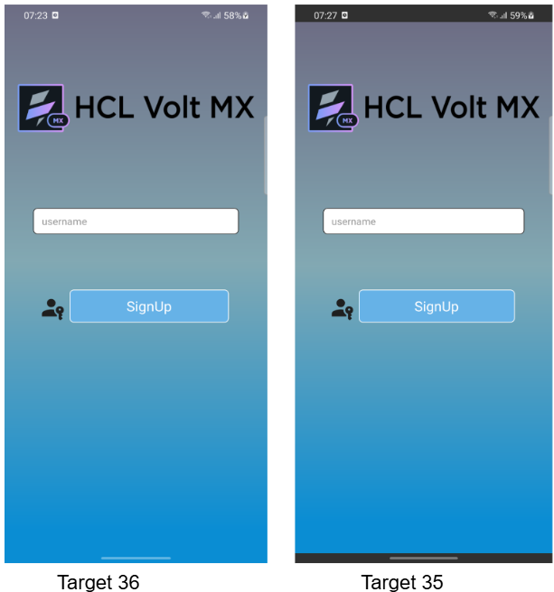

# Android 16 Target Behavioural Changes

Starting with Iris 9.5.58, apps that target API level 36 or higher must support full‑screen design on Android. In Volt MX IRIS, this means the form’s background now extends beneath the status bar and navigation bar to give an edge‑to‑edge look on devices running Android 11 (API 30) and above.

The UI elements (buttons, text, layout) still stay within safe bounds, exactly as they did for apps targeting API level 35 or lower. Only the background reaches behind the system bars; the visible layout, touch behavior, and interaction remain the same as before.

