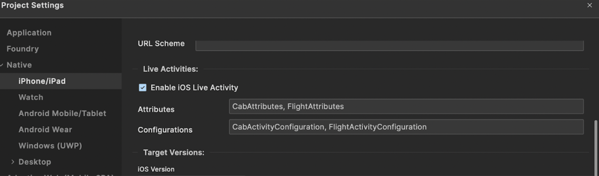
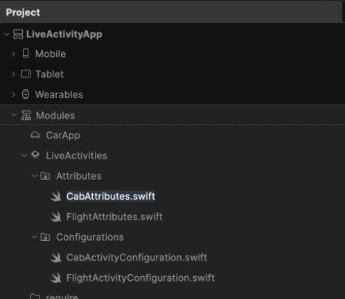

Configure iOS Live Activities in Volt MX Iris
===============================================

With the introduction of Live Activities in Volt MX Iris from iOS 16.2, developers now have access to the Live Activities, enabling the creation of streamlined and glanceable user interactions. Notably, from iPhone 14 Pro and Pro Max models, Live Activities make optimal use of the Dynamic Island's expansive display capabilities. 

Live Activities showcase the latest data from your app directly on the iPhone or iPad Lock Screen and within the Dynamic Island. This feature enables users to quickly view real-time information and take immediate actions relevant to the displayed content. Live Activities offer a concise and immersive method to monitor event progress or task status. They are characterized by a defined start and end, facilitating real-time updates either through background app runtime or remotely via Push Notifications.


I.Integrate Live Activities with an iOS Ap
=============================================

To enable live activities, you need to add the Permissions, Capabilities, Attributes, Configurations and the images (if any) in the IRIS project. Follow the following steps to achieve the same:


1.Information Property List
=============================

To support Live Activities in your app, include the following key(s) in the infoplist_configuration.json file of the project:

```

{
    "NSSupportsLiveActivities" : true,
    "NSSupportsLiveActivitiesFrequentUpdates" : true
}

```

<b>NSSupportsLiveActivities</b> : (Boolean)
Set this key to true to enable Live Activities in your app. This allows your app to display real-time updates on the Lock Screen and in the Dynamic Island.

<b>NSSupportsLiveActivitiesFrequentUpdates</b> : (Boolean)
Set this key to true to allow your app’s Live Activities to receive frequent updates through remote push notifications.
Make sure to configure these keys properly to enhance the Live Activities experience for users.

2.Push Capabilities
=====================

In Volt MX Iris, Go to <B>Project > Settings > Native > iPhone/iPad</B>. Scroll down to find the <B>Push Notifications</B> section. Change the value of Push Certificate from <B>None</B> to either <B>development</B> or <B>production</B>, depending on your environment. Enabling push notifications is required if your Live Activity will be started using <B>push capability</B> or <B>broadcast channel capability</B>.


3.Enable Live Activities
===========================

In Volt MX Iris, Go to <b>Project > Settings > Native > iPhone/iPad</b>. Scroll down to the <b>‘Live Activities’</b> section. Check the box labeled <b>‘Enable iOS Live Activity’</b>.

Once you enable Live Activities, two text fields will appear:

a. <b>Attributes:</b> Enter the comma-separated names of the SwiftUI structs conforming to <b>ActivityAttributes</b>, which define the attributes for your Live Activities.

<b>Example:</b> CabAttributes, FlightAttributes

b. <b>Configurations:</b> Enter the comma-separated names of the SwiftUI structs conforming to <b>Widget</b>, which define the UI layout and behavior for the Live Activity.

**Example:** CabActivityConfiguration, FlightActivityConfiguration





Important Considerations
-------------------------

When configuring <b>‘Attributes’</b> and <b>‘Configurations’</b> for Live Activities, keep the following in mind:

1. <b>Both fields must be filled – </b> You must provide at least one entry in both the ‘Attributes’ and ‘Configurations’ fields. If either field is left empty, Live Activities might not be enabled, even if the checkbox is ticked.

2. <b>Names must match exactly (case-sensitive) – </b> The names entered in these fields must exactly match the corresponding ActivityAttributes and Widget struct names (as well as the swift module file names) used, including capitalization. Live Activities are case-sensitive, so any mismatch in letter casing will cause issues.

3. <b>Unique names are required –</b>

   * All ‘Attributes’ must have unique names.
   * All ‘Configurations’ must have unique names.
   * Duplicate names within either field can causebconflicts and unexpected behavior.

4. <b>Multiple entries are allowed –</b> You can add as many ActivityAttributes and Widget configurations as needed, separated by commas.

5. <b>Refer to the next section -</b> Refer ‘Creating LiveActivities module’ for more information on generating the SwiftUI files.

Failing to follow these guidelines may result in Live Activities not being generated or functioning incorrectly.


4.Creating LiveActivities module
=================================

i.Adding Attribute and Configuration Modules
----------------------------------------------

1. Navigate to the <B>Modules</B> section in your <B>Project</B> settings.

2. Locate the newly available <B>LiveActivities</B> section.

3. Under <B>LiveActivities</B>, you will find two folders:

    i)<b>Attributes</b> (for defining activity attributes)

    ii)<b>Configurations</b> (for defining activity UI and behavior)

4. To add a new swift module:

    i) Click the small <b>dropdown arrow</b> next to <b>Attributes</b>, then select <b>New Swift Module.</b> This will create a new Swift file inside the Attributes folder.

    ii) Similarly, click the <b>dropdown arrow</b> next to Configurations, then select <b>New Swift Module</b> to create a new Swift file inside the <b>Configurations </b>folder.

5. You can add multiple Attribute Swift files and multiple Configuration Swift files under these folders as needed.

6. The names of modules within the <b>Attributes</b> and <b>Configurations</b> folders must exactly match the comma-separated values specified in the respective Attributes and Configurations text fields found under <b>Project > Settings > Native > iPhone/iPad - ‘Enable iOS Live Activity’</b>. <b>For example</b>, if the Attributes field contains CabAttributes, FlightAttributes, then you must have Swift modules named CabAttributes.swift and FlightAttributes.swift. Each of these modules should contain the implementation of their corresponding structs — struct CabAttributes and struct FlightAttributes. Having additional or missing modules that do not align with the values provided in the text fields may result in Live Activities being disabled.



ii.	Bringing SwiftUI Live Activity from Native to Volt MX
-----------------------------------------------------------

Post developing a SwiftUI Live Activity in your native Xcode project, you need to modify it slightly to fit our structure. Follow these steps:


**Step 1: Create a Widget Extension in Xcode**

1. Open your <b>Xcode</b> project.
2. Go to <b>File > New > Target</b>.
3. Select <b>Widget Extension</b> for iOS.
4. Enter a Product Name (e.g., <b>Sample)</b>.
5. Tick the checkbox <b>Include Live Activity</b>.
6. Click <b>Finish</b> and enable the extension when prompted.

After this, Xcode will generate a default Swift file called <b>SampleLiveActivity.swift</b> inside the new Widget Extension. The file will look like this:

```
import ActivityKit
import WidgetKit
import SwiftUI


struct SampleAttributes: ActivityAttributes {
    public struct ContentState: Codable, Hashable {
        var emoji: String  // Dynamic property that changes over time
    }
    var name: String  // Fixed property that does not change
}


struct SampleLiveActivity: Widget {
    var body: some WidgetConfiguration {
        ActivityConfiguration(for: SampleAttributes.self) { context in
            VStack {
                Text("Hello \(context.state.emoji)")
            }
            .activityBackgroundTint(Color.cyan)
            .activitySystemActionForegroundColor(Color.black)
        } dynamicIsland: { context in
            DynamicIsland {
                DynamicIslandExpandedRegion(.leading) {
                    Text("Leading")
                }
                DynamicIslandExpandedRegion(.trailing) {
                    Text("Trailing")
                }
                DynamicIslandExpandedRegion(.bottom) {
                    Text("Bottom \(context.state.emoji)")
                }
            } compactLeading: {
                Text("L")
            } compactTrailing: {
                Text("T \(context.state.emoji)")
            } minimal: {
                Text(context.state.emoji)
            }
            .widgetURL(URL(string: "http://www.apple.com"))
            .keylineTint(Color.red)
        }
    }
}

```
        

**Step 2: Modify Your Code to Two Separate Files**

To integrate your code into our product, you need to separate it into two files:

1. Attributes File (Defines attributes and dynamic states)
2. Configuration File (Defines the UI layout)

    a.	Attributes File (SampleAttributes.swift)

```

#if canImport(ActivityKit)
import ActivityKit


@available(iOS 16.2, *)
struct SampleAttributes: ActivityAttributes {
    public struct ContentState: Codable, Hashable {
        var emoji: String  // Dynamic variable (required)
    }
    var name: String  // Fixed variable (optional)
}
#endif


```

**Key Changes:**

* Added <b>#if canImport(ActivityKit) -</b> Ensures compatibility across platforms.
* Added <b>@available(iOS 16.2, *) -</b> Ensures Live Activity runs on iOS 16.2 and above.
* Fixed properties (var name: String) are optional – your Live Activity must have at least one dynamic (ContentState) variable.


    b.	Configurations File (SampleLiveActivity.swift)


```
import SwiftUI
import WidgetKit


@available(iOS 16.2, *)
struct SampleLiveActivity: Widget {
    var body: some WidgetConfiguration {
        ActivityConfiguration(for: SampleAttributes.self) { context in
            VStack {
                Text("Hello \(context.state.emoji)")
            }
            .activityBackgroundTint(Color.cyan)
            .activitySystemActionForegroundColor(Color.black)
        } dynamicIsland: { context in
            DynamicIsland {
                DynamicIslandExpandedRegion(.leading) {
                    Text("Leading")
                }
                DynamicIslandExpandedRegion(.trailing) {
                    Text("Trailing")
                }
                DynamicIslandExpandedRegion(.bottom) {
                    Text("Bottom \(context.state.emoji)")
                }
            } compactLeading: {
                Text("L")
            } compactTrailing: {
                Text("T \(context.state.emoji)")
            } minimal: {
                Text(context.state.emoji)
            }
            .widgetURL(URL(string: "http://www.apple.com"))
            .keylineTint(Color.red)
        }
    }
}


```

**Key Changes:**

* Added import SwiftUI and import WidgetKit.
* Kept UI layout code unchanged.
* Added <b>@available(iOS 16.2, *)</b> - Ensures Live Activity runs on iOS 16.2 and above.


    c. 	Understanding SampleAttributes & SampleLiveActivity


**SampleAttributes**

The SampleAttributes struct defines the data structure for a Live Activity. It consists of two parts: ContentState (dynamic variables) and fixed attributes. The ContentState struct contains emoji, which is a dynamic variable—this means its value can change over time, reflecting updates in real-time. The outer SampleAttributes struct contains name, which is a fixed variable that remains unchanged throughout the activity's lifecycle. While this example does not access ‘name’, it can be retrieved using context.attributes.name if needed. The @available(iOS 16.2, *) ensures compatibility since Live Activities are supported from iOS 16.2 onwards.


**SampleLiveActivity**

The SampleLiveActivity struct is responsible for defining how the Live Activity appears on the Lock Screen and Dynamic Island. The main UI for the Lock Screen and Notification Banner is defined inside ActivityConfiguration. In this example, it displays "Hello \(context.state.emoji)".

The Dynamic Island UI is structured using multiple regions:

* DynamicIslandExpandedRegion(.leading) - Displays content in the leading (left) area of the expanded Dynamic Island.

* DynamicIslandExpandedRegion(.trailing) - Displays content in the trailing (right) area of the expanded Dynamic Island.

* DynamicIslandExpandedRegion(.bottom) - Displays content in the bottom area of the expanded Dynamic Island, allowing for more details.

* compactLeading - Defines content in the leading (left) area of the compact Dynamic Island.

* compactTrailing - Defines content in the trailing (right) area of the compact Dynamic Island.

* minimal - Displays content when the Dynamic Island is in its smallest (minimal) state.

This structured approach ensures that the Live Activity adapts dynamically across different screen placements, making it visible and interactive in multiple locations on iOS devices. For more information, refer to the official Apple doc for the design of live activities.


**Step 3: Enter Names in Live Activities Settings**

Once you have separated your code into Attributes and Configurations, enter the corresponding names under ‘Enable iOS Live Activity’ fields for ‘Attributes’ & ‘Configurations’ as explained earlier in section - ‘Enable Live Activities’:

* <b>Attributes</b> textfield - SampleAttributes
* <b>Configurations</b> textfield - SampleLiveActivity


This step ensures that our system recognizes your SwiftUI files correctly. In case of multiple live activity configurations, add comma separated values for both Attributes and Configurations.

**Important Considerations**

1. **Unique Naming** The names of Attributes and Configurations must be unique. No two Configurations can reference the same Attributes.

2. **Required Imports**

    i. Attributes files - Must include import ActivityKit.

    ii. Configurations files - Must include import SwiftUI , import WidgetKit  

    iii. Failing to import these correctly may cause compilation errors.

3. **Minimum iOS Version**

    @available(iOS 16.2, *) must be added in both Attributes and Configurations files. Live Activities are supported only from iOS 16.2.


4. **Splitting Files**

    a. The native Xcode-generated SwiftUI file must be split into two separate files:

        i. Attributes file (inside the Modules/LiveActivities/Attributes folder)

        ii. Configurations file (inside the Modules/LiveActivities/Configurations folder)

    b. A single combined file inside either folder will not work and may cause issues.

5. **Correct Referencing Between Files**

The Attributes struct name must match the one referenced inside Configurations.

**Example:**

```
struct SampleAttributes: ActivityAttributes { // Inside Attributes file
```


```
ActivityConfiguration(for: SampleAttributes.self) { context in // Inside Configurations file
```

6. **Registering Names in Enable iOS Live Activity Section**

    The struct(same as module) names of Attributes & Configurations must be entered in the respective text fields under ‘Enable iOS Live Activity’ settings. If names are not provided, Live Activities may get disabled.


7. **Fixed Variables Are Optional**

    A Live Activity must have at least one ContentState variable but may or may not have fixed variables. 

    **Example:**

```
struct SampleAttributes: ActivityAttributes {
    public struct ContentState: Codable, Hashable {
        var emoji: String  // Required (Dynamic variable)
    }
    var name: String  // Optional (Fixed variable)
}

```

8. **Accessing Variables in Configurations**

For the above SampleAttributes, the variables can be accessed in the configuration as follows:

a. Dynamic Variables (ContentState) - context.state.emoji

b. Fixed Variables (Attributes) - context.attributes.name

9. **Case Sensitivity & Syntax Awareness**

All names are case-sensitive. Ensure consistency while referencing them. Be careful while copying files. Maintain correct { } bracket structures. Follow naming conventions precisely.

By following these guidelines, you can ensure that your Live Activity setup is smooth and error-free.


iii. Adding Images to Live Activity in Configurations UI
=========================================================

If you need to reference any images within the Configurations UI of your Live Activity, you must first add them to the project's assets. To do this, navigate to Assets under Project. Find the ‘Media’ section under Assets. There will be a new section called LiveActivities. Next to LiveActivities, there will be a dropdown option labeled Import Images. Click on it to add the images you want to use in your Live Activity. These images can then be referenced inside your Live Activity UI as needed.


iv.	Sample Use Case: A Cab Live Activity
==========================================

Example of an ‘Attribute’ Swift File - CabAttributes.swift (Inside **Attributes** folder) -


```
#if canImport(ActivityKit)
import ActivityKit
@available(iOS 16.2, *)
struct CabAttributes: ActivityAttributes {
    public struct ContentState: Codable, Hashable {
    // ContentState represents the dynamic (mutable) state of the Live Activity.
    // These values can change over time and will be updated in real-time.
        var driverName: String
        var carModel : String
        var carNumber : String
        var pickupLocation : String
        var dropoffLocation : String
        var progress : String
        var distanceRemaining : String
    }
// Fixed attribute variables – These do not change once the Live Activity starts.
    var cabService: String
}
#endif


```

Example of a ‘Configuration’ Swift File - CabActivityConfiguration.swift (Inside Configurations folder) -

```
import SwiftUI
import WidgetKit
@available(iOS 16.2, *)
struct CabActivityConfiguration: Widget {
    // Defines the UI layout and behavior for the widget, targeting both the lock screen and Dynamic Island.
    var body: some WidgetConfiguration {
        ActivityConfiguration(for: CabAttributes.self) { context in
            // Configures the lock screen UI & retrieves UI components using the activity's context.
            VStack(spacing: 8) {
                VStack(alignment: .leading, spacing: 8) {
                    Text(context.attributes.cabService)
                        .font(.custom("HelveticaNeue-Bold", size: 16))
                        .foregroundColor(.green)
                        .frame(maxWidth: .infinity, alignment: .leading)
                        .padding(6)
                        .animation(.easeInOut(duration: 0.5), value: context.attributes.cabService)
                }
                HStack {
                    Image(systemName: "car.fill")
                        .resizable()
                        .frame(width: 30, height: 30)
                        .foregroundColor(.green)
                        .animation(.easeInOut(duration: 0.5), value: context.state.driverName)
                    VStack(alignment: .leading) {
                        Text("\(context.state.driverName)")
                            .font(.custom("HelveticaNeue-Bold", size: 16))
                            .foregroundColor(.white)
                            .animation(.easeInOut(duration: 0.5), value: context.state.driverName)
                        Text("\(context.state.carModel)")
                            .font(.custom("HelveticaNeue", size: 14))
                            .foregroundColor(.white)
                            .animation(.easeInOut(duration: 0.5), value: context.state.carModel)
                    }
                    .padding(.leading, 4)
                    Spacer()
                    Text(context.state.carNumber)
                        .font(.custom("HelveticaNeue-Bold", size: 14))
                        .foregroundColor(.green)
                        .animation(.easeInOut(duration: 0.5), value: context.state.carNumber)
                }
                .padding(6)
                HStack {
                    GeometryReader { geometry in
                        ZStack(alignment: .leading) {
                            Rectangle()
                                .foregroundColor(.gray)
                                .cornerRadius(5)
                            Rectangle()
                                .foregroundColor(.green)
                                .cornerRadius(5)
                                .frame(width: CGFloat(Double(context.state.progress)!) / 100 * geometry.size.width)
                                .animation(.easeInOut(duration: 0.5), value: context.state.progress)
                        }
                        .frame(height: 10)
                    }
                }
                .padding(6)
                HStack {
                    Text(context.state.pickupLocation)
                        .font(.custom("HelveticaNeue-Bold", size: 14))
                        .foregroundColor(.white)
                        .padding(.leading, 2)
                        .animation(.easeInOut(duration: 0.5), value: context.state.pickupLocation)           
                    Spacer()
                    Text(context.state.dropoffLocation)
                        .font(.custom("HelveticaNeue-Bold", size: 14))
                        .foregroundColor(.white)
                        .padding(.trailing, 2)
                        .animation(.easeInOut(duration: 0.5), value: context.state.dropoffLocation)
                }
                .padding(6)
            }
                .padding(6)
                .background(Color(red: 0.0, green: 0, blue: 0.5))
                .activityBackgroundTint(Color.white.opacity(0.7))
                .activitySystemActionForegroundColor(Color.black)
        } dynamicIsland: { context in
            // Configures the Dynamic Island UI for expanded, compact, and minimal states.
            DynamicIsland {
                // Defines the UI for the expanded leading region of the dynamic island.
                DynamicIslandExpandedRegion(.leading) {
                    Text(context.state.pickupLocation)
                        .foregroundColor(.green)
                        .padding(.leading, 2)
                        .animation(.easeInOut(duration: 0.5), value: context.state.pickupLocation)
                }
                // Defines the UI for the expanded trailing region of the dynamic island.
                DynamicIslandExpandedRegion(.trailing) {
                    Text(context.state.dropoffLocation)
                        .foregroundColor(.red)
                        .padding(.trailing, 2)
                        .animation(.easeInOut(duration: 0.5), value: context.state.dropoffLocation)
                }
                // Defines the UI for the expanded bottom region of the dynamic island.
                DynamicIslandExpandedRegion(.bottom) {
                    VStack {
                        Image(systemName: "car.fill")
                            .resizable()
                            .frame(width: 30, height: 30)
                            .foregroundColor(.white)
                            .padding()
                            .animation(.easeInOut(duration: 0.5), value: context.state.driverName)
                        
                        HStack {
                            GeometryReader { geometry in
                                ZStack(alignment: .leading) {
                                    Rectangle()
                                        .foregroundColor(.gray)
                                        .cornerRadius(5)
                                    Rectangle()
                                        .foregroundColor(.green)
                                        .cornerRadius(5)
                                        .frame(width: CGFloat(Double(context.state.progress)!) / 100 * geometry.size.width)
                                        .animation(.easeInOut(duration: 0.5), value: context.state.progress)
                                }
                                .frame(height: 10)
                            }
                        }
                        .padding(.horizontal)
                    }
                }
            } compactLeading: {
                // UI for the compact leading region of the dynamic island.
                Text(context.state.pickupLocation )
                    .foregroundColor(.green)
                    .padding(.leading, 2)
                    .animation(.easeInOut(duration: 0.5), value: context.state.pickupLocation)
            } compactTrailing: {
                // UI for the compact trailing region of the dynamic island.
                Text(context.state.dropoffLocation)
                    .foregroundColor(.red)
                    .padding(.trailing, 2)
                    .animation(.easeInOut(duration: 0.5), value: context.state.dropoffLocation)
            } minimal: {
                // UI for the minimal configuration of the dynamic island.
                Image(systemName: "car.fill")
                    .frame(width: 10, height:10)
                    .foregroundColor(.green)
                    .padding()
                    .animation(.easeInOut(duration: 0.5), value: context.state.driverName)
            }
            .widgetURL(URL(string: "liveAct://Cab"))
        }
    }
}


```

v. Deeplinking in Live Activities using widgetURL
==================================================

By default, tapping on a Live Activity or widget opens the corresponding app. To enhance the user experience and take them directly to relevant content, you can specify a deep link using the **widgetURL(_:)** modifier. This allows your app to open at a specific screen that matches the context of the Live Activity.


**Adding Deep Linking to Your Live Activity Configuration**

In your Live Activity widget configuration, include the widgetURL modifier as shown below:

```
.widgetURL(URL(string: "liveAct://Cab"))

```

In the above example ( iv. Sample Use Case: A Cab Live Activity ), when a user taps on the Live Activity in the Dynamic Island, the app will open with the deep link "liveAct://Cab", which will be handled in the app to navigate to the correct screen.

**Handling Deep Linking in the App**

Once the deep link (widgetURL) is set in the Live Activity configuration, you need to define how the app should handle this URL when it is opened.

To do this, you must add the following code snippet in your IRIS project AppEvents at the path: Mobile > Properties > App Events > App Service.


```

function launchParams(params) {
    //The line below displays how an application is launched: Normal, 
    for (var key in params) {
        voltmx.print("**********" + params[key]);
    }
    if (params.launchmode == 1) {
        return "Form1";
    } else if (params.launchmode == 3) {
        voltmx.print("*************** launch params are: " + params.launchparams);
       
        switch(params.launchparams.URL){
            case "liveAct://Cab":
                        return "FormCab"; // Navigates to the Cab form - FormCab
                    break;
        }
    }
    return "Form1"; // Default fallback startup form
}

return launchParams(eventobject);


```

Here, in our example - clicking on the lock screen live activity opens the app and lands on the home screen (Form1), since there is no deep linking from the lock screen. Clicking on the dynamic island (with widgetURL) opens the app and navigates directly to FormCab, as defined in the deep link.

This setup ensures a smooth user experience by directing them to the relevant screen when interacting with a Live Activity.


vi.	Live Activities in the Smart Stack on Apple Watch
======================================================

* Starting with watchOS 11 and iOS 18, Live Activities now appear in the Smart Stack on Apple Watch.

* When a Live Activity starts on a paired iPhone, the Smart Stack automatically surfaces on the Apple Watch, displaying the Live Activity at the top. By default, this view includes the leading and trailing elements from the compact Live Activity presentation on iPhone.

* If you want to optimize the experience for Apple Watch, you can design a custom SwiftUI layout specifically for the Smart Stack. However, even if you don't create a custom layout, a default UI will still be shown automatically.

* Tapping a Live Activity on Apple Watch opens a full-screen view with more details and provides an option to launch the app on the paired iPhone for further interaction.

vii. Live Activities in StandBy Mode
=====================================

* The minimal presentation of a Live Activity appears at the top of the Lock Screen when the iPhone is in StandBy mode (landscape, charging, and angled toward the room). 

* Tapping the minimal presentation expands the Live Activity to fill the entire display using the Lock Screen presentation.

* When multiple apps start Live Activities, the system decides which ones to display based on relevance.

* The system can show two Live Activities in minimal presentation: One attached to the Dynamic Island. One detached, appearing on the Lock Screen in StandBy mode.

* If your app starts multiple Live Activities, you can influence which one appears by setting a relevance score. More details: [Apple Human Interface Guidelines – StandBy Mode](https://developer.apple.com/design/human-interface-guidelines/live-activities#StandBy)


II.	Volt MX Live Activity Namespace & APIs
===========================================

1.	**Volt MX Live Activity Namespace**

    The voltmx.liveActivity namespace provides a seamless way to integrate and manage Live Activities within your app. It enables you to request, update, and end Live Activities while also offering lifecycle observation, state management, and real-time data updates. This allows apps to display persistent, glanceable information on the Lock Screen and Dynamic Island, enhancing user engagement and interactivity.

2.	**Volt MX Live Activity APIs**

    The table below provides details about the voltmx.liveActivity APIs, which enable interaction with Live Activities. These APIs allow you to start, update, observe, and manage Live Activities within your app, ensuring seamless real-time updates and lifecycle control.


| API  | Description |
| ------------- |:-------------:|
| voltmx.liveActivity.start     | Starts a Live Activity locally by initializing it with the required attributes and content state. This enables real-time updates and persistent display on the Lock Screen and Dynamic Island. |
| voltmx.liveActivity.update     | Updates the Live Activity’s content-state data dynamically. Additionally, you can set a staleDate (indicating when the content is outdated) and a relevanceScore to prioritize activities on the Lock Screen.|
|voltmx.liveActivity.end    | Ends a specific Live Activity, removing it from the Lock Screen and Dynamic Island. This is useful when the activity is no longer relevant, such as when a ride is completed or a delivery is fulfilled.|
|    voltmx.liveActivity.observeActivityStateUpdates|  Monitors activity state changes of a Live Activity, such as when it becomes active, stale, dismissed, or ended. This allows the app to respond accordingly based on the Live Activity’s status.|
|   voltmx.liveActivity.stopActivityStateUpdates |  Stops observing the activity state changes of a specific Live Activity. This is useful when state tracking is no longer needed to optimize resource usage.|
|   voltmx.liveActivity.observeContentStateUpdates | Listens for real-time changes in the content state of a Live Activity. This ensures that your app can react dynamically to updates like progress changes or status modifications.|
|   voltmx.liveActivity.stopContentStateUpdates | Stops observing content state changes for a Live Activity. This is helpful when continuous tracking of content updates is no longer required.|
|  voltmx.liveActivity.fetchActivityData|  Retrieves all available information for a specific Live Activity, including both its attributes (fixed properties) and content state (dynamic data).|
|  voltmx.liveActivity.isEnabled| Returns a Boolean value indicating whether your app is allowed to start Live Activities. This helps in determining if Live Activities are available for use on the device.|
|   voltmx.liveActivity.isHighFrequencyUpdateEnabled | Checks if the user has granted permission for high-frequency updates via ActivityKit push notifications, allowing for more frequent real-time updates.|


3.voltmx.liveActivity functions
=================================

**Note -** All the APIs listed below are only applicable from iOS 16.2

1.voltmx.liveActivity.start
----------------------------

**Syntax**

voltmx.liveActivity.start(activityParams, pushType, onSuccessCallback, onFailureCallback)

**Description**

Starts a Live Activity locally by initializing it with the required attributes and content state. This enables real-time updates and persistent display on the Lock Screen and Dynamic Island.

**Input Parameters**

The following is the breakup of activityParams:


| Parameter  | Type |Description|
| ------------- |:-------------:|:-------------:|
| attributesName     | String    |The name of the struct conforming to the ActivityAttributes protocol. This must match the attributes struct name used in the Live Activity configuration. The same attributes name was also mentioned earlier<br>under ‘Enable iOS Live Activity’ as one of the values in ‘Attributes’ textfield.</br>|
| state     | Object    |A key-value pair containing dynamic properties (ContentState variables) defined in the ActivityAttributes struct. These values update throughout the Live Activity's lifecycle.|
| attributes      | Object    |A key-value pair containing fixed properties (Attributes variables) defined in the ActivityAttributes struct. If there are no fixed-state variables defined in Attributes struct, specify here as attributes = { }.|
| staleDatePeriod    | Double   |A score determining the priority order of multiple Live Activities on the Lock Screen. Higher scores appear above lower ones. 0 indicates the lowest relevance and 100 the highest.|
| channelID   | String   |This is an optional parameter. A base64-encoded string required to configure a Live Activity for broadcast channels. This parameter is mandatory when using PUSHTYPE_CHANNEL and is available only on iOS 18 and above.|


**Return Values**

None

**Exceptions**

The following errors may be returned in the onFailureCallback if the API call fails.

| Error Code  | Error Message| Error constants|
| ------------- |:-------------:|:-------------:|
| 5021     | Live Activities are not enabled    |voltmx.liveActivity.ERROR_NOT_ENABLED|
| 5001     | The provided Live Activity attributes exceeded the maximum size of 4KB   |voltmx.liveActivity.ERROR_ATTRIBUTES_TOO_LARGE|
| 5002     | The device does not support Live Activities  |voltmx.liveActivity.ERROR_UNSUPPORTED|
| 5003     | The person has deactivated Live Activities in the Settings  |voltmx.liveActivity.ERROR_DENIED|
| 5004     | The device has reached the maximum number of ongoing Live Activities  |voltmx.liveActivity.ERROR_GLOBAL_MAX_EXCEEDED|
| 5005    | The app has already started the maximum number of concurrent Live Activities  |voltmx.liveActivity.ERROR_TARGET_MAX_EXCEEDED|
| 5006    | The app does not have the required entitlement to start a Live Activity  |voltmx.liveActivity.ERROR_UNSUPPORTED_TARGET |
| 5007   | App tried to start Live Activity while it was in the background  |voltmx.liveActivity.ERROR_VISIBILITY |
| 5008   | System could not persist the Live Activity |voltmx.liveActivity.ERROR_PERSISTENCE_FAILURE |
| 5009   | Process that tried to start Live Activity is missing a process identifier |voltmx.liveActivity.ERROR_MISSING_PROCESS_IDENTIFIER |
| 5010   | App does not have the required entitlement to start a Live Activity |voltmx.liveActivity.ERROR_UNENTITLED|
| 5011   | Provided activity identifier is malformed |voltmx.liveActivity.ERROR_MALFORMED_ACTIVITY_IDENTIFIER|
| 5012   | Process that tried to recreate Live Activity is not the process that originally created the Live Activity |voltmx.liveActivity.ERROR_RECONNECT_NOT_PERMITTED|
| 5013   | Type mismatch encountered while decoding the Live Activity data |voltmx.liveActivity.ERROR_DATA_TYPE_MISMATCH|
| 5014   | Key not found while decoding the Live Activity data |voltmx.liveActivity.ERROR_DATA_KEY_NOT_FOUND|
| 5015   | Value not found for expected type while decoding the Live Activity data|voltmx.liveActivity.ERROR_DATA_VALUE_NOT_FOUND|
| 5016   | Invalid data provided|voltmx.liveActivity.ERROR_DATA_INVALID|
| 5017   | Permissions error - Missing required entitlements or capabilities|voltmx.liveActivity.ERROR_PERMISSION|


>**Note :**<br> i) In case of Unknown error -  errorCode, errorMessage & errorDescription is returned as 99999, ‘Unknown error’ & ‘Unknown error encountered’ respectively. For errorCode of 5021 when live activities are not enabled, only errorCode & errorMessage is returned. For all other errors, onFailureCallback will return all three - errorCode, errorMessage & errorDescription in onFailureCallback<br>ii)The errors with errorCodes 5001 - 5012 are of ‘ActivityAuthorizationError’ type. The errorDescription is generated from the system’s localized error message, offering insights into the cause of the Live Activity failure.<br>iii)
The errors with errorCodes 5013 - 5017 are of ‘DecodingError’ type. The errorDescription is extracted from the system's decoding context, providing details about the specific issue encountered while processing Live Activity data.<br>iv)
The error message strings in the table are representations and may not match the exact messages returned by the system.


**Example**

```
var activityParams = {
	attributes: {
		airlineName: "Nimbus Airways"
	},
	state: {
		flightCode: "G89-AU",
		progress: 40.83,
		time: "Arriving in 30m",
		status: "5min delay",
		departure: "BLR",
		arrival: "HYD"
	},
	staleDatePeriod: 300.0,
	relevanceScore: 50.0,
	attributesName: "FlightAttributes",
	channelID: "channelIDhere"
};
var pushType = voltmx.liveActivity.PUSHTYPE_CHANNEL;

function onSuccessCallback(id) {
	voltmx.ds.save([id], "activityID_flight_01");
	alert("Success ActID: " + id);
}

function onFailureCallback(errorInfo) {
	var errorCode = errorInfo.errorCode;
	var errorMessage = errorInfo.errorMessage;
	var errorDescription = errorInfo.errorDescription;
	alert("Failure Details - start :\n" + "------------------\n" + "Error Code : " + errorCode + "\n" + "Error Message: " + errorMessage + "\n" + "Error Description: " + errorDescription);
}
voltmx.liveActivity.start(activityParams, pushType, onSuccessCallback, onFailureCallback);


```

Important Considerations
--------------------------

* Once the Live Activity starts successfully, it returns an activityID (for PUSHTYPE_NIL and PUSHTYPE_CHANNEL) or both activityID and pushToken (for PUSHTYPE_TOKEN). activityID is a unique identifier and should be stored securely (e.g., using voltmx.ds.save) for future reference. It is required to update (voltmx.liveActivity.update), end (voltmx.liveActivity.end), or fetch data (voltmx.liveActivity.fetchActivityData) for the Live Activity. pushToken is essential when using PUSHTYPE_TOKEN for server-driven updates. This token can be used to update or end the Live Activity remotely.

* A Live Activity can stay active for up to eight hours unless it is manually ended by the app or the user. After reaching this limit, the system automatically terminates the Live Activity and removes it from the Dynamic Island. However, a live activity remains visible on the Lock Screen until the user dismisses it or for up to an additional four hours, whichever comes first. In total, a Live Activity can remain on the Lock Screen for a maximum of 12 hours.

* All dynamic variables must be initialized inside the state object, while fixed variables should be placed inside the attributes object in activityParams.

* If using Channel Push Type, refer to [Apple’s Broadcast Push Notification Documentation](https://developer.apple.com/documentation/usernotifications/setting-up-broadcast-push-notifications?language=objc). Ensure that the Broadcast Capability is enabled for your app. Use the push notification console to manage channels under the Channels tab, where you can create or delete channels. When creating a new channel, the console provides guidance on configuring parameters like environment and message storage policy [(More details here)](https://developer.apple.com/documentation/usernotifications/sending-channel-management-requests-to-apns?language=objc).

* DecodingErrors may occur if some key-value pairs are missing in attributes or state within activityParams. Additionally, if a user disables "Allow Live Activities" in app settings, an error "Live Activities are not enabled" may be thrown. A previously started Live Activity can also automatically dismiss due to system constraints.


* If the Live Activity is started via Push or Channel type, ensure that Push Capability is added in IRIS.

* Calling this API multiple times can start multiple Live Activities with the same initial attributes and state values. However, each Live Activity will have a unique activityID and pushToken, as their lifecycles are independent.

Platform Availability
----------------------

* iOS

2.voltmx.liveActivity.update
=============================

Syntax
---------

voltmx.liveActivity.update(activityParams,  onFailureCallback, alertParams)


Description
-----------

The voltmx.liveActivity.update API is used to modify the content state of an ongoing Live Activity. This allows real-time updates to be reflected on the Lock Screen and Dynamic Island.
This API enables updating dynamic data such as progress, status, or time while also allowing adjustments to the staleDatePeriod and relevanceScore, ensuring the Live Activity remains relevant. The activityID parameter ensures that the correct Live Activity instance is updated.
Additionally, an optional alertParams parameter can be provided. When used, it triggers an alert notification on paired Apple Watch devices and displays a banner notification on devices that do not support the Dynamic Island.

Input Parameters
-----------------

| Parameter  | Type| Description|
| ------------- |:-------------:|:-------------:|
| activityParams     | Object    |An object containing the updated content-state data, stale date period, relevance score, and the activityID of the Live Activity to be updated.|
| onFailureCallback    | Function    |Callback function invoked in case of failure in update, returning an error object containing errorCode and errorMessage. Refer Exceptions for different types of error constants.|
| alertParams    | Object   |This is an optional parameter. On a paired apple watch, the alert will be shown once the update is finished. If alertParams is provided as an input, the expanded presentation in the Dynamic Island or the Lock Screen presentation as a banner on devices that don’t support the Dynamic Island, will be shown.|

**Below is the breakup of activityParams -**

| Parameter  | Type| Description|
| ------------- |:-------------:|:-------------:|
| attributesName     | String    |The name of the struct conforming to the ActivityAttributes protocol.|
| state    | Object    |The updated content-state data (dynamic key-value pairs) to reflect in the Live Activity.|
| activityID    | String    |A string representing the unique identifier of the Live Activity that needs to be updated.|
| staleDatePeriod    | Double    |The duration (in seconds) after which the system considers the Live Activity outdated.|
| relevanceScore   | Double    |A score that determines the priority order of Live Activities on the Lock Screen when multiple Live Activities are active.|

**Below is the breakup of alertParams -**

| Parameter  | Type| Description|
| ------------- |:-------------:|:-------------:|
|title     | String    |A string representing the alert title|
|body     | Object   |A string representing the alert body message.|

Return Values
--------------

None

Exceptions
-------------

The following errors may be returned in the onFailureCallback if the API call fails.


| Error Code  | Error Message| Error Constant|
| ------------- |:-------------:|:-------------:|
|5021     | Live Activities are not enabled    |voltmx.liveActivity.ERROR_NOT_ENABLED
|5020    | Live Activity with specified activityID not found   |voltmx.liveActivity.ERROR_NOT_FOUND.|

Other errorCodes(errorMessage/errorConstants) of ActivityAuthorizationError & DecodingError similar to voltmx.liveActivity.start API apply here as well.

**Example**

```
var activityParams = {
    state: {
        flightCode: "G89-D",
        progress: 100,
        time: "Arrived",
        status: "Boarding!",
        departure: "HYD",
        arrival: "DEL"
    },
    activityID: voltmx.ds.read("activityID_flight_01")[0],
    staleDatePeriod: 300.0,
    relevanceScore: 50.0,
    attributesName: "FlightAttributes"
};

function onFailureCallback(errorInfo) {
    var errorCode = errorInfo.errorCode;

```

```
   var errorMessage = errorInfo.errorMessage;
    alert("Failure Details - update :\n" + "------------------\n" + "Error Code : " + errorCode + "\n" + "Error Message: " + errorMessage);
}

//alertParams is optional
var alertParams = {
    "title": "Arrived!",
    "body": "Boarding at Gate 3 ..!"
}
voltmx.liveActivity.update(activityParams, onFailureCallback, alertParams);

```

Important Considerations
--------------------------

* If a Live Activity has already started but is dismissed before calling this update API (either due to exceeding its 8-hour lifecycle or being manually dismissed by the user), the failure callback will trigger with the error constant voltmx.liveActivity.ERROR_NOT_FOUND. The same error occurs if the provided activityID is incorrect.

* alertParams is optional. Live Activity alerts light up the screen and, by default, play a notification sound for critical updates. They also present an expanded view in the Dynamic Island or appear as a banner notification on devices that do not support the Dynamic Island. Avoid excessive alerts or non-essential updates, as users may disable Live Activities for your app in Settings. The alert message is delivered to a paired Apple Watch.

* watchOS 11 Integration: Starting with watchOS 11, when a Live Activity starts on an iPhone paired to an Apple Watch, the Smart Stack will automatically show the Live Activity at the top. By default, the Smart Stack displays a combination of the leading and trailing elements from the Live Activity’s compact presentation on the iPhone.

* Live Activity Updates: The activityID is unique for each Live Activity. A Live Activity can be updated multiple times with different state, staleDate, and relevanceScore, as long as it has not been ended or dismissed. Updates can be sent either from the application using this API or remotely.

* Fixed Attributes Cannot Be Updated: The attributes defined in the attributes struct (fixed key-value pairs) cannot be modified once the Live Activity has started. Only the state (dynamic key-value pairs), staleDatePeriod, and relevanceScore can be updated. 

* Use alertParams if you want to display an alert on a paired Apple Watch. Banner notifications are typically not shown when the update is triggered while the app is in the foreground. However, these notifications can appear if the app is in the background or not running, and the alertParams update is sent remotely.


**Platform Availability**

* iOS

3.voltmx.liveActivity.end
============================

Syntax
--------

voltmx.liveActivity.end(activityParams, policyParams, onFailureCallback)

Description
------------

The voltmx.liveActivity.end API is used to end a running Live Activity based on a specified dismissal policy. This API allows the application to control how and when the Live Activity should be dismissed from the system.

There are three dismissal policies available:
----------------------------------------------

* Immediate (DISMISSAL_IMMEDIATE): The Live Activity is removed instantly.
* Default (DISMISSAL_DEFAULT): The Live Activity remains on the Lock Screen for up to four hours before being removed by the system or the user.
* Custom (DISMISSAL_CUSTOM): The Live Activity is removed at a specified time, within a four-hour window.

If a Live Activity has already been dismissed or the provided activityID is incorrect, the failure callback will trigger with an error.

The following table shows the different dismissal policies available for ending a Live Activity, along with their descriptions, required parameters, and state transitions -


| Dismissal Policy  | Description| Required Parameters in policyParams|Activity State Transition |
| ------------- |:-------------:|:-------------:|:-------------:|
| DISMISSAL_IMMEDIATE    | The system immediately removes the Live Activity.|None|The activityState changes to STATE_DISMISSED immediately.|
| DISMISSAL_DEFAULT    | The Live Activity remains on the Lock Screen for up to four hours unless removed by the user.|state – Defines the final state of the Live Activity before dismissal.|The activityState does not change to STATE_DISMISSED until the system or user removes it.|
| DISMISSAL_CUSTOM   | The system removes the Live Activity at a specified time within a four-hour window.|state – Defines the final state of the Live Activity before dismissal.dismissalDate – A string in ISO format indicating the removal time.|The system removes the Live Activity at the specified date or after four hours, whichever comes first. When removed, the activityState changes to STATE_DISMISSED.|

Input Parameters
------------------


| Parameter  | Type| Description|
| ------------- |:-------------:|:-------------:|
| activityParams    | Object|Contains details of the Live Activity to be ended.|
| policyParams   | Object|Defines the dismissal policy for the Live Activity.|
| onFailureCallback   | Function|Callback function invoked in case of failure in invoking end call, returning an error object containing errorCode and errorMessage. Refer Exceptions for different types of error constants.|

The following is the breakup of activityParams
---------------------------------------------

| Parameter  | Type| Description|
| ------------- |:-------------:|:-------------:|
| attributesName    | String|The name of the struct conforming to the ActivityAttributes protocol.|
| activityID    | String|A unique identifier for the Live Activity that needs to be ended|
| staleDatePeriod    | Double|The duration (in seconds) after which the system considers the Live Activity out of date.|
| relevanceScore   | Double|Determines the priority of the Live Activity when multiple are present.|

The following is the breakup of policyParams
--------------------------------------------

| Parameter  | Type| Description|
| ------------- |:-------------:|:-------------:|
| dismissalPolicy    | Constant|Defines how the Live Activity should be dismissed. Acceptable values:<br>- voltmx.liveActivity.DISMISSAL_IMMEDIATE<br>- voltmx.liveActivity.DISMISSAL_DEFAULT<br>- voltmx.liveActivity.DISMISSAL_CUSTOM|
| state    | Object (optional)|The final state of the Live Activity before dismissal (only applicable for DISMISSAL_DEFAULT and DISMISSAL_CUSTOM).|
| dismissalDate    | String (ISO format)|Specifies when the Live Activity should be removed (only applicable for DISMISSAL_CUSTOM).|

Return Values
----------------
None

Exceptions
--------------

The following errors may be returned in the onFailureCallback if the API call fails.


| Error Code  | Error Message| Error Constant|
| ------------- |:-------------:|:-------------:|
|5021     | Live Activities are not enabled    |voltmx.liveActivity.ERROR_NOT_ENABLED
|5020    | Live Activity with specified activityID not found   |voltmx.liveActivity.ERROR_NOT_FOUND.|

Other errorCodes(errorMessage/errorConstants) of ActivityAuthorizationError & DecodingError similar to voltmx.liveActivity.start API apply here as well.


**Example**

```

//Immediate dismissal - No state or dismissalDate required
var activityParams = {
    attributesName: "FlightAttributes",
    activityID: voltmx.ds.read("activityID_flight_02")[0],
    staleDatePeriod: 300.0,
    relevanceScore: 100.0
};
var policyParams = {
    dismissalPolicy: voltmx.liveActivity.DISMISSAL_IMMEDIATE
};

function onFailureCallback(errorInfo) {
    var errorCode = errorInfo.errorCode;
    var errorMessage = errorInfo.errorMessage;
    alert("Failure Details - end :\n" + "------------------\n" + "Error Code : " + errorCode + "\n" + "Error Message: " + errorMessage);
}
voltmx.liveActivity.end(activityParams, policyParams, onFailureCallback);


//Custom dismissal - Requires state and dismissalDate
var activityParams = {
    attributesName: "FlightAttributes",
    activityID: voltmx.ds.read("activityID_flight_02")[0],
    staleDatePeriod: 300.0,
    relevanceScore: 100.0
};
//Ensure date is passed in correct format
var date_ = new Date(new Date().getTime() + 10000).toISOString(); //ends after 10s
var policyParams = {
    dismissalPolicy: voltmx.liveActivity.DISMISSAL_CUSTOM,
    state: {
        flightCode: "G89-AU",
        progress: 100,
        time: "Arrived",
        status: "Boarding in 10min",
        departure: "HYD",
        arrival: "DEL"
    },
    dismissalDate: date_
};

function onFailureCallback(errorInfo) {
    var errorCode = errorInfo.errorCode;
    var errorMessage = errorInfo.errorMessage;
    alert("Failure Details - end :\n" + "------------------\n" + "Error Code : " + errorCode + "\n" + "Error Message: " + errorMessage);
}
voltmx.liveActivity.end(activityParams, policyParams, onFailureCallback);


```

Important Considerations
--------------------------

* A Live Activity can also be ended remotely using the appropriate API calls.
* If a Live Activity has been started and dismissed before calling this API (e.g., exceeded its 8-hour lifecycle or was dismissed by the user), the failure callback will trigger with the error constant voltmx.liveActivity.ERROR_NOT_FOUND.
* The same error (voltmx.liveActivity.ERROR_NOT_FOUND) is thrown if the activityID provided is incorrect.
* Attributes (fixed variables in the ActivityAttributes struct) cannot be updated using this API. Only state data, dismissal policies, and timing parameters can be modified.
* When using DISMISSAL_CUSTOM, ensure dismissalDate is in ISO format.
* The dismissalDate should be set correctly, as the system will remove the Live Activity at the specified time or within four hours after the provided date—whichever comes first.
* If a Live Activity is ended using DISMISSAL_CUSTOM or DISMISSAL_DEFAULT, it may remain visible on the Lock Screen for the specified duration before being removed. However, once it is marked as ended, it cannot be updated or ended again.
* If the dismissal policy is immediate, the Live Activity will be removed instantly, and its state will change to STATE_DISMISSED.
* The system handles the final removal of Live Activities based on the chosen dismissal policy, ensuring a seamless user experience.

Platform Availability
----------------------

* iOS

4.voltmx.liveActivity.observeActivityStateUpdates
==================================================

Syntax
---------

voltmx.liveActivity.observeActivityStateUpdates(activityID, attributesName, onSuccessCallback, onFailureCallback)

Description
-------------


The voltmx.liveActivity.observeActivityStateUpdates API is used to observe activity state changes of a Live Activity in real-time. It asynchronously notifies the application when the activity state changes, allowing the app to respond accordingly. The callback function will be triggered continuously as long as the activity state keeps changing. When first called, it immediately returns the current activity state of the Live Activity.

Input Parameters
------------------


| Parameter | Type| Description|
| ------------- |:-------------:|:-------------:|
| activityID   | String|A unique identifier representing the Live Activity whose activity state changes need to be observed.|
| attributesName   | String|The name of the struct conforming to the ActivityAttributes protocol.|
|  onSuccessCallback  | Function|A callback function that receives updates whenever the Live Activity's state changes.|
|  onFailureCallback  | Function|A callback function that is triggered if an error occurs while observing state changes.|

Activity State constants

| Constants | Description| 
| ------------- |:-------------:|
| voltmx.liveActivity.STATE_ACTIVE   | The Live Activity is currently running, visible to the user, and capable of receiving updates.|
| voltmx.liveActivity.STATE_ENDED  | The Live Activity remains visible, but it has been marked as ended, meaning it will no longer receive updates.|
| voltmx.liveActivity.STATE_DISMISSED | The Live Activity has been fully removed from view, either by the system or the user, and can no longer be interacted with.|
| voltmx.liveActivity.STATE_STALE | The content of the Live Activity is outdated and needs a refresh. This can occur if there is a connectivity issue preventing updates.|
| voltmx.liveActivity.STATE_UNKNOWN | The Live Activity's state is undefined or does not match any of the known states.|

Return Values
--------------

None

Exceptions
------------

The following errors may be returned in the onFailureCallback if the API call fails.


| Error Code | Error Message| Error Constant |
| ------------- |-------------|-------------|
| 5020   | Live Activity with specified activityID not found|voltmx.liveActivity.ERROR_NOT_FOUND

**Example**

```
function onSuccessCallback(activityState) {
    if (activityState == voltmx.liveActivity.STATE_ACTIVE) {
        alert("Activity State : ACTIVE");
    } else if (activityState == voltmx.liveActivity.STATE_ENDED) {
        alert("Activity State : ENDED");
    } else if (activityState == voltmx.liveActivity.STATE_DISMISSED) {
        alert("Activity State : DISMISSED");
    } else if (activityState == voltmx.liveActivity.STATE_STALE) {
        alert("Activity State : STALE");
    } else if (activityState == voltmx.liveActivity.STATE_UNKNOWN) {
        alert("Activity State : UNKNOWN");
    }
}

function onFailureCallback(errorInfo) {
    var errorCode = errorInfo.errorCode;
    var errorMessage = errorInfo.errorMessage;
    alert("Failure Details - observeActivityStateUpdates :\n" + "------------------\n" + "Error Code : " + errorCode + "\n" + "Error Message: " + errorMessage);
}

var attributesName = "FlightAttributes";
voltmx.liveActivity.observeActivityStateUpdates(voltmx.ds.read("activityID_flight_03")[0], attributesName, onSuccessCallback, onFailureCallback);

```

Important Considerations
---------------------------

* If the activityID is incorrect or does not exist, the onFailureCallback will be triggered with the error constant voltmx.liveActivity.ERROR_NOT_FOUND.

* This API is asynchronous and will continue to trigger the onSuccessCallback whenever the state of the Live Activity changes.

* The first onSuccessCallback will immediately return the current activity state of the Live Activity. Further updates will be triggered only when the activity state changes.

* Once a Live Activity reaches the STATE_DISMISSED state, it is no longer visible and cannot receive further updates.

Platform Availability
----------------------

* iOS

5.voltmx.liveActivity.stopActivityStateUpdates
================================================

Syntax
-----------
voltmx.liveActivity.stopActivityStateUpdates(activityID)

Description
----------------

The voltmx.liveActivity.stopActivityStateUpdates API is used to stop observing the activity state changes of a specific Live Activity. Once this API is called, the application will no longer receive activity state updates for the specified activityID. However, the application can call observeActivityStateUpdates again later if it wants to resume tracking the activity state of the same Live Activity.


Input Parameters
--------------------

| Parameter | Type| Description|
| ------------- |:-------------:|:-------------:|
| activityID   | String|A unique identifier representing the Live Activity for which state updates should be stopped. |

Return Values
-------------
None

Exceptions
------------
None

Example
--------

```
voltmx.liveActivity.stopActivityStateUpdates(voltmx.ds.read("activityID_flight_03")[0]);

```

Important Considerations
--------------------------
* Calling this API stops further activity state updates for the specified activityID.
* There is no failure callback, so if the provided activityID is incorrect or does not exist, the API will silently do nothing.
* The application can re-register for activity state updates using observeActivityStateUpdates at any time.

Platform Availability
----------------------
* iOS

6.voltmx.liveActivity.observeContentStateUpdates
==================================================

Syntax
----------

voltmx.liveActivity.observeContentStateUpdates(activityID, attributesName, onSuccessCallback, onFailureCallback)

Description
-------------

This API allows an application to asynchronously observe changes in the content state of a Live Activity. It continuously listens for updates and triggers the success callback whenever the content state changes. When first called, it immediately returns the current content state of the Live Activity.


Input Parameters
------------------

| Parameter | Type| Description|
| ------------- |:-------------:|:-------------:|
| activityID   | String|The unique identifier of the Live Activity whose content state changes need to be observed. |
| attributesName  | String|The name of the struct conforming to the ActivityAttributes protocol. |
| onSuccessCallback |Function|A callback function that receives the updated content state whenever it changes. This callback only returns dynamic variables of the Live Activity. |
| onFailureCallback |Function|A callback function that gets triggered if the API fails.|

Return Values
-------------
None

Exceptions
--------------
If the API call fails, the onFailureCallback will be triggered with the following errors:

| Error Code | Error Message| Error Constant |
| ------------- |-------------|-------------|
| 5020   | voltmx.liveActivity.ERROR_NOT_FOUND |

Example
--------

```
function onSuccessCallback(activityContentState) {
    console.log(activityContentState);
    alert("callback parameters ActivityContentState : " + JSON.stringify(activityContentState));
}

function onFailureCallback(errorInfo) {
    var errorCode = errorInfo.errorCode;
    var errorMessage = errorInfo.errorMessage;
    alert("Failure Details - observeContentStateUpdates :\n" + "------------------\n" + "Error Code : " + errorCode + "\n" + "Error Message: " + errorMessage);
}
var attributesName = "FlightAttributes";
voltmx.liveActivity.observeContentStateUpdates(voltmx.ds.read("activityID_flight_03_B")[0], attributesName, onSuccessCallback, onFailureCallback);

```

Important Considerations
-------------------------
* If the provided activityID is incorrect or does not exist, the onFailureCallback will trigger with ERROR_NOT_FOUND.

* Content state updates only return dynamic state variables and do not include fixed attributes defined in ActivityAttributes.

Platform Availability
----------------------
* iOS

7.voltmx.liveActivity.stopContentStateUpdates
==============================================

Syntax
--------
voltmx.liveActivity.stopContentStateUpdates(activityID)

Description
-------------

Stops observing content state changes for a specific Live Activity. After calling this API, the app will no longer receive content state updates for the given activityID.

Input Parameters
-----------------

| Parameter | Type| Description|
| ------------- |:-------------:|:-------------:|
| activityID   | String|The unique identifier of the Live Activity for which content state updates should be stopped. |

Return Values
-------------
None

Exceptions
-----------
None

Example
----------

```
voltmx.liveActivity.stopContentStateUpdates(voltmx.ds.read("activityID_flight_03_B")[0]);

```

Important Considerations
-------------------------

* This API does not provide a failure callback. If the provided activityID is incorrect or the Live Activity does not exist, the API will silently do nothing without returning an error.

* If needed, the app can call voltmx.liveActivity.observeContentStateUpdates again for the same activityID to resume observing content state updates.

Platform Availability
----------------------

* iOS

8.voltmx.liveActivity.fetchActivityData
========================================

Syntax
---------
voltmx.liveActivity.fetchActivityData(activityParams, onSuccessCallback, onFailureCallback)

Description
---------------
Retrieves the latest available data for a specified Live Activity. This API returns both fixed attributes (from ActivityAttributes) and dynamic content state variables. Unlike observation APIs, it does not provide continuous updates; it only returns the data once when called.

Input Parameters
------------------

| Parameter | Type| Description|
| ------------- |:-------------:|:-------------:|
| activityParams   | Object |Contains the parameters required to fetch activity data. |
| onSuccessCallback   | Function |A callback function that receives the fetched data. Returns both fixed attributes (as liveActivityfixedState) and dynamic content state (as liveActivityContentState). |
| onFailureCallback  | Function |A callback function triggered if the API call fails. |

The following is the breakdown of activityParams
------------------------------------------------

| Property| Type| Description|
| ------------- |:-------------:|:-------------:|
| activityID   | String |The unique identifier of the Live Activity whose data is to be fetched. |
| attributesName  | String |The name of the struct conforming to the ActivityAttributes protocol.|

Return Values
--------------
None

Exceptions
-----------
If the API call fails, the onFailureCallback will be triggered with the following errors:


| Error Code | Error Message| Error Constant|
| ------------- |:-------------:|:-------------:|
| 5020   | Live Activity with specified activityID not found |voltmx.liveActivity.ERROR_NOT_FOUND |


Example
--------

```
var activityParams = {
    activityID: voltmx.ds.read("activityID_flight_03")[0],
    attributesName: "FlightAttributes"
};

function onSuccessCallback(liveActivityfixedState, liveActivityContentState) {
    alert("ATTRIBUTES " + "\n" + JSON.stringify(liveActivityfixedState) + "\n------------------\n" + "STATE " + "\n" + JSON.stringify(liveActivityContentState));
}

function onFailureCallback(errorInfo) {
    var errorCode = errorInfo.errorCode;
    var errorMessage = errorInfo.errorMessage;
    alert("Failure Details - fetchActivityData :\n" + "------------------\n" + "Error Code : " + errorCode + "\n" + "Error Message: " + errorMessage);
}
voltmx.liveActivity.fetchActivityData(activityParams, onSuccessCallback, onFailureCallback);


```

Important Considerations
------------------------
* The onSuccessCallback will return both fixed attributes (liveActivityfixedState) and dynamic content state (liveActivityContentState).
* This API only returns data once when called; it does not continuously update the app with changes in content state or activity state.
* If the provided activityID is incorrect or does not exist, the failure callback will be triggered with error constant voltmx.liveActivity.ERROR_NOT_FOUND.

Platform Availability
----------------------
* iOS

9.voltmx.liveActivity.isEnabled
================================

Syntax
----------
voltmx.liveActivity.isEnabled( )

Description
--------------
Returns a Boolean value indicating whether Live Activities are enabled for the app. This setting is controlled by the user and can be toggled in the app's settings.

Input Parameters
-----------------
None

Return Values
---------------

| Data Type | Description| 
| ------------- |:-------------:|
| Boolean   | Returns true if Live Activities are enabled at the system level. Returns false if the user has explicitly disabled Live Activities in Settings > Your App > Live Activities |


Exceptions
----------
None

Example
---------

```
var isEnabled = voltmx.liveActivity.isEnabled();
alert(isEnabled);

```

Important Considerations
-------------------------

* This API simply checks the system setting for Live Activities and does not interact with any specific Live Activity instance.

* If Live Activities are disabled in the app settings, this API will return false, preventing the app from starting or updating any Live Activities.

* **NSSupportsLiveActivities (Boolean)** - Set this key to true to enable Live Activities in your app, in infoplist_configuration.json file. Refer ‘Information Property List’ section.

* **Note:** This API checks the system-wide Live Activities authorization state and does not verify if NSSupportsLiveActivities is set to YES in the app’s Info.plist. Even if this API returns true, attempting to start a Live Activity will fail 

* if NSSupportsLiveActivities = NO in Info.plist. 
If NSSupportsLiveActivities = NO in Info.plist, this API may still return true, but attempting to start a Live Activity will fail with unsupportedtarget 

(voltmx.liveActivity.ERROR_UNSUPPORTED_TARGET).

Platform Availability
--------------------
* iOS

10.voltmx.liveActivity.isHighFrequencyUpdateEnabled
====================================================

Syntax
--------
voltmx.liveActivity.isHighFrequencyUpdateEnabled( )

Description
-------------
Returns a Boolean value indicating whether the user has allowed the app to send high-frequency updates for Live Activities using frequent ActivityKit push notifications. This setting can be toggled by the user in the app's settings.

Input Parameters
------------------
None

Return Values
---------------

| Data Type | Description| 
| ------------- |:-------------:|
| Boolean   | Returns true if high-frequency updates are enabled; otherwise, returns false. |

Exceptions
-----------
None

Example
----------

```
var isHighFreqEnabled = voltmx.liveActivity.isHighFrequencyUpdateEnabled();
alert(isHighFreqEnabled);

```

Important Considerations
-------------------------

* NSSupportsLiveActivitiesFrequentUpdates (Boolean) - Set this key to true to allow your app’s Live Activities to receive frequent updates through remote push notifications in infoplist_configuration.json file. Refer ‘Information Property List’ section.

* The user can toggle the More Frequent Updates option off in the app settings.

Platform Availability
----------------------
* iOS

