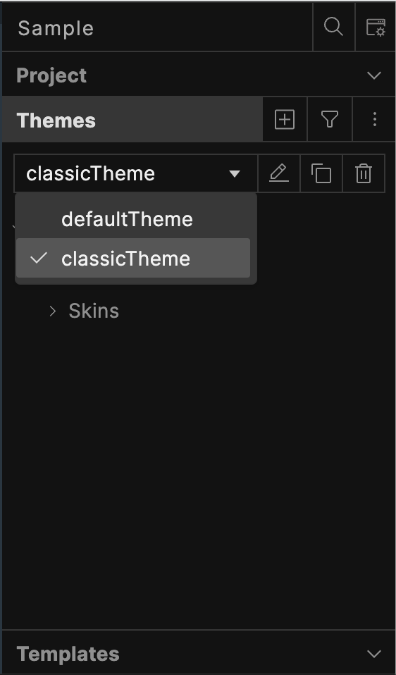

                          

Impact of Upgrade to Volt Iris V10
=================

When you import a project created in a Volt Iris versions earlier than 10.0.0, the selected theme under **Themes**  in the **Project Explorer** appears as **classicTheme**. This is the default theme used in versions prior to 10.0.0.

  

Starting with version 10.0.0, widget styling has been enhanced for a more modern appearance. To apply the updated styling, select **defaultTheme** from the theme drop-down list. Refer to the image below for theme selection.

