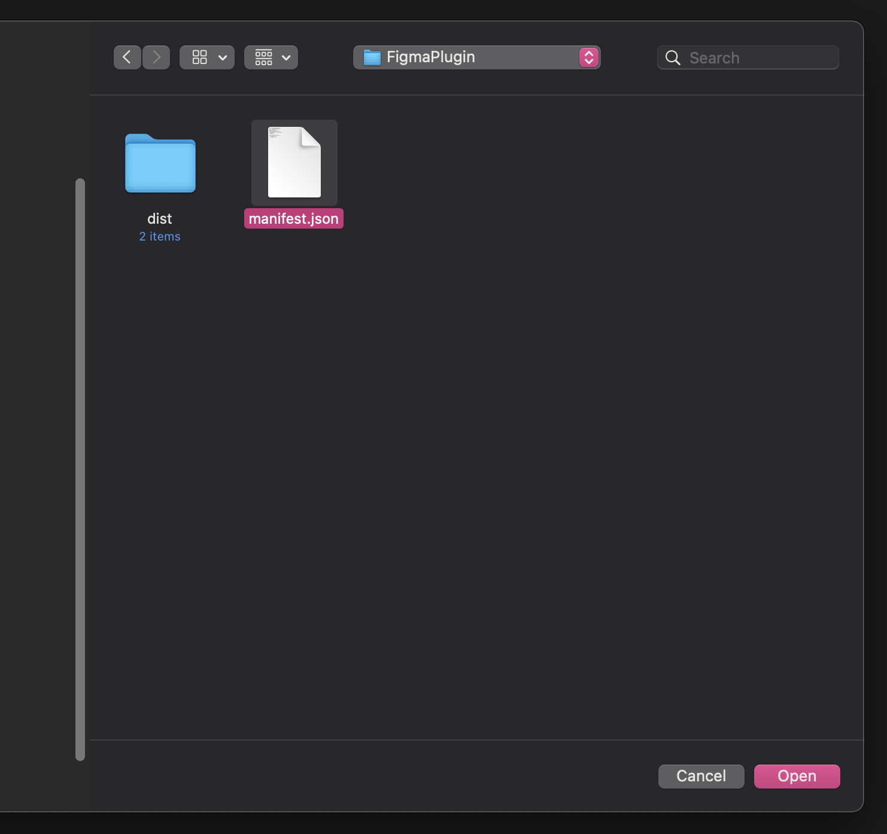
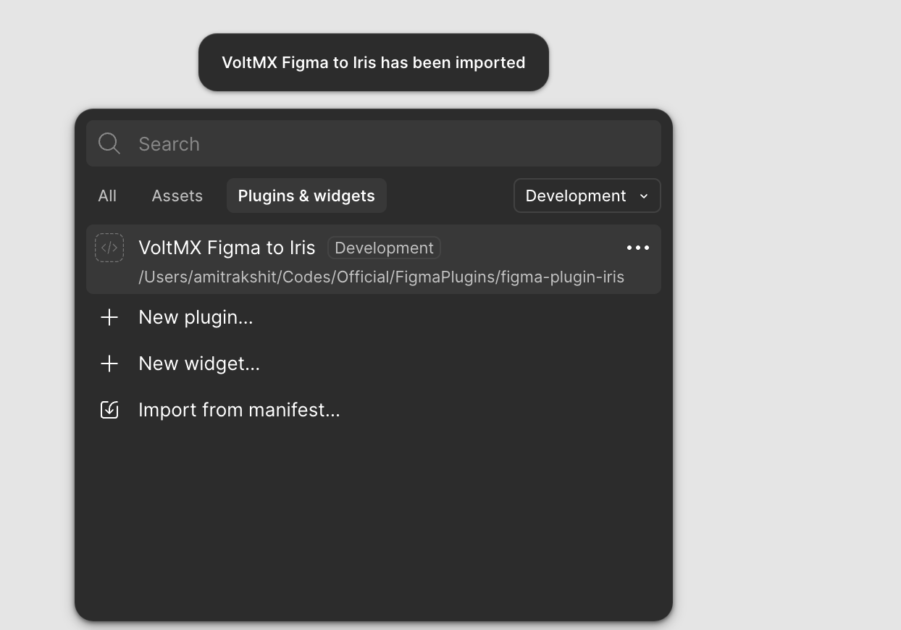
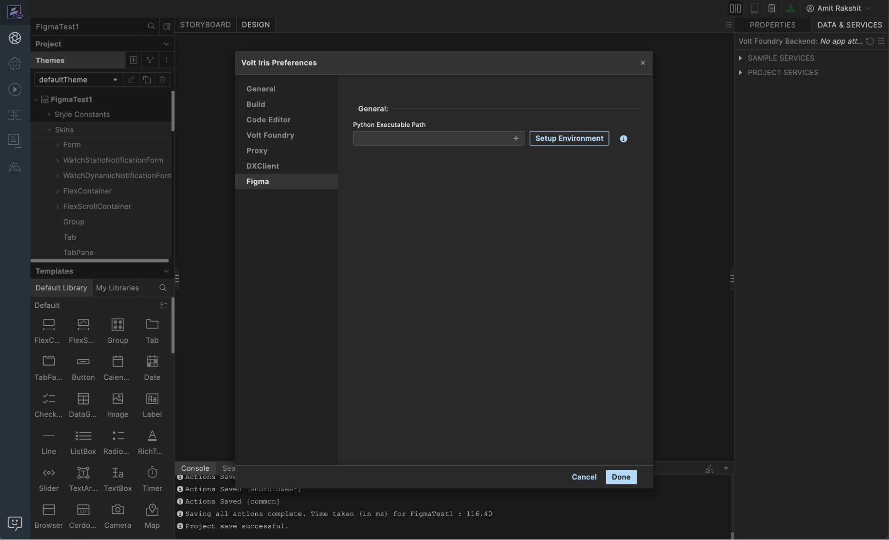
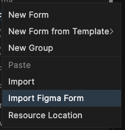
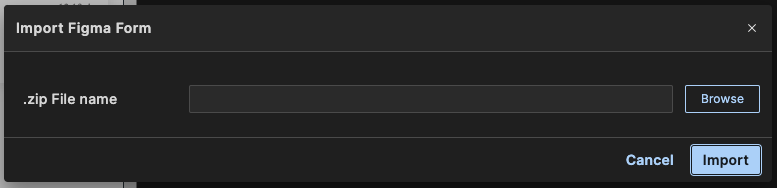
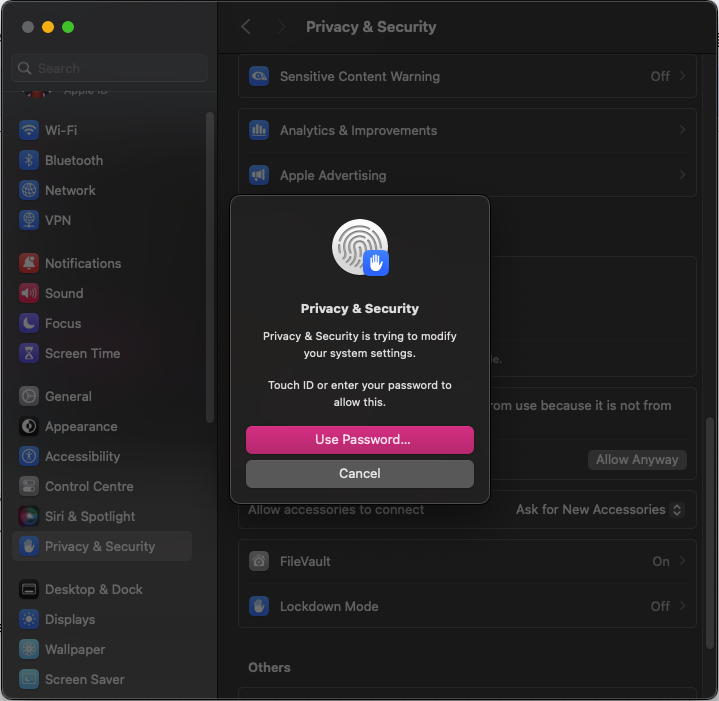

# Import Figma Design into Volt Iris

This feature enables developers and designers to import Figma designs into Volt Iris using artificial intelligence (AI). It uses advanced AI to map designs to Iris-compatible widgets accurately.

**Prerequisites**

* Install **Python 3.12.x** on your computer. [Download Python](https://www.python.org/downloads/).
* Install **the Figma desktop application**. [Download Figma](https://www.figma.com/downloads/).
* Install **VoltMX Figma to Iris Form** plugin in Figma. [Download Plugin](https://my.hcltechsw.com/downloads/voltmx/utilities).

## Setting Up the Environment

### Set Up the VoltMX Figma to Iris Plugin in Figma

Follow these steps to set up the plugin:

1. Unzip the downloaded **VoltMX Figma to Iris** `.zip` file to a preferred location on your computer.
2. Open the **Figma desktop application**, and open the Figma design file you want to use.
3. Right-click an empty area of the canvas, and select **Plugins > Development > Import plugin from manifest…**.

    

4. Go to the folder where you extracted the plugin in [step 1](#step1), and select the `manifest.json` file.

    

5. Select **Open**. *The plugin loads, and the following screen appears*.
    
    

    *This plugin allows you to export design frames as `.zip` files compatible with Volt Iris.*
>**Important:** This plugin is compatible only with Figma **Design** files. It does not support **FigJam**, **Slides**, or any other Figma file types. Ensure you are using a Design file to access the plugin’s functionality.

### Set Up the Python Environment in Volt Iris

Follow these steps to set up the Python Environment:

1. Open **Volt Iris**.
2. Go to **Preferences > Figma > General**.
    
    

3. Enter the correct Python binary path:

    * macOS example: `/usr/local/bin/python3.12`
    * Windows example: `C:\Python312\python.exe`

    

4. Select **Setup Environment**. 
*Volt Iris installs and configures the required Python packages. When setup is successful, the following message appears:*

    

## Import the Figma Design into Volt Iris

### Export the `.zip` file from Figma

Follow these steps to export the `.zip` file:

1. Select the desired frame in your Figma design.
2. Right-click the frame, and select **Plugins > Development > VoltMX Figma to Iris**.

    

3. In the plugin UI, select **Export**.

    

4. Select **Save** to export the form as a `.zip` file.

    

### Import the Design into Volt Iris

Follow these steps to import the design:

>**Note:** To use the **Import Figma Form** option in Iris, you must connect to a Foundry server. If the option appears dimmed, sign in to Iris to enable it.

1. In **Volt Iris**, right-click any form in the **Project Explorer**.

     

2. Select **Import Figma Form** from the context menu.
     
    

3. In the dialog box, browse to the `.zip` file you exported from the Figma plugin, and select it.

    

4. Select **Import**.

    

## macOS First-Time Setup Warning ⚠️

When you use **Import Figma Form** for the first time on macOS, the import may fail due to security restrictions on native Python extensions (such as *pydantic*). A pop-up like the one shown below may appear.

>**Note:** The exact message and behavior may vary depending on your macOS version.

### To resolve this issue:

1. Select **OK** on the pop-up.

     

    You may see a console error in Volt Iris.

    

3. Open **System Settings > Privacy & Security**.
4. Scroll to the **Security** section.
5. Select **Allow Anyway** for the blocked item (typically *pydantic*).

    

6. Authenticate the action using Touch ID or your System Password.

    

7. Retry the import in Volt Iris, and select **Open** when prompted.

     

    *Once approved, future imports will proceed without interruption.*

    >**Disclaimer:** The **Figma to Iris** feature uses AI to convert your designs into Iris forms. While this can significantly speed up your workflow, AI-generated outputs may contain occasional inaccuracies. We recommend reviewing the form's structure, hierarchy, and design elements carefully before finalizing or using the converted form.
